## Lecture 1: Introduction to Reinforcement Learning
David Silver
翻译：xiaotian zhao

---
### Outline
- Admin
- About Reinforcement Learning
- The Reinforcement Learning Problem
- Inside An RL Agent
- Problems within Reinforcement Learning

---
### Textbooks

- An Introduction to Reinforcement Learning, Sutton and Barto, 1998
  - MIT Press, 1998
  - ~ 40 pounds
  - Avaliable free online
  - http://webdocs.cs.ualberta.ca/∼sutton/book/the-book.html

- Algorithms for Reinforcement Learning, Szepesvari
  - Morgan and Claypool, 2010
  - ~ 20 pounds
  - Available free online!
  - http://www.ualberta.ca/∼szepesva/papers/RLAlgsInMDPs.pdf

---
### Many Faces of Reinforcement Learning
&nbsp;&nbsp;&nbsp;&nbsp;&nbsp;&nbsp;&nbsp;&nbsp;&nbsp;&nbsp;&nbsp;&nbsp;&nbsp;&nbsp;&nbsp;&nbsp;&nbsp;&nbsp;&nbsp;&nbsp;&nbsp;&nbsp;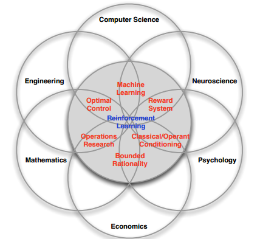

---
### Branches of Machine Learning
&nbsp;&nbsp;&nbsp;&nbsp;&nbsp;&nbsp;&nbsp;&nbsp;&nbsp;&nbsp;&nbsp;&nbsp;&nbsp;&nbsp;&nbsp;&nbsp;&nbsp;&nbsp;&nbsp;&nbsp;&nbsp;&nbsp;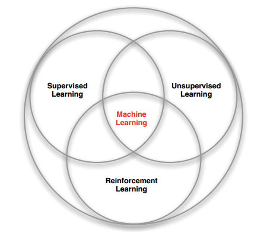

---
### Characteristics of Reinforcement Learning

是什么让强化学习不同于其他的机器学习算法？
- 无监督，仅有奖励（Reward）信号
- 反馈延迟，并不是及时的
- 时间真的重要（序列的，而非独立同分布数据）
- Agent的动作影响它收到的后续数据

---
### Examples of Reinforcement Learning

- 直升飞机的特技动作
- 击败双陆棋的世界冠军
- 管理投资组合
- 控制发电站
- 人形机器人行走
- 在很多Atari游戏中，能力高过人类

---
### Rewards
- 奖励（Reward）$R_t$ 是一个标量反馈信号
- 声明在第 $t$ 步，Agent做的有多好
- Agent的任务是最大化累计奖励

强化学习基于奖励假设（reward hypothesis）
```
Reward Hypothesis (奖励假设)

所有目标都可以被描述为最大化累计奖励期望
```
你是否同意这个定义？

---
### Examples of Rewards
- 直升飞机的特技动作
  -	+奖励，跟随所需的轨道
  -	-奖励，坠毁
- 击败双陆棋的世界冠军
  - +/-奖励，赢/输掉游戏
- 管理投资组合
  - +奖励，每挣一美元
- 控制发电站
  - +奖励，生产电力
  - -奖励，超过安全阈值
- 人形机器人行走
  - +奖励，前进动作
  - -奖励，跌倒
- 在很多Atari游戏中，能力高过人类
  - +/-奖励，提高/降低得分

---
### Sequential Decision Making（连续性决策制定）
- 目标：选择动作去最大化未来全部奖励
- 动作可能会产生长期后果
- 奖励可能被延迟
- 牺牲及时奖励获取更长期的奖励可能更好
- 例子：
  - 金融投资（可能需要数月才能成熟）
  - 直升机加油（可能防止数小时内的坠毁）
  - 阻挡对手移动（可能提高数步之后的胜利机会）

---
### Agent and Environment
&nbsp;&nbsp;&nbsp;&nbsp;&nbsp;&nbsp;&nbsp;&nbsp;&nbsp;&nbsp;&nbsp;&nbsp;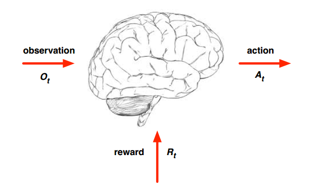

---
### Agent and Environment
&nbsp;&nbsp;&nbsp;&nbsp;&nbsp;&nbsp;&nbsp;&nbsp;&nbsp;&nbsp;&nbsp;&nbsp;&nbsp;&nbsp;&nbsp;&nbsp;&nbsp;&nbsp;&nbsp;&nbsp;&nbsp;&nbsp;&nbsp;&nbsp;<left>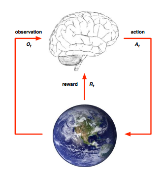</left>
- 时间步 $t$ ，Agent：
  - 执行动作 $A_t$
  - 接收到观测结果 $O_t$
  - 接收到标量奖励 $R_t$

---
### Agent and Environment
&nbsp;&nbsp;&nbsp;&nbsp;&nbsp;&nbsp;&nbsp;&nbsp;&nbsp;&nbsp;&nbsp;&nbsp;&nbsp;&nbsp;&nbsp;&nbsp;&nbsp;&nbsp;&nbsp;&nbsp;&nbsp;&nbsp;&nbsp;&nbsp;<left></left>
- 时间步 $t$, Environment：
  - 接收到动作 $A_t$
  - 产生观测 $O_t$
  - 产生标量奖励 $R_{t+1}$
- $t$ 逐步上升

---
### History and State（历史和状态）
- 历史是观测，动作，奖励的序列
$H_t = O_1, R_1, A_1, ..., O_{t-1}, R_{t-1}, A_{t-1}, O_t,R_t$
- 即：截止时间 $t$ 的所有可观测变量
- 即：机器人或具体Agent的感觉动作流
- 下一步发生什么依靠历史：
  - Agent选择动作
  - 环境选择观测/奖励
- State是决定下一步发生什么用到的信息
- 规范化地来说，state是history的函数
$S_t = f(H_t)$

---
### Environment State
&nbsp;&nbsp;&nbsp;&nbsp;&nbsp;&nbsp;&nbsp;&nbsp;&nbsp;&nbsp;&nbsp;&nbsp;&nbsp;&nbsp;&nbsp;&nbsp;&nbsp;&nbsp;&nbsp;&nbsp;&nbsp;&nbsp;&nbsp;&nbsp;&nbsp;&nbsp;&nbsp;&nbsp;&nbsp;&nbsp;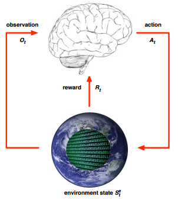
- 环境状态 $S_t^e$ 是环境的私有化表示
- 即： 环境使用的去选择下一个观测/奖励的任何数据
- 环境状态对于agent来说通常是不可见的
- 即使 $S_t^e$ 是可见的，它可能也包含一些不相关信息

---
### Agent State
&nbsp;&nbsp;&nbsp;&nbsp;&nbsp;&nbsp;&nbsp;&nbsp;&nbsp;&nbsp;&nbsp;&nbsp;&nbsp;&nbsp;&nbsp;&nbsp;&nbsp;&nbsp;&nbsp;&nbsp;&nbsp;&nbsp;&nbsp;&nbsp;&nbsp;&nbsp;&nbsp;&nbsp;&nbsp;&nbsp;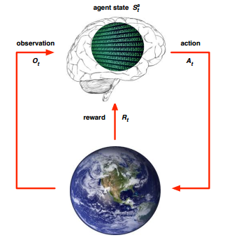
- agent 状态 $S_t^a$ 是agent的内部表示
- 即： agent使用的去选择下一个动作的任何数据
- 即： 强化学习算法使用的信息
- 它可以是history的任意函数
$S_t^a=f(H_t)$

---
### Information State
信息状态包括（也被成为，马尔科夫状态）历史中的所有有用的信息
一个状态 $S_t$ 是马尔科夫的当且仅当$P(S_{t+1} \mid S_t) = P(S_{t+1} \mid S_t,S_{t-1},...,S_{1})$
- 当给定当前的状态之后，未来和之前的状态是相互独立的
$H_{1:t} \rightarrow S_t \rightarrow H_{t+1:\infty}$
- 一旦状态已知，历史可以被扔掉
- 即：这个状态足够对未来进行统计
- 环境状态$S_t^e$ 是马尔科夫的
- 历史状态 $H_t$是马尔科夫的

---
### Rat Example
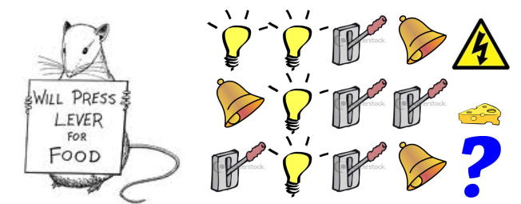
- 如果agent状态 =（序列中最后三个物品）？
- 如果agent状态 =（灯，铃铛和奶酪的数量）？
- 如果agent状态 =（完整序列）？

---
### Fully Observable Environment（完全可观测环境）
&nbsp;&nbsp;&nbsp;&nbsp;&nbsp;&nbsp;&nbsp;&nbsp;&nbsp;&nbsp;&nbsp;&nbsp;&nbsp;&nbsp;&nbsp;&nbsp;&nbsp;&nbsp;&nbsp;&nbsp;&nbsp;&nbsp;&nbsp;&nbsp;&nbsp;&nbsp;&nbsp;&nbsp;&nbsp;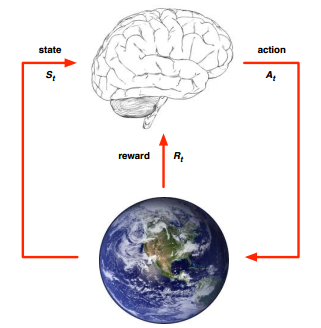
完全可观测性：agent可以直接观察环境状态
$O_t=S_t^a=S_t^e$
- Agent state (agent 状态)=Environment state(环境状态)=information state(信息状态)
- 规范化的来说，这是一个马尔科夫决策过程（MDP）
- 下一节课程这是主要内容

---
### Partially Observable Environments
- 部分可观测性：agent不直接观察环境
  - 一个装备照相机视角的机器人没有被告诉它的绝对位置
  - 一个交易agent仅观察当前价格
  - 一个扑克agent仅观察公开的牌
- 现在agent state $\ne$ environment state
- 规范化的来说，这个部分可观测马尔科夫决策过程（PDMDP）
- Agent必须构建它自己的状态表示$S_t^a$
  - 完整的历史：$S_t^a=H_t$
  - 环境状态的信念（Beliefs）： $S_t^a=(P(S_t^e=s^1),...,P(S_t^e=S^n))$
  - 循环神经网：$S_t^a= \sigma (S_{t-1}^aW_s + O_tW_o)$

---
### Major Components of an RL Agent（RL Agent主要组件）
- 强化学习Agent可能包含下列多个组件中的一个或者多个
  - Policy（策略函数）:agent的行为函数
  - Value Function（价值函数）：每个状态或动作有多好
  - Model（模型）: 环境的agent表示

---
### Policy（策略）
- 策略是agent的行为
- 它将state(状态)映射为action(动作)
- 确定性策略： $a=\pi(s)$
- 随机策略： $\pi(a\mid s)=P(A_t=a\mid S_t=s)$

---
### Value Function (价值函数)
- 价值函数是对未来奖励的预测
- 被用来评价状态的好坏
- 并且因此从actions(动作)中选择
$v_{\pi}(s)=E_{\pi}(R_{t+1}+\lambda R_{t+2} + \lambda^2 R_{t+3}+... \mid S_t=s)$

---
### Model (模型)
- 模型预测下一步环境要做什么
- $P$ 预测下一个状态
- $R$ 预测下一个（及时）奖励
$P_{ss'}^{a} =P(S_{t+1}=s'\mid S_t=s,A_t=a)$
$R_{s}^a=E(R_{t+1}\mid S_t=s,A_t=a)$

---
### Maze Example
&nbsp;&nbsp;&nbsp;&nbsp;&nbsp;&nbsp;&nbsp;&nbsp;&nbsp;&nbsp;&nbsp;&nbsp;&nbsp;&nbsp;&nbsp;&nbsp;&nbsp;&nbsp;&nbsp;&nbsp;&nbsp;&nbsp;&nbsp;&nbsp;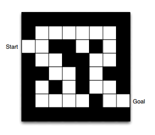
- 奖励：每个时间步 -1
- 动作：N,E,S,W（北，东，南，西）
- 状态：Agent的位置

---
### Maze Example: Policy
&nbsp;&nbsp;&nbsp;&nbsp;&nbsp;&nbsp;&nbsp;&nbsp;&nbsp;&nbsp;&nbsp;&nbsp;&nbsp;&nbsp;&nbsp;&nbsp;&nbsp;&nbsp;&nbsp;&nbsp;&nbsp;&nbsp;&nbsp;&nbsp;&nbsp;&nbsp;&nbsp;&nbsp;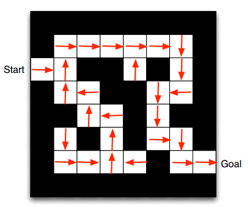
- 箭头表示在每个状态 $s$ 下的策略

---
### Maze Example: Value Function
&nbsp;&nbsp;&nbsp;&nbsp;&nbsp;&nbsp;&nbsp;&nbsp;&nbsp;&nbsp;&nbsp;&nbsp;&nbsp;&nbsp;&nbsp;&nbsp;&nbsp;&nbsp;&nbsp;&nbsp;&nbsp;&nbsp;&nbsp;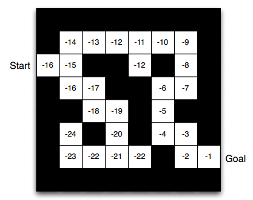
- 数字表示每个状态下的值$v_{\pi}(s)$

---
### Maze Example: Model
&nbsp;&nbsp;&nbsp;&nbsp;&nbsp;&nbsp;&nbsp;&nbsp;&nbsp;&nbsp;&nbsp;&nbsp;&nbsp;&nbsp;&nbsp;&nbsp;&nbsp;&nbsp;&nbsp;&nbsp;&nbsp;&nbsp;&nbsp;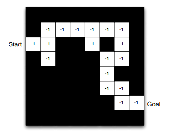
- Agent可能有一个环境的内部模型
- 动态的：动作如何改变状态
- 奖励：每个状态有多少奖励
- 模型可能并不完美
- Grid 格局表示转移模型$P_{ss'}^a$
- 数字代表及时奖励$R_s^a$对于每个状态$s$(对于动作$a$也是如此)

---
### Categorizing RL agent (分类 RL agent)
- Value Based
  - 无策略
  - 价值函数
- Policy Based
  - 策略
  - 无价值函数
- Actor-Critic
  - 策略
  - 价值函数

---
### Categorizing RL agent (分类 RL agent)
- Model Free
  - 策略或者价值函数
  - 无模型
- Model Based
  - 策略或价值函数
  - 模型

---
### RL Agent Taxonomy
&nbsp;&nbsp;&nbsp;&nbsp;&nbsp;&nbsp;&nbsp;&nbsp;&nbsp;&nbsp;&nbsp;&nbsp;&nbsp;&nbsp;&nbsp;&nbsp;&nbsp;&nbsp;&nbsp;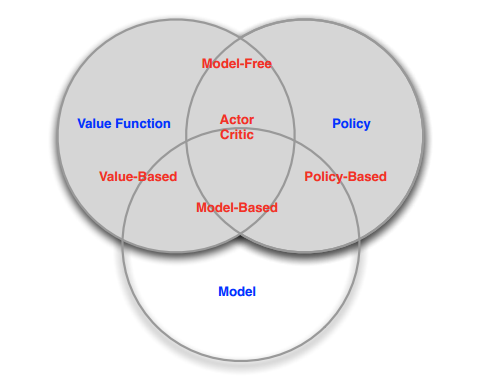

---
### Learning and Planning
连续性决策制定的两个基础性问题
- Reinforcement Learning（强化学习）
  - 环境最初是未知的
  - agent与环境交互
  - agent提升它的策略
- Planning
  - 环境的模型是已知的
  - agent使用它的模型去执行计算（不使用额外的交互）
  - agent提升策略
  - 也被称为：深思，推理，内省，沉思，思考，搜索

---
### Atari Example: Reinforcement Learning
&nbsp;&nbsp;&nbsp;&nbsp;&nbsp;&nbsp;&nbsp;&nbsp;&nbsp;&nbsp;&nbsp;&nbsp;&nbsp;&nbsp;&nbsp;&nbsp;&nbsp;&nbsp;&nbsp;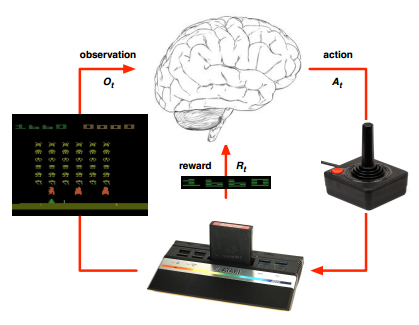
- 游戏的规则是未知的
- 从游戏对局交互中直接学习
- 根据操作杆选择动作，观察像素和得分

---
### Atari Example: Planning
&nbsp;&nbsp;&nbsp;&nbsp;&nbsp;&nbsp;&nbsp;&nbsp;&nbsp;&nbsp;&nbsp;&nbsp;&nbsp;&nbsp;&nbsp;&nbsp;&nbsp;&nbsp;&nbsp;&nbsp;&nbsp;&nbsp;&nbsp;&nbsp;&nbsp;&nbsp;&nbsp;&nbsp;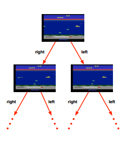
- 游戏的规则是已知的
- 可以查询模拟器
  - agent脑中有完美模型
- 如果我在状态s下选择动作a:
  - 下一个状态应该是什么？
  - 得分应该是多少？
- 提前计划找到最优策略
  - 例如：树搜索

---
### Exploration and Exploitation
- 强化学习像是试错学习
- agent应该去发现好策略
- 通过它对环境的经验
- 一路不失去过多的奖励

---
### Exploration and Exploitation
- 探索发现关于环境的更多信息
- 开发利用已知信息去极大化奖励
- 通常开发和探索一样重要

---
### Example
- 餐厅
Exploitation 去你最喜欢的餐厅
Exploration 尝试新的餐厅
- 在线banner广告
Exploitation 展示最成功的广告
Exploration 展示不同的广告
- 石油钻探
Exploitation 钻探众所周知的地方
Exploration 钻探新的地方
- 游戏玩耍
Exploitation 使用你相信的最好的移动 
Exploration 使用实验性移动

---
### Prediction and Control
- Prediction: 评估未来
  - 给定策略
- Control：优化未来
  - 寻找最优策略

---
### Gridworld Example: Prediction
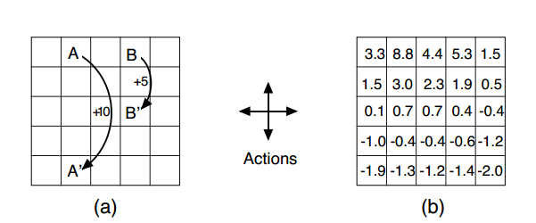
采用随机策略的价值函数是什么？

---
### Gridworld Example: Control
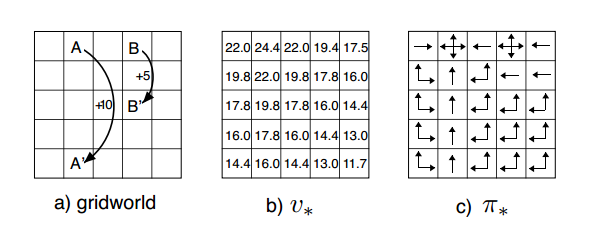
在所有可能的策略中最好的值函数是什么？
什么是最优策略？

---
### Course Outline
- Part I: Elementary Reinforcement Learning
  - Introduction to RL
  - Markov Decision Processes
  - Planning by Dynamic Programming
  - Model-Free Prediction
  - Model-Free Control
- Part II: Reinforcement Learning in Practice
  - Value Function Approximation
  - Policy Gradient Methods
  - Intergeting Learning and Planning
  - Exploration and Exploitation
  - Case Study - RL in games