## Lecture 10: Classic Games
David Silver
翻译：xiaotian zhao

---
### Outline
- State of the Art
- Game Theory
- Minimax Search
- Self-Play Reinforcement Learning
- Combining Reinforcement Learning and Minimax Search
- Reinforcement Learning in Imperfect-Information Games
- Conclusions

---
### Why Study Classic Games?
- 简单规则，深度概念
- 已经被研究了数百数千年
- 有意义的IQ测试
- 弱人工智能
- 微观世界封装了现实世界的问题
- 游戏很有趣

---
### AI in Games: State of the Art
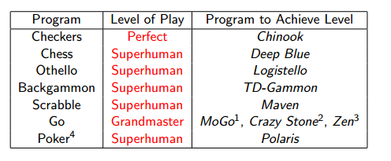
${}^{1}$ 9x9
${}^{2}$ 9x9 和 19 x 19
${}^{3}$ 19 x 19
${}^{4}$ 单挑限制德州扑克

---
### RL in Games: State of the Art
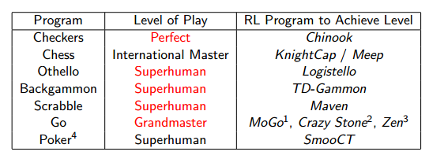
${}^{1}$ 9x9
${}^{2}$ 9x9 和 19 x 19
${}^{3}$ 19 x 19
${}^{4}$ 单挑限制德州扑克

---
### Optimality in Games
- 什么是第i个玩家的最优策略$\pi^{i}$?
- 如果所有的玩家都固定他们的策略$\pi^{-i}$
- 最佳反应$\pi_{*}^{i}(\pi^{-i})$是针对这些策略的最佳策略
- 纳什均衡是所有玩家的联合策略
$\pi^{i}=\pi^{i}_{*}(\pi^{-i})$
- 这样每个玩家策略都是最优策略
- 没有玩家会选择偏离纳什均衡

---
### Single-Agent and Self-Play Reinforcement Learning
- 最佳响应是单-agent强化学习问题的解决方案
  - 其他玩家成为环境的一部分
  - 游戏被约减为一个MDP
  - 最佳的响应就是这个MDP的最优策略
- 纳什均衡是self-play强化学习的固定点
  - 经验通过agents之间玩游戏生成
  $a_1 \sim \pi^{1}, a_2 \sim \pi^{2},...$
  - 每个agent学习面对其他玩家的最佳响应
  - 一个玩家的策略决定另外玩家的环境
  - 所有的玩家都适应其他玩家

---
### Two-Player Zero-Sum Games
- 我们将会关注一个特殊类别游戏：
  - 双人游戏有两个玩家
    - 将玩家1命名为white，玩家二命名为 black
  - 零和游戏white和black有相等且相反的奖励
  $R^1 + R^2 = 0$
  我们考虑在这些游戏中寻找纳什均衡
  - 游戏树搜索(即，planning)
  - self-play强化学习

---
### Perfect and Imperfect Information Games
- 完美信息和马尔科夫游戏是完全可观察的
  - 西洋棋
  - 跳棋
  - 奥赛罗（一种黑白棋游戏）
  - 双陆棋
  - 围棋
- 非完美信息游戏是部分可观察的
  - Scrabble（拼字游戏）
  - Poker（扑克牌）
- 我们关注第一种完美信息游戏

---
### Minimax
- 价值函数定义了总期望奖励在给定联合策略$\pi=<\pi^1, \pi^2>$
$v_{\pi}(s) = E_{\pi}(G_t \mid S_t = s)$
- minmax价值函数最大化白色方的期望回报，同时最小化黑色放的期望回报
$v_{*}(s) = max_{\pi^{1}}min_{\pi^2} v_{\pi}(s)$
- minmax策略是联合策略$\pi=<\pi^1, \pi^2>$可以达到minmax值
- 这有唯一的minmax价值函数
- minmax策略是纳什均衡

---
### Minimax Search
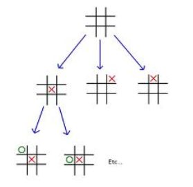
- minmax值可以通过深度优先-游戏树搜索找到
- 由Claude Shannon在Programming a Computer for Playing Chess提出
- 可以在白纸上运行

---
### Minmax Search Example
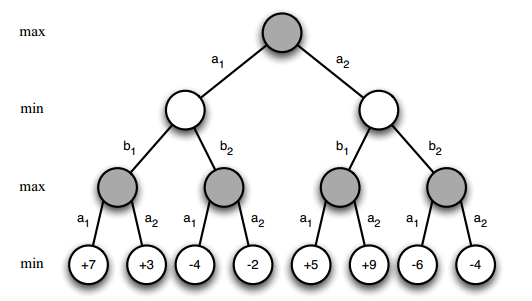

---
### Minmax Search Example

---
### Minmax Search Example
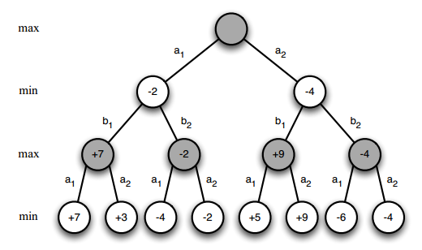

---
### Minmax Search Example
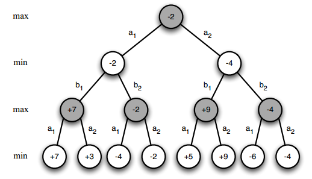

---
### Value Function in Minimax Search
- 搜索树指数增长
- 搜索到游戏结束不具有可行性
- 使用函数逼近器$v(s,w) \approx v_{*}(s)$
  - 例如，评估函数，启发函数
- 使用价值函数去估计叶节点的minmax值
- minmax搜索运行固定的深度遵循叶节点

---
### Binary-Linear Value Function
- 二元特征向量：例如每片一个特征
- 权重向量$w$: 例如，每片的值
- 位置是通过将活跃特征的权重加起来进行评估的
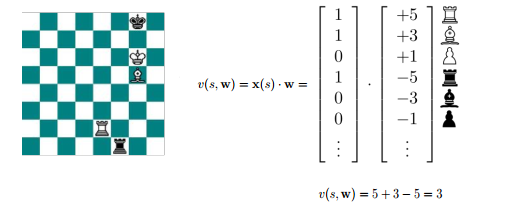

---
### Deep Blue
- 知识
  - 8000手工国际棋特征
  - 二元线性价值函数
  - 权重很大程度上是通过人类专家手动调整的
- 搜索
  - 高性能并行alpha-beta搜索
  - 480个特定目的的VLSI国际棋处理器
  - 搜索200百万位置/秒
  - 向前看16-40轮
- 结果
  - 打败人类想起冠军Garry Kasparov 4-2(1997)
  - 很多互联里面的已看过事件

---
### Chinook(西洋跳棋)
- 知识
  - 二元-线性价值函数
  - 21个基于知识的特征（位置，流动性,...）
  - x4 阶段的游戏
- 搜索
  - 高性能$\alpha-\beta$搜索
  - 逆向分析
    - 从胜利的位置向后搜索
    - 将所有胜利的位置存储在查询表
    - 从最后n个跳棋完美执行
- 结果
  - 在1994年世锦赛上打败了Marion Tinsley
    - 赢了两局，然后Tinsley以健康原因退赛
  - 在2007年Chinook解决了跳棋游戏
    - 完美运行对抗上帝

---
### Self-Play Temporal-Difference Learning
- 将基于价值的RL算法应用于self-play的游戏
- MC:更新价值函数朝向回报$G_t$
$\triangle w = \alpha(G_t - v(S_t, w)) \triangledown_w v(S_t, w)$
- TD(0):朝向后继值$V(S_{t+1})$更新价值函数
$\triangle w = \alpha(v(S_{t+1},w) - v(S_t, w)) \triangledown_w v(S_t, w)$
- TD($\lambda$)：朝着$\lambda-return$更新价值函数
$\triangle w = \alpha(G_t^{\lambda} - v(S_t, w)) \triangledown_w v(S_t, w)$

---
### Policy Improvement with Afterstates
- 对于确定性的游戏估算$v_{*}(s)$是足够的
- 这是因为我们可以有效的估计后续状态
$q_{*}(s,a) = v_{*}(succ(s,a))$
- 游戏的规则定义了后继状态$succ(s,a)$
- 动作根据最小/最大后续状态价值
$A_t = argmax_{a} v_{*}(succ(S_t, a))$
$A_t = argmax_{a} v_{*}(succ(S_t, a))$
- 这可以提升两个玩家的联合策略

---
### Self-Play TD in Othello: Logistello
- logistello 创造自己的特征
- 以原始输入特征开始，例如：“黑子在C1位置”
- 通过连接/断开链接创造新的特征
- 创造了1.5百万特征在不同的配置下
- 二元-线性价值函数使用这些特征

---
### Reinforcement Learning in Logistello
Logistello使用泛化策略迭代
- 从当前的策略生成batch的self-play游戏
- 使用蒙特卡洛（回归输出）评估策略
- 贪心策略提升生成新玩家 

结果
- 以6-0击败世界冠军Takeshi Murukami

---
### TD Gammon: Non-Linear Value Function Approximation
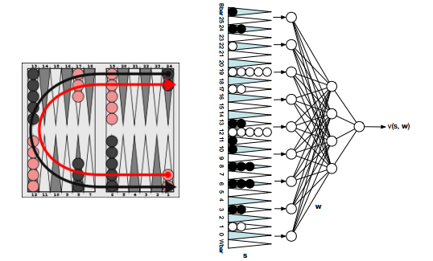

---
### Self-Play TD in Backgammon: TD-Gammon
- 随机初始化权重
- 通过self-play的游戏进行训练
- 使用非线性差分学习
$\delta_t = v(S_{t+1}, w) - v(S_t, w)$
$\triangle w = \alpha \delta_t \triangledown_w v(S_t, w))$
- 贪心策略提升(非探索)
- 算法在现实中经常收敛
- 对于其他游戏不是真的

---
### TD Gammon:结果
- 零专家知识 $\Rightarrow$ 强即时游戏
- 手工规则 $\Rightarrow$ 游戏的高水平（1991）
- 2-ply 搜索 $\Rightarrow$ 游戏的大师水平(1993)
- 3-ply 搜索 $\Rightarrow$ 游戏超过人类水平
- 以7-1战胜世界冠军Luigi Villa(1992)

---
### New TD-Gammon Results
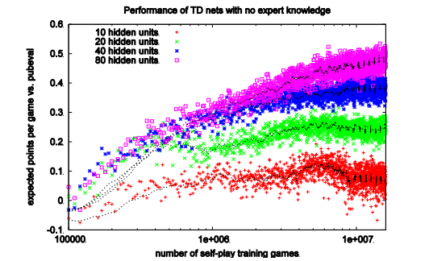

---
### Simple TD
- TD：朝向后继值更新
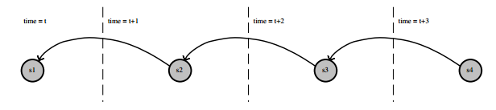
- 价值函数逼近器$v(s,w)$使用参数$w$
- 价值函数从下一个状态的原始值进行备份
$v(S_t,w) \leftarrow v(S_{t=1}, w)$
- 首先通过TD-learning学习价值函数
- 然后使用在minmax搜索中使用价值函数(无学习)
$v_{+}(S_t, w) = minmax_{s \in leaves(S_t)} v(s,w)$

---
### Simple TD: Results
- Othello: 在Logistello中表现超过人类
- Backgammon: 在TD-Gammon中超过人类表现
- Chess: 差劲的表现
- Checkers: 差劲的表现
- 在国际象棋战术中似乎必须找到位置信号
- 即。很难不使用搜索找到“将死”的状态
- 我们是否可以直接从minmax搜索的值中进行学习？

---
### TD Root
- TD root:朝着后继搜索值更新
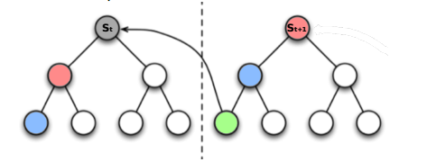
- 搜索值在根位置$S_t$被计算
$V_{+}(S_t, w) = minmax_{s \in leaves(S_t)} v(s,w)$
- 价值函数从下个状态的搜索之进行备份
$v(S_t, w) \leftarrow v_{+}(S_{t+1}, w) = v(l_{+}(S_{t+1}),w)$
-这里$l_{+}$表示从状态$s$到minmax值的叶子节点

---
### TD Root in Checkers: Samuel’s Player
- 首个TD learning算法（Samuel 1959）
- 通过self-play算法应用于跳棋游戏
- 击败了业余人类选手
- 也使用了其他的思想，我们现在可能认为很怪异

---
### TD Leaf
- TD leaf:通过后继搜索值更新搜索值
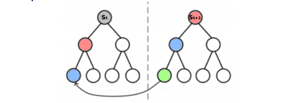
- 搜索值在当前步和下一步计算
$v_{+}(S_t,w) = minmax_{s \in leaves(S_t)} v(s,w)$
$v_{+}(S_{t+1}, w) = minmax_{s \in leaves(S_{t+1})} v(s,w)$
- 在第t步的搜索值是通过在t+1步来更新的
$v_{+}(S_t, w) \leftarrow v_{+}(S_{t+1}, w)$
$\Rightarrow v(l_{+}(S_{t}),w) \leftarrow v(l_{+}(S_{t+1}),w)$

---
### TD leaf in Chess: Knightcap
- 学习
  - Knight被训练对抗专家对手
  - 仅从标准值开始
  - 使用TD-leaf学习到权重
- 搜索
  - Alpha-beta搜索使用标准增强
- 结果
  - 在少量游戏之后达到大师水平
  - 在self-play中不算有效
  - 在从比较好的权重开始时，并不有效

---
### TD leaf in Checkers: Chinook
- 原始Chinook使用手工调整的规则
- 后续的版本使用self-play进行训练
- 使用TD-leaf调整权重
  - 希望保持原始权重不变
- self-play权重表现 $\ge$ 手工调整权重
- 即，学习超过人类水平

---
### TreeStrap
- TreeStrap:更新搜索值向着更深的搜索值

- minmax搜索值在所有节点上计算$s \in nodes(S_t)$
- 对所有节点，在同一步，从搜索值进行值备份
$v(s,w) \leftarrow v_{+}(s,w)$
$\Rightarrow$ $v(s,w) \leftarrow v(l_{+}(s),w)$

---
### Treestrap in Chess: Meep
- 2000个特征的二元线性价值函数
- 从随机初始化的权重中开始（没有先验知识）
- 通过TreeStrap进行权重调整
- 13/15的胜率，对战国际大师
- 在self-play中，是有效率的
- 在随机初始化权重的时候是有效率的

---
### Simulation-Based Search
- self-play强化学习可以替代搜索
- self-play从根状态$S_t$模拟游戏
- 在模拟经验上应用RL
  - 蒙特卡洛控制 $\Rightarrow$ 蒙特卡洛树搜索
  - UCT算法有很多高效变种
    - 在每个节点使用UCB平衡exploration /exploitation
  - self-play UCT收敛到minmax值
  - 完美信息，零和，2-玩家游戏
  - 非完美信息：看见下一个状态

---
### Performance of MCTS in Games
- MCTS在很多有挑战性的游戏中都是表现最好的模型
  - Go（围棋）
  - Hex
  - Lines of Action
  - Amazons
- 在很多游戏中简单蒙特卡洛搜索是足够的
  - Scrabble
  - Backgammon(双陆棋)

---
### Simple Monte-Carlo Search in Maven
- 学习
  - Maven通过得分$+v(rack)$评估移动
  - rack的二元线性价值函数
  - 使用一个，连个和三个信件特征
  - Q??????,QU?????, III????
  - 通过蒙特卡洛策略迭代(Logistello)
- 搜索
  - 通过向量self-play的n步来推动移动
  - 通过得分$+v(rack)$来评估结果位置
  - 根据推出时的平均评估值对动作进行打分
  - 选取并执行最高得分的移动
  - 使用$B^{*}$搜索专特定结局

---
### Maven: Results
- Maven以9-5击败世界冠军Adam
- 这里，Maven使用MOUTHPART预测了最后的结局
- 分析表明每局游戏有三个百分点的错误率
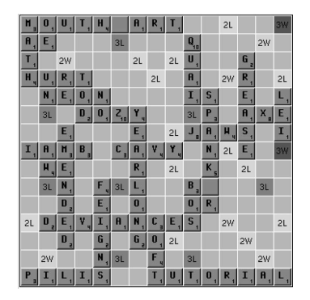

---
### Game-Tree Search in Imperfect Information Games
- 玩家有不同的信息状态因此搜索树分开了
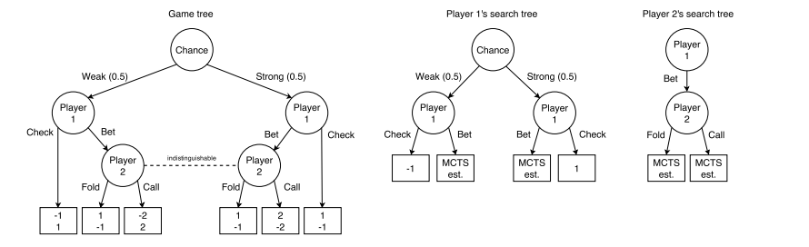
- 这里每个信息状态有一个节点
  - 总结玩家知道什么
  - 例如，他们看到过的牌
- 很多真实的状态可能通过相同的信息状态共享
- 也可能整合状态，例如，使用相似值

---
### Solution Methods for Imperfect Information Games
- 信息状态游戏树可能被解决：
 - 迭代前向搜索方法
   - 例如，反事实的regret最小化
   - 在扑克牌中的"完美"玩家（heads-up limit Hold’em）
 - self-play强化学习
 - 例如.平滑UCT
   - 两人和三人扑克中的3枚银牌（限注德州扑克）
   - 表现由于大规模前向搜索agent

---
### Smooth UCT Search
- 在信息状态游戏树上应用MCTS
- UCT的变种，受到游戏理论虚拟执行启发
  - Agent学习对抗和对对手的平均行为进行反应
- 抽取平均策略从节点动作计数$\pi_{avg}(a \mid s) = \frac{N(s,a)}{N(s)}$
- 在每个节点，根据下述方程选择模型
$A \sim \left\{ \begin{matrix} UCT(S) , with \ probability \ \eta\\ \pi_{avg}(. \mid S), with \ probability \ 1 - \eta \end{matrix} \right.$
- 经验的，在扑克牌的变种中：
  - 原始MCTS发散了
  - 平滑UCT收敛到纳什均衡

---
### RL in Games: A Successful Recip
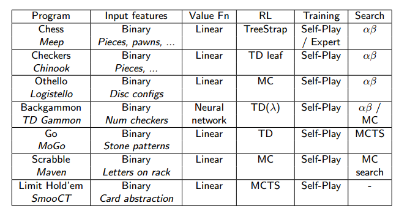