## Lecture 2: Markov Decision Processes
David Silver
翻译：xiaotian zhao

---
### Outline
- Markov Processes
- Markov Reward Processes
- Markov Decision Processes
- Extensions to MDPs

---
### Introduction to MDPs
- 马尔科夫决策过程规范地被描述为增强学习的环境
- 环境是可以被完全观测的
- 即：当前的状态可以完全刻画过程
- 几乎所有的强化学习问题都可以被转化为MDPs.
  - 优化控制主要处理连续MDPs
  - 部分可观察问题可以被转换为MDPs
  - 老虎机是具有一个状态的MDPs

---
### Markov Property
给定当前的状态，未来和之前的状态是独立的。
一个状态 $S_t$ 是马尔科夫的当且仅当
$P(S_{t+1}\mid S_t) = P(S_{t+1} \mid S_1, ...,S_t)$
- 当前状态捕捉了历史中所有相关信息
- 一旦状态已知，历史可以被扔掉
- 当前状态足够对未来做出统计

---
### 状态转移矩阵
对于马尔科夫状态 $s$ 和其后继状态 $s'$，状态转移概率被定义为：$P(ss')=P(S_{t+1} = s'\mid S_t =s)$
状态转移矩阵 $P$ 定义了从所有的状态 $s$ 到所有的后继状态 $s'$ 的转移概率，矩阵每一行的和为1。
$\left\{
\begin{matrix} 
P_{11}& ... & P_{1n}\\
...& ... &...\\
P_{n1}& ... & P_{nn}
\end{matrix}
\right\}$

---
### 马尔科夫过程
马尔科夫过程是一个无记忆的随机过程。即，一个拥有马尔科夫性的随机状态序列$S_1,S_2,...$
马尔科夫过程（马尔科夫链）是一个元组$(S,P)$
- $S$ 是状态的有限集合
- $P$ 是状态转换概率矩阵
$P_{ss'}=P(S_{t+1}=s' \mid S_t =s)$

---
### Example: Student Markov Chain
&nbsp;&nbsp;&nbsp;&nbsp;&nbsp;&nbsp;&nbsp;&nbsp;&nbsp;&nbsp;&nbsp;&nbsp;&nbsp;&nbsp;&nbsp;&nbsp;&nbsp;&nbsp;&nbsp;&nbsp;&nbsp;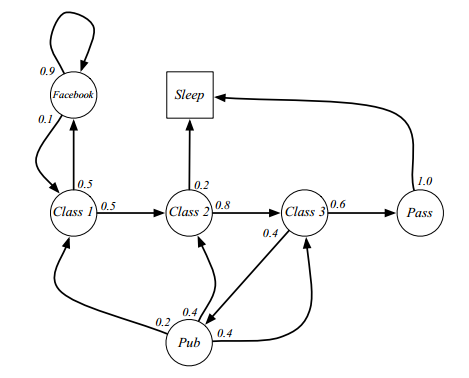

---
### Example: Student Markov Chain Episodes
&nbsp;&nbsp;&nbsp;&nbsp;&nbsp;&nbsp;&nbsp;&nbsp;&nbsp;&nbsp;&nbsp;&nbsp;&nbsp;&nbsp;&nbsp;&nbsp;&nbsp;&nbsp;&nbsp;&nbsp;&nbsp;
在学生马尔科夫链从$S_1=C_1$ 开始采样，$S_1,S_2,S_3,...,S_T$
- C1 C2 C3 Pass Sleep
- C1 FB FB C1 C2 Sleep
- C1 C2 C3 Pub C2 C3 Pass Sleep
- C1 FB FB C1 C2 C3 Pub C1 FB FB FB C1 C2 C3 Pub C2 Sleep

---
### Example: Student Markov Chain Transition Matrix
&nbsp;&nbsp;&nbsp;&nbsp;&nbsp;&nbsp;&nbsp;&nbsp;&nbsp;&nbsp;&nbsp;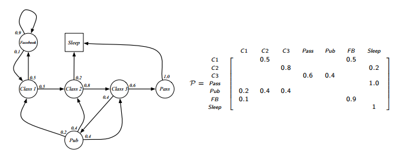

---
### Markov Reward Process
马尔科夫奖励过程（MRP）是有值的马尔科夫链
马尔科夫奖励过程是一个元组 $(S,P,R,\gamma)$
- $S$ 是状态的有限集合
- $P$ 是状态转移概率矩阵,$P_{ss'}=P(S_{t+1} = s' \mid S_t = s)$
- $R$ 是奖励函数，$R_s = E(R_{t+1} \mid S_t=s)$
- $\gamma$ 是折扣因子，$\gamma \in [0,1]$

---
### Student MRP
&nbsp;&nbsp;&nbsp;&nbsp;&nbsp;&nbsp;&nbsp;&nbsp;&nbsp;&nbsp;&nbsp;&nbsp;&nbsp;&nbsp;&nbsp;&nbsp;&nbsp;&nbsp;&nbsp;&nbsp;&nbsp;&nbsp;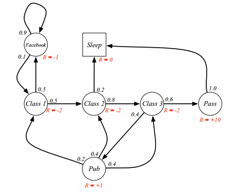

---
### Return（回报）
回报$G_t$ 是从时间步 $t$ 开始的折扣奖励和
$G_t=R_{t+1} + \gamma R_{t+2} + \gamma^2 R_{t+3} + ...$
- 折扣 $\gamma \in [0,1]$ 是未来奖励的当前值
- 在$k+1$ 时间步之后接收到的奖励R的实际值是 $\gamma^k R$
- 这个值的直接奖励是大于延迟奖励的
  - $\gamma$ 接近0 导致短视评价
  - $\gamma$ 接近1 导致长远评价

---
### Why discount?
很多马尔科夫奖励和决策过程都有折扣。为什么？
- 数学上计算方便
- 避免循环马尔科夫过程中的无限回报
- 未来的不确定性可能没有被完全表示
- 假设回报是经济上的，即时回报可能比延迟回报得到更好的收益
- 动物/人类都倾向于获取即时回报
- 一些情况下可以使用无折扣的奖励，例如，所有的序列都会终止

---
### Value Function
价值函数$v(s)$ 给出了状态 $s$ 的长期值。
状态 $s$ 的MRP值函数 $v(s)$ 是从 状态$s$ 开始的回报期望值。
$v(s) = E[G_t \mid S_t = s]$

---
### Example: Student MRP Returns
从Student MRP中采样回报
从$S_1= C_1$ 开始，使用折扣因子$\gamma = \frac{1}{2}$
$G_1 = R_2 + \gamma R_3 + ... + \gamma^{T-2} R_T$
- C1 C2 C3 Pass Sleep | $v_1 = -2+0.5*(-2)+0.25*(-2)+10 * 0.125 = -2.25$
- C1 FB FB C1 C2 Sleep |$v_1=-2 + \frac{1}{2}* (-1) + \frac{1}{4}*(-1)+\frac{1}{8} * (-2)+\frac{1}{16}* (-2)$
- C1 C2 C3 Pub C2 C3 Pass Sleep
- C1 FB FB C1 C2 C3 Pub C1 FB FB FB C1 C2 C3 Pub C2 Sleep

---
### Example: State-Value Function for Student MRP
&nbsp;&nbsp;&nbsp;&nbsp;&nbsp;&nbsp;&nbsp;&nbsp;&nbsp;&nbsp;&nbsp;&nbsp;&nbsp;&nbsp;&nbsp;&nbsp;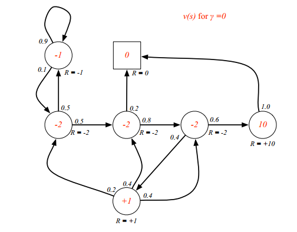

---
### Example: State-Value Function for Student MRP
&nbsp;&nbsp;&nbsp;&nbsp;&nbsp;&nbsp;&nbsp;&nbsp;&nbsp;&nbsp;&nbsp;&nbsp;&nbsp;&nbsp;&nbsp;&nbsp;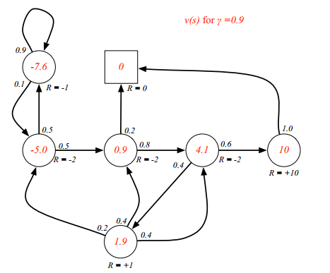

---
### Example: State-Value Function for Student MRP
&nbsp;&nbsp;&nbsp;&nbsp;&nbsp;&nbsp;&nbsp;&nbsp;&nbsp;&nbsp;&nbsp;&nbsp;&nbsp;&nbsp;&nbsp;&nbsp;

---
### Bellman Equation for MRPs
价值函数可以分分解为两个部分：
- 即时奖励 $R_{t+1}$
- 后续状态的折扣值 $\gamma v(S_{t+1})$

$v(s) = E[G_t \mid S_t = s]$
$=E[R_{t+1} + \gamma R_{t+2} + \gamma^2 R_{t+3} + ... \mid S_t = s]$
$=E[R_{t+1} + \gamma (R_{t+2} + \gamma R_{t+3} + ...) \mid S_t = s]$
$=E[R_{t+1} + \gamma G_{t+1} \mid S_t = s]$
$=R_s + \gamma v(S_{t+1})$

---
### Bellman Equation for MRPs
$v(s) = E[R_{t+1} + \gamma v(S_{t+1}) \mid S_t = s]$
&nbsp;&nbsp;&nbsp;&nbsp;&nbsp;&nbsp;&nbsp;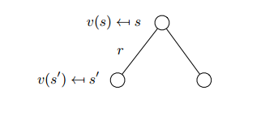
$v(s)=R_s + \gamma \sum_{s' \in S} P_{ss'} v(s')$

---
### Example: Bellman Equation for Student MRP
&nbsp;&nbsp;&nbsp;&nbsp;&nbsp;&nbsp;&nbsp;&nbsp;&nbsp;&nbsp;&nbsp;&nbsp;&nbsp;&nbsp;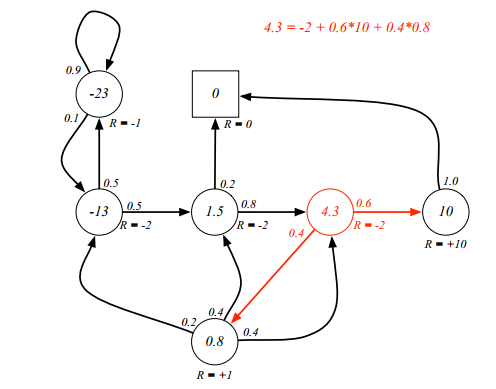

---
### Bellman Equation in Matrix Form
bellman方程可以使用矩阵形式更方便的进行表示
$v=R+ \gamma Pv$
这里 $v$ 是一个列向量，每个状态是一个实体
${\left[ \begin{matrix} v(1) \\ ...\\ v(n) \end{matrix} \right]} = {\left[ \begin{matrix} R_1 \\ ... \\ R_n \end{matrix} \right]} + \gamma \times {\left[ \begin{matrix} P_{11}&...&P_{1n} \\ ...&...&... \\ P_{n1}&...&P_{nn} \end{matrix} \right]} {\left[ \begin{matrix} v(1) \\ ... \\ v(n) \end{matrix} \right]}$

---
### Solving the Bellman Equation
- Bellman方程是一个线性方程
- 可以被直接求解
$v = R + \gamma P v$
$(1 - \gamma P)v = R$
$v = (1 - \gamma P)^{-1} R$
- n个状态的时间复杂度是 $O(n^3)$
- 直接求解对与小型MRPs是可行的
- 对于大型MRPs有很多迭代算法
  - 动态规划（Dynamic programming）
  - 蒙特卡洛评估 (Monte-Carlo evaluation)
  - 时间差分学习 (Temporal-Difference learning)

---
### Markov Decision Process
马尔科夫决策过程是带有决策的马尔科夫奖励过程。它是一个所有状态都具有马尔科夫性的环境。
马尔科夫决策过程是一个元组$(S,A,P,R,\gamma)$
- S是状态的有限集合
- A是动作的有限集合
- P是状态转换概率矩阵
$P_{ss'}^{a} = P(S_{t+1} = s' \mid S_t=s, A_t=a)$
- R是奖励函数，$R_{s}^{a}=E[R_{t+1} \mid S_t=s, A_t=a]$
- $\gamma$ 是折扣因子，$\gamma \in [0,1]$

---
### Example: Student MDP
&nbsp;&nbsp;&nbsp;&nbsp;&nbsp;&nbsp;&nbsp;&nbsp;&nbsp;&nbsp;&nbsp;&nbsp;&nbsp;&nbsp;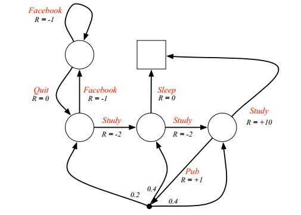

---
### Policies
策略$\pi$ 是在给定状态下，在动作上的分布
$\pi(a\mid s) = P[A_t=a \mid S_t = s]$
- 策略完全定义了agent的行为
- MDP的策略依赖于当前的状态(并不是历史)
- 即，策略是静态的（与时间无关）
$A_t \sim \pi(. \mid S_t)$

---
Policies
- 给定MDP $M=(S,A,P,R,\gamma)$ 和策略 $\pi$
- 状态序列$S_1,S_2,...$是马尔科夫过程$(S,P^{\pi})$
- 状态和奖励序列$S_1,R_1,S_2,...$ 是马尔科夫奖励过程$(S,P^{\pi},R^{\pi}, \gamma)$
- 这里
$P_{ss'}^{\pi} = \sum_{a \in A} \pi(a \mid s)P_{ss'}^{a}$
$R_{s}^{\pi} = \sum_{a \in A} \pi(a \mid s)R_s^a$

---
### Value Function
- MDP的状态值函数 $v_{\pi}(s)$ 是从状态$s$ 开始，遵循策略 $\pi$的期望回报 
$v_{\pi}(s) = E_{\pi}[G_t \mid S_t = s]$
- 动作-价值函数，是从状态$s$ 开始，采取动作$a$， 并遵循策略 $\pi$ 的期望回报
$q_{\pi}(s, a) = E_{\pi}[G_t \mid S_t = s, A_t = a]$

---
### Example: State-Value Function for Student MDP
&nbsp;&nbsp;&nbsp;&nbsp;&nbsp;&nbsp;&nbsp;&nbsp;&nbsp;&nbsp;&nbsp;&nbsp;&nbsp;&nbsp;

---
### Bellman Expectation Equation
状态价值函数也可以被分解为即时回报和后续状态的折扣值。
$v_{\pi}(s) = R_s + \gamma v_{\pi}(S_{t+1})$
$q_{\pi}(s, a) = R_s^a + \gamma q_{\pi}(S_{t+1}, A_{t+1})$

---
### Bellman Expectation Equation for $V_{\pi}$
&nbsp;&nbsp;&nbsp;&nbsp;&nbsp;&nbsp;&nbsp;&nbsp;&nbsp;&nbsp;&nbsp;&nbsp;&nbsp;&nbsp;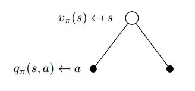
$v_{\pi}(s) = \sum_{a \in A} \pi(a \mid s)q_{\pi}(s, a)$

---
### Bellman Expectation Equation for $Q_{\pi}$
&nbsp;&nbsp;&nbsp;&nbsp;&nbsp;&nbsp;&nbsp;&nbsp;&nbsp;&nbsp;&nbsp;&nbsp;&nbsp;&nbsp;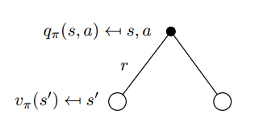
$q_{\pi}(s,a) = R_s^a + \gamma\sum_{s' \in S}P_{ss'}^{a}v_{\pi}(s')$

---
### Bellman Expectation Equation for $V_{\pi}$
&nbsp;&nbsp;&nbsp;&nbsp;&nbsp;&nbsp;&nbsp;&nbsp;&nbsp;&nbsp;&nbsp;&nbsp;&nbsp;&nbsp;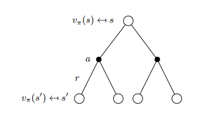
$v_{\pi}(s)=\sum_{a \in A} \pi(a\mid s)q_{\pi}(s,a)$
$=\sum_{a \in A} \pi(a \mid s)(R_s^a + \gamma \sum_{s' \in S}(P_{ss'}^av_{\pi}(s')))$

---
### Bellman Expectation Equation for $Q_{\pi}$
&nbsp;&nbsp;&nbsp;&nbsp;&nbsp;&nbsp;&nbsp;&nbsp;&nbsp;&nbsp;&nbsp;&nbsp;&nbsp;&nbsp;
$q_{\pi}(s,a)=R_s^a + \gamma P_{ss'}^{a}\sum_{a' \in A}\pi(a' \mid s')q(s',a')$

---
### Example: Bellman Expectation Equation in Student MDP
&nbsp;&nbsp;&nbsp;&nbsp;&nbsp;&nbsp;&nbsp;&nbsp;&nbsp;&nbsp;&nbsp;&nbsp;&nbsp;&nbsp;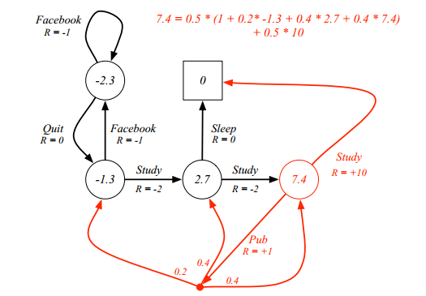

---
### Bellman Exception Equation(Matrix Form)
bellman期望方程可以使用MRP方便的表达
$v_{\pi}=R^{\pi} + \gamma P^{\pi}v_{\pi}$
可以直接求解
$v_{\pi} = (1 - \gamma P^{\pi})^{-1} R^{\pi}$

---
### Optimal Value Function
最优状态价值函数$v_*(s)$是所有策略中的最优值
$v_*(s)=max_{\pi} v_{\pi}(s)$
最优动作价值函数$q_*(s,a)$是所有策略中的最优动作价值函数
$q_*(s,a)=max_{\pi}q_{\pi}(s,a)$
- 最优价值函数声明了MDP中可能达到的最优表现
- MDP被解决当我们知道其最优价值函数

---
### Example: Optimal Value Function for Student MDP
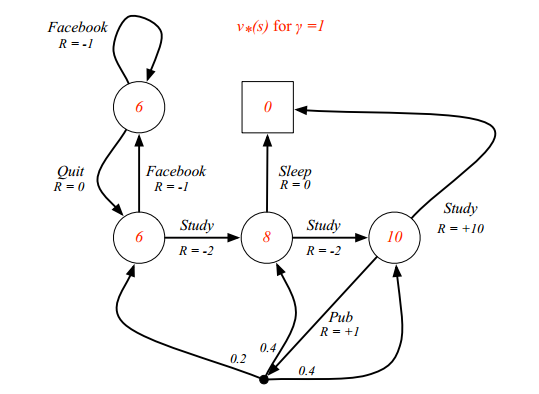

---
### Example: Optimal Action-Value Function for Student MDP
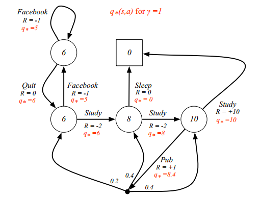

---
### Optimal Policy
定义一个在所有策略上的偏序
$\pi \ge \pi{'}$ if $v_{\pi}(s) \ge v_{\pi'}(s), \forall s$
定理：
对于任何马尔科夫决策过程
- 存在一个最优策略$\pi_{*}$，好于或等于其他所有的策略
- 所有最优化策略可以达到最优化价值函数，$v_{\pi_{*}}(s) = v_{*}(s)$
- 所有最优化策略可以达到最优化动作-价值函数，$q_{\pi_{*}}(s,a) = q_{*}(s,a)$

---
### Finding an Optimal Policy
最优化策略可以通过在$q_{*}(s,a)上求最大值得到$
$\pi_{*}(a \mid s) = \left\{ \begin{aligned}1 & & if \ a = argmax_{a \in A} \ q_{*}(s,a)  \\ 0 & & otherwise \end{aligned}  \right.$
- 对于任何MDP,始终存在确定性的最优策略
- 如果我们知道$q_{*}(s,a),我们立刻可以知道最优策略$

---
### Example: Optimal Policy for Student MDP
&nbsp;&nbsp;&nbsp;&nbsp;&nbsp;&nbsp;&nbsp;&nbsp;&nbsp;&nbsp;&nbsp;&nbsp;&nbsp;&nbsp;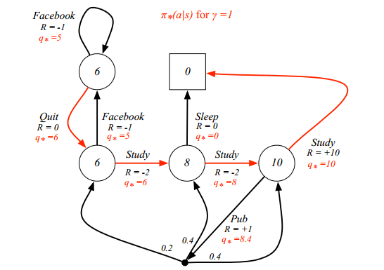

---
### Bellman Optimality Equation for $v_{*}$
最优价值函数和Bellman最优方程是递归相关的。
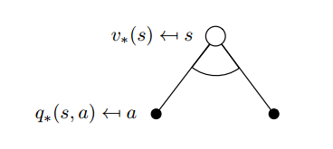
$v_{*}(s) = max_{a} q_{*}(s,a)$

---
### Bellman Optimality Equation for $Q_{*}$
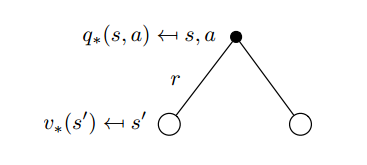
$q_{*}(s,a)=R_s^a + \gamma \sum_{s' \in S} P_{ss'}^av_{*}(s')$

---
### Bellman Optimality Equation for $V_{*}$

$v_{*}(s) = max_{a} R_s^a+\gamma \sum_{s' \in S} P_{ss'}^av_{*}(s')$

---
### Bellman Optimality Equation for $Q_{*}$
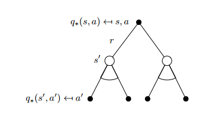
$q_{*}(s,a) = R_s^a + \gamma \sum_{s'\in S} P_{ss'}^{a} max_{a'} q_{*}(s',a')$

---
### Example: Bellman Optimality Equation in Student MDP
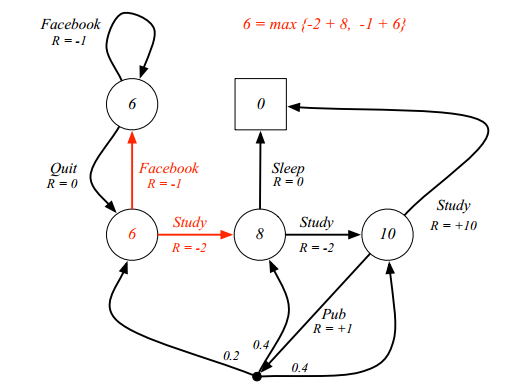

---
### Solving the Bellman Optimality Equation
- Bellman最优方程是非线性的
- 没有闭合解（一般来说）
- 很多迭代解决方法
  - Value Iteration(价值迭代)
  - Policy Iteration（策略迭代）
  - Q-learning
  - Sarsa

---
### Extensions to MDPs
- 无限和连续MDPs
- 部分可观测MDPs
- 无折扣，平均奖励MDPs

---
### Infinite MDPs
下列扩展都是可能的
- 可数无限状态或动作空间
  - 直接求解
- 连续状态或动作空间
  - 线性二次模型的闭合形式
- 连续时间
  - 需要偏微分方程
  - Hamilton-Jacobi-Bellman (HJB) equation
  - 将Bellman方程的极限情况视为时间步长 $\rightarrow$ 0

---
### POMDPs
部分可观察马尔科夫决策过程是拥有隐状态的MDP。它是有动作的隐马尔科夫模型。
POMDP是元组$(S,A,O,P,R,Z,\gamma)$
- S是状态的有限集合
- A是动作的有限集合
- O是观察的有限集合
- P是状态转移概率矩阵
$P_{ss'}^{a}=P[S_{t+1} = s \mid S_t =s,A_t = a]$
- R是奖励函数
- Z是观察函数
$Z_{s'o}^a = P[O_{t+1} = o \mid S_{t+1}=s', A_t=a]$
- $\gamma$ 是折扣因子，$\gamma \in [0,1]$

---
### Belief States
定义
历史$H_t$ 是动作，观察和奖励的序列
$H_t=A_0,O_1,R_1, ..., A_{t-1},O_t,R_t$
定义
信念状态$b(h)$ 是给定历史$h$的情况下，在所有状态上的一个分布。
$b(h)=(P[S_t=s^1 \mid H_t = h], ..., P[S_t=s^n \mid H_t = h])$

---
### Reductions of POMDPs
- 历史$H_t$ 满足马尔科夫性
- 信念状态$b(H_t)$满足马尔科夫性
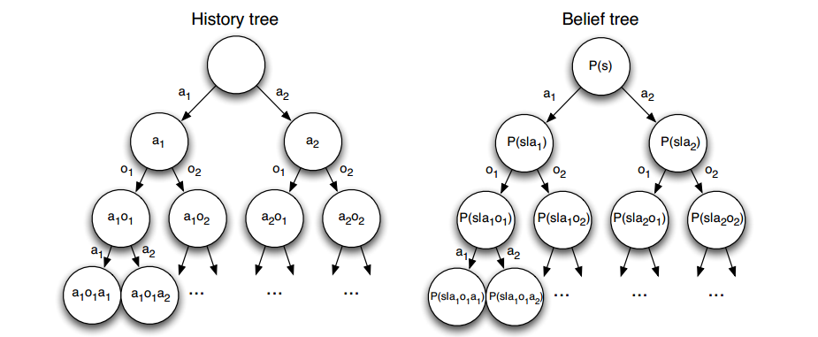
- POMDP可以被约减为（无限）历史树
- POMDP可以为约减为（无限）信念状态树

---
### Ergodic Markov Process
Ergodic Markov process 是
- Recurrent（循环的）: 每个状态在有限的次数中可以被访问
- Aperiodic（非周期性的）: 每个状态被访问是没有任何系统性周期的
定理
Ergodic Markov process有一个固定的静态分布$d^{\pi}(s)有下列属性$
$d^{\pi}(s) =\sum_{s' \in S} d^{\pi}(s')P_{ss'}$

---
### Ergodic MDP
MDP是可比案例的当马尔科夫链包含的策略是可遍历的
对于任意策略$\pi$，一个可遍历MDP在每个时间步有平均奖励$\rho^\pi$是独立于起始状态。
$\rho^{\pi} = lim_{T\rightarrow \infty} \frac{1}{T}E[\sum_{t=1}^{T}R_t]$

---
### Average Reward Value Function
- 价值函数是不打折扣时，ergodict MDP可以被表示为平均奖励
- $\tilde{v_{\pi}}(s)$ 是额外的奖励，因为从状态$s$开始
 $\tilde{v_{\pi}}(s) = E_{\pi}[\sum_{k=1}^{\infty}(R_{t+k}-\rho^{\pi}) \mid S_t = s]$
- 对应的平均奖励Bellman等式
$\tilde{v_{\pi}}(s) = E_{\pi}[(R_{t+1}-\rho^{\pi}) + \sum_{k=1}^{\infty}(R_{t+k+1} - \rho^{\pi}) \mid S_t = s]$
$= E_{\pi}[(R_{t+1} - \rho^{\pi}) + \tilde{v_{\pi}}(S_{t+1})\mid S_t=s]$

---
### Questions?
The only stupid question is the one you were afraid to ask but never did.
-Rich Sutton

