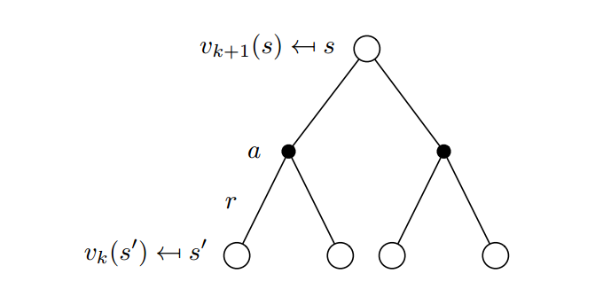
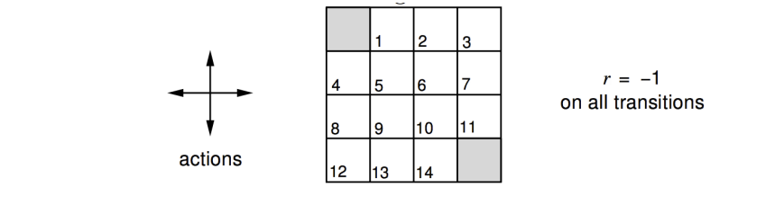
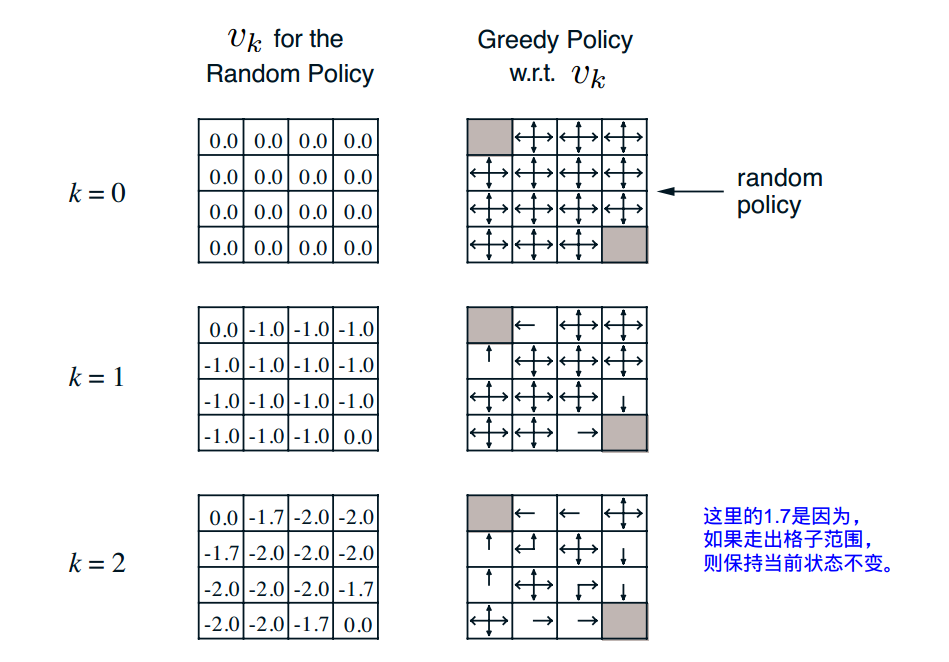
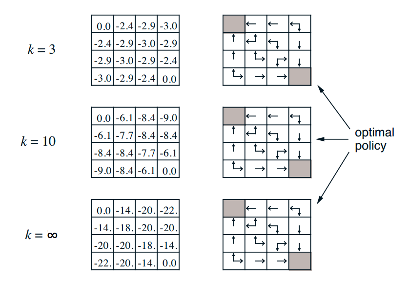
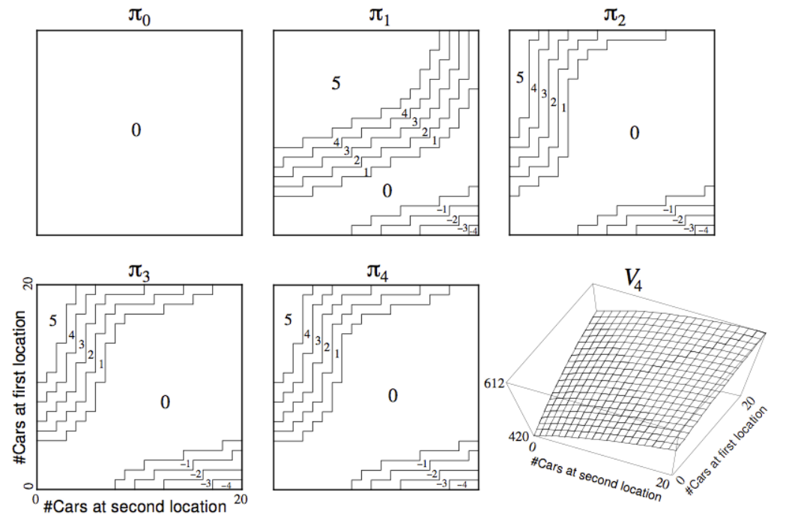
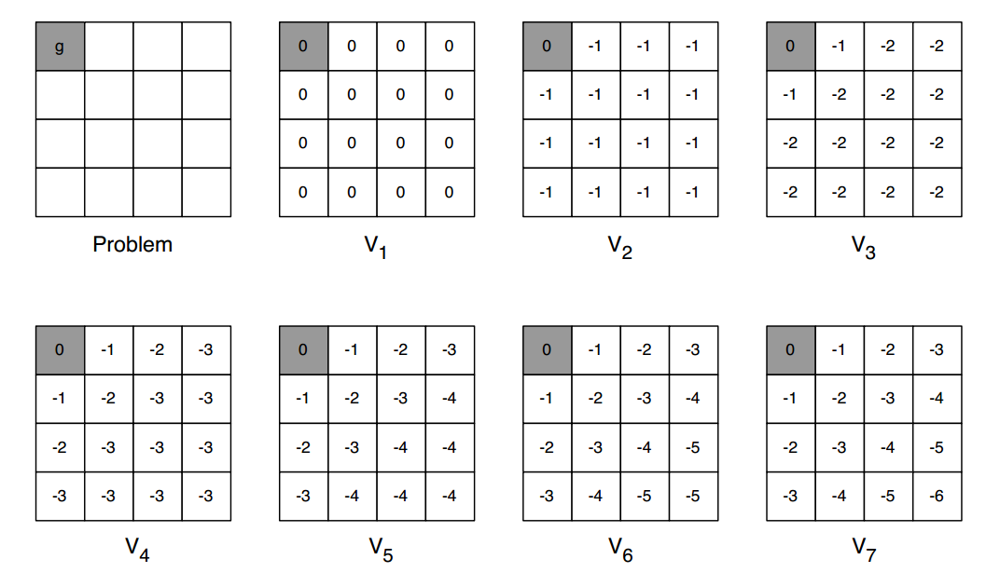
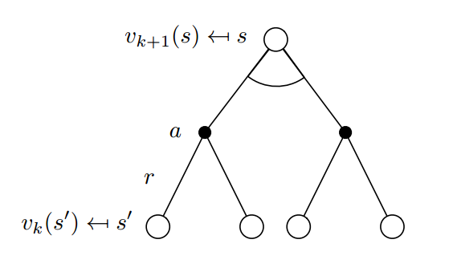
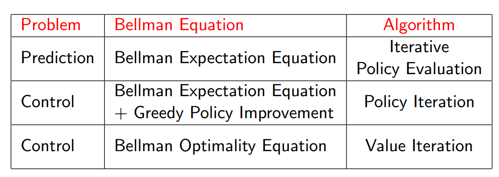

## Lecture 3: Planning by Dynamic Programming
David Silver
翻译：xiaotian zhao

---
### Outline
- Introduction
- Policy Evaluation
- Policy Iteration
- Value Iteration
- Extensions to Dynamic Programming
-  Contraction Mapping

---
### What is Dynamic Programming?
Dynamic（动态） 问题有时间和序列属性
Programming(规划) 优化“规划”，例如，策略；类似于线性规划

- 解决复杂问题的一种方法
- 通过将他们划分为子问题
  - 解决子问题
  - 将子问题的解决方案组合起来

---
### Requirements for Dynamic Programming
动态规划是一种非常通用的解决方案，当问题具有下列两个性质时：
- 最优子结构
  - 最优原则适用
  - 优化方案可以被分解到子问题中
- 重叠子问题
  - 子问题多次复发
  - 解决方案可以被缓存和复用
- 马尔科夫决策过程满足这两个性质
  - Bellman方程给出了循环分解
  - 价值函数存储和复用解决方案

---
### Planning by Dynamic Programming
- 动态规划假设MDP的所有信息已知
- 它在MDP中被用来做planning
- 对预测问题
  - 输入：MDP $(S,A,P,R,\gamma)$ 和策略 $\pi$
  - 或：MRP$(S,P^{\pi},R^{\pi}, \gamma)$
  - 输出：价值函数 $v_{\pi}$
- 对控制问题
  - 输入： MDP $(S, A, P, R,\gamma)$
  - 输出：最优化价值函数 $v_{*}$和最优化策略$\pi_{*}$

---
### Other Applications of Dynamic Programming
动态规划也被用来解决其他问题，例如：
- 调度问题
- 字符串算法（例如 序列对齐）
- 图算法（例如 最短路径算法）
- 图模型（例如 维特比算法）
- 生物信息学（例如 晶体模型）

---
### Iterative Policy Evaluation（迭代策略评估）
- 问题：评价一个给定的策略 $\pi$
- 解决方案： 迭代的使用bellman期望备份
- $v_1 \rightarrow v_2 \rightarrow ... \rightarrow v_{\pi}$
- 使用同步备份
  - 在每个迭代步 k+1
  - 对于所有状态 $s \in S$
  - 从$v_k(s')$ 更新$v_{k+1}(s)$
  - 这里$s'$ 是$s$的后继状态
- 我们稍后将会讨论同步备份
- $v_{\pi}$ 的收敛性将在本节课的最后给出证明

---
### Iterative Policy Evaluation （迭代策略评估）

$v_{k+1}(s) = \sum_{a \in A} \pi(a \mid s) (R_{s'}^a + \gamma \sum_{s' \in S} P_{ss'}^{a}v_k(s'))$
$v_{k+1} = R^{\pi} + \gamma P^{\pi}v^{k}$

---
### Evaluating a Random Policy in the Small Gridworld

- 无折扣可遍历MDP($\gamma =1$)
- 非终结状态$1,2,3,...,14$
- 一个终结状态（暗灰色的格子，被展示了两次）
- 导致走出格子的动作保持当前状态不变
- 奖励是-1，直到到达终止状态
- Agent遵循下述的随机策略
$\pi(n \mid .) = \pi(e \mid .) = \pi(s \mid .) = \pi(w \mid .) = 0.25$

---
### Iterative Policy Evaluation in Small Gridworld

---
### Iterative Policy Evaluation in Small Gridworld

---
### How to Improve a Policy
- 给定策略$\pi$
  - 评价策略$\pi$
  $v_{\pi}(s) = E[R_{t+1} + \lambda R_{t+2} + ... \mid S_t = s]$
  - 提升策略通过在遵循$v_{\pi}$的情况下执行贪心策略
  $\pi' = greedy(v_{\pi})$
- 在小型网格世界提升策略是最优的，$\pi' = \pi^{*}$
- 一般来说，需要更多的迭代的提升和评估
- 但是策略迭代这个过程总是收敛到$\pi^{*}$

---
### Policy Iteration

策略评估（Policy evaluation） 评估$v_{\pi}$
迭代策略评估
策略提升（Policy improvement） 生成策略 $\pi' \ge \pi$
贪心策略提升
$\pi_{*} \Longleftrightarrow v_{*}$

---
### Jack’s Car Rental
- 状态：两个地点，每个地点最多20辆车
- 动作： 移动最多5辆车晚上在两个地点之间
- 奖励：每辆车租车费用为 $10(必须是可租的)
- 转移：汽车返还和请求是随机的
  - 泊松分布，n归还/请求概率是 $\frac{\lambda^n}{n!}e^{-\lambda}$
  - 第一个地点：平均请求=3，平均归还=3
  - 第二个地点：平均请求=4， 平均归还=4

---
### Policy Iteration in Jack’s Car Rental

---
### Policy Improvement
- 考虑确定性策略，$a=\pi(s)$
- 我们可以采用贪心算法提升策略
$\pi'(s)=argmax_{a\in A} \ q_{\pi}(s,a)$
- 这可以提高任何一个状态的值
$q_{\pi}(s, \pi'(s)) = max_{a \in A} \ q_{\pi}(s,a) \ge q_{\pi}(s, \pi(s)) = v_{\pi}(s)$
- 它因此提高了价值函数，$v_{\pi'}(s) \ge v_{\pi}(s)$
$v_{\pi}(s) \le q_{\pi}(s, \pi'(s))=E_{\pi'}[R_{t+1} + \gamma v_{\pi}(S_{t+1}) \mid S_t=s]$
$\le E_{\pi'}[R_{t+1 } + \gamma q_{\pi}(S_{t+1}, \pi'(S_{t+1})) \mid S_t = s]$
$\le E_{\pi'}[R_{t+1} + \gamma R_{t+2} + \gamma^2 q_{\pi}(S_{t+2}, \pi'(S_{t+2})) \mid S_t=s]$
$\le E_{\pi'}[R_{t+1} + \gamma R_{t+2} + \gamma^2 R_{t+3} + ... \mid S_t=s] = v_{\pi'}(s)$

---
### Policy Improvement
- 如果提升停止
$q_{\pi}(s, \pi'(s))=max_{a \in A} \ q_{\pi}(s,a) = q_{\pi}(s, \pi(s))=v_{\pi}(s)$
- 然后Bellman最优化等式被满足
$v_{\pi}(s) = max_{a \in A} \ q_{\pi}(s,a)$
- 因此 $v_{\pi}(s) = v_{*}(s) \ ,\forall s \in S$
- 所以$\pi$ 是最优策略

---
### Modified Policy Iteration
- 策略评估是否需要收敛到 $v_{\pi}$ ?
- 或者我们应该引入一个终止条件
  - 例如，$\epsilon-convergence$价值函收敛
- 或者简单的在第k次迭代之后停止策略评估？
- 例如，在小网格世界中 $k=3$足够达到最优策略。
- 为什么不在每次迭代中更新策略？即，在$k=1$时停止
  - 这等价与价值迭代（下一个部分）

---
### Generalised Policy Iteration

策略评估（Policy evaluation） 评估$v_{\pi}$
迭代策略评估,可以设置提前终止条件
策略提升（Policy improvement） 生成策略 $\pi' \ge \pi$
贪心策略提升
$\pi_{*} \Longleftrightarrow v_{*}$

---
### Principle of Optimality（最优化原则）
优化策略可以被分解为两个部分：
- 最优首动作$A_{*}$
- 后续状态中紧随的最优策略
定理
如果策略$\pi(a \mid s)$从状态s达到最优值，$v_{\pi}(s) = v_{*}(s)$，当且仅当
- 对于任何从状态s可到达的状态s'
- $\pi$ 可以从状态s'到达最优值， $v_{\pi}(s') = v_{*}(s')$

---
### Deterministic Value Iteration（确定性价值迭代）
- 如果我们知道子问题$v_{*}(s)$的解决方案
- 解决方案$v_{*}(s)$可以通过向前看一步来解决
$v_{*}(s) \leftarrow max_{a \in A}R_s^a + \gamma\sum_{s' \in S} P_{ss'}^{a}v_{*}(s')$
- 值迭代的思想就是每一步应用这些更新
- 直觉：从最后的奖励开始并且向后工作
- 仍然适用于循环随机MDP

---
### Example: Shortest Path

---
### Value Iteration
- 问题：找到最优策略$\pi$
- 解决方案：迭代应用Bellman最优化备份
- $v_1 \rightarrow v_2 \rightarrow ... \rightarrow v_{\pi}$
- 使用同步备份
  - 对于每次迭代k+1
  - 对于所有状态 $s \in S$
  - 从$v_k(s')$更新$v_{k+1}(s)$
- $v_{*}$的收敛性稍后证明
- 不像策略迭代，这里没有明确的策略
- 中间价值函数也许不明确的对应任何策略

---
### Value Iteration 

$v_{k+1}(s) = max_{a \in A}(R_s^a + \gamma \sum_{s' \in S}P_{ss'}^{a}v_k(s'))$
$v_{k+1} = max_{a\in A} R^a + \gamma P^av_k$

---
### Example of Value Iteration in Practice
http://www.cs.ubc.ca/∼poole/demos/mdp/vi.html
(链接不可用)

---
### Synchronous Dynamic Programming Algorithms(同步动态规划算法)

- 算法是基于状态-值函数$v_{\pi}(s)$ 或 $v_{*}(s)$
- 每个迭代时间复杂度$O(mn^2)$,m个动作和n个状态
- 也可以基于动作-值函数$q_{\pi}(s,a)$ 或 $q_{*}(s,a)$
- 每个迭代时间复杂度是 $O(m^2n^2)$

---
### Asynchronous Dynamic Programming （异步动态规划）
- 到目前为止，所描述的动态规划都是同步备份的
- 即，所有的状态都是并行备份的
- 异步动态规划可以以任何顺序单独备份状态
- 对于每个选择的状态，应用适当的备份
- 可以有效减少计算
- 如果所有状态持续被选择可以保证收敛

---
### Asynchronous Dynamic Programming（异步动态规划）
三个异步动态规划的简单思路：
- In-place动态规划(In-Place Dynamic Programming)
- 优先清除(Prioritised Sweeping)
- 实时动态规划()

---
### In-Place Dynamic Programming
- 同步值迭代存储价值函数的两个拷贝
for all s in S
$v_{new}(s) \leftarrow max_{a\in A}(R_s^a + \gamma\sum_{s'\in S}P_{ss'}^{a}v_{old}(s'))$
$v_{old} \leftarrow v_{new}$
- 内部值迭代仅存储价值函数的一个拷贝
for all s in S
$v(s) \leftarrow max_{a \in A}(R_s^a + \gamma \sum_{s' \in S} P_{ss'}^{a}v(s'))$

---
### Prioritised Sweeping
- 使用Bellman误差指导状态选择，即
$\mid max_{a \in A} (R_s^a + \gamma \sum_{s' \in S}P_{ss'}^av(s')) - v(s) \mid$
- 备份拥有最大Bellman误差的状态
- 在做完备份之后更新受到Bellman误差影响的状态
- 需要逆向动态的知识（前状态）
- 可以通过维持一个优先队列来有效实现

---
### Real-Time Dynamic Programming
- 思想：只有状态和agent相关
- 使用agent的经验指导选择状态
- 在每个时间步$S_t, A_t, R_{t+1}$
- 备份状态$S_t$
$v(S_t) \leftarrow max_{a \in A}(R_{S_t}^a + \gamma \sum_{s' \in S}P_{S_{t}s'}v(s'))$

---
### Full-Width Backups
- 动态规划使用full-width 备份
- 对于每个备份（同步或异步）
  - 每个后继状态和动作被考虑
  - 使用MDP的转移概率和奖励函数
- DP对于中等规模的问题是有效的（数百万个状态）
- 对于大规模问题会遇到Bellman维度爆炸
  - 状态的数量 $n = \mid S \mid$随着状态变量指数型增长
- 即使只有一个备份也太昂贵

---
### Sample Backup(采样备份)
- 在接下来的课程里，我们将会考虑采样备份
- 使用采样奖励和采样转移$(S,A,R,S')$
- 替换奖励函数$R$和转移动态$P$
- 优点：
  - Model-free(无需模型)：不需要MDP的先验知识
  - 通过采样打破维度爆炸
  - 备份耗费是常量的，独立于$n = \mid S \mid$

---
### Approximate Dynamic Programming(近似动态规划)
- 近似值函数
- 使用函数近似器 $\hat{v}(s, w)$
- 在$\hat{v}(., w)$上应用动态规划
- 即，在第k次迭代中重复拟合迭代
  - 采样状态 $\tilde{S} \subseteq S$
  - 对于每个状态 $s \in \tilde{S}$,使用Bellman最优方程估计目标值
  $\tilde{v_k}(s) = max_{a \in A}(R_s^a + \gamma \sum_{s' \in S}P_{ss'}^{a}\hat{v}(s', w_k))$
  - 训练下一个值函数$\hat{v}(.,w_{k+1})$使用目标$\{<s, \tilde{v_k}(s)>\}$

---
### Some Technical Questions
- 我们为什么知道值函数可以收敛到$v_{*}$?
- 或者迭代策略评估可以收敛到$v_{\pi}$?
- 和因此策略迭代可以收敛到$v_{*}$?
- 这种解法是唯一的么？
- 这些算法收敛速度多快？
- 这些问题可以被压缩映射定理解决

---
### Value Function Space
- 考虑在价值函数上的向量空间$V$
- 有$\mid S \mid$个维度
- 在这个空间的每个点完整的声明了价值函数 $v(s)$
- Bellman备份如何处理这些空间中的点？
- 我们将证明它使价值函数更加接近
- 因此备份必须集中在一个唯一的解决方案上

---
### Value Function $\infty$-Norm
- 我们将要使用 $\infty$范数 测量价值函数$u$和$v$的距离
- 即，两个状态价值的最大差值
$\mid\mid u - v \mid\mid_{\infty} = max_{\infty}\mid u(s) - v(s)\mid$

---
### Bellman Expectation Backup is a Contraction
- 定义Bellman期望备份操作$T^{\pi}$
$T^{\pi}(v) = R^{\pi} + \gamma P^{\pi}v$
- 这个操作是$\gamma-$压缩。即，它通过最小的$\gamma$让价值函数更近
$\mid\mid T^{\pi}(u) - T^{\pi}(v)\mid\mid_{\infty} = \mid\mid (R^{\pi} + \gamma P^{\pi}u) - (R^{\pi} + \gamma P^{\pi}v)\mid\mid_{\infty}$
$=\mid\mid \gamma P^{\pi}(u-v) \mid\mid$
$\le \mid\mid \gamma P^{\pi} \mid\mid u - v \mid\mid_{\infty} \mid\mid_{\infty}$
$\le \gamma\mid\mid u - v \mid\mid_{\infty}$

---
### Contraction Mapping Theorem
定理：（收缩映射定理）
对于所有指标空间$V$，是操作$T(v)$下完整的，这里T是 $\gamma-constraction$
- T收敛到一个唯一的固定点
- 使用线性收敛率$\gamma$

---
### Convergence of Iter. Policy Evaluation and Policy Iteration、
- Bellman期望操作 $T^{\pi}$有一个唯一固定点
- $v_{\pi}$是$T^{\pi}$的固定点
- 通过收缩映射定理
- 迭代策略评估收敛到$v_{\pi}$
- 策略迭代收敛到$v_{*}$

---
### Bellman Optimality Backup is a Contraction
- 定义Bellman最优备份操作$T^{*}$
$T^{*}(v)=max_{a \in A}R^a + \gamma P^{a} v$
- 这个操作是$\gamma-constraction$,即它通过最小的$\gamma$让价值函数更接近
$\mid\mid T^{*}(u) - T^{*}(v) \mid\mid_{\infty} \le \gamma \mid\mid u - v \mid\mid_{\infty}$

---
### Convergence of Value Iteration
- Bellman最优操作$T^{*}$有一个唯一固定点
- $v_{*}$是$T^{*}$的固定点
- 通过收缩映射定理
- 价值迭代可以收敛到$v_{*}$