## Lecture 4: Model-Free Prediction
David Silver
翻译：xiaotian zhao

---
### Outline
- Introduction
- Monte-Carlo Learning
- Temporal-Difference Learning
- TD($\lambda$)

---
### Model-Free Reinforcement Learning
- 上节课
  - 动态规划Planning
  - 解决已知信息的MDP
- 这节课
  - Model-Free Prediction(无模型预测)
  - 估计未知MDP的价值函数
- 下节课
  - Model-Free Control(无模型控制)
  - 优化未知MDP的价值函数

---
### Monte-Carlo Reinforcement Learning(蒙特卡洛强化学习)
- MC方法直接从经验的片段中学习
- MC是无模型的：没有MDP的转移和奖励知识
- MC从完整片段中学习：没有bootstrapping
- MC利用最简单可用思想：value = mean return
- 警告：只能在episodic MDP（有限可终止MDP）中使用MC
  - 所有片段必须终止

---
### Monte-Carlo Policy Evaluation
- 目标: 在策略$\pi$通过经验片段学习$v_{\pi}$
$S_1,A_1,R_2,...,S_k \sim \pi$
- 回忆 回报是折扣奖励的总和
$G_t = R_{t+1} + \gamma R_{t+2} + ... + \gamma^{T-1}R_T$
- 回忆 价值函数是回报的期望
$v_{\pi}(s) = E_{\pi}[G_t \mid S_t = s]$
- 蒙特卡洛策略评估使用经验平均回报而不是期望回报

---
### First-Visit Monte-Carlo Policy Evaluation（首次访问蒙特卡洛策略评估）
- 为了评估状态s
- 在片段中被第一次访问状态$s$的时间步$t$
- 提升计数器$N(s) \leftarrow N(s) + 1$
- 提升总回报 $S(s) \leftarrow S(s) + G_t$
- 价值通过平均回报进行评估 $V(s) = S(s) / N(s)$
- 遵循大数定律，$V(s) \rightarrow v_{\pi}(s)$随着$N(s) \rightarrow \infty$

---
### Every-Visit Monte-Carlo Policy Evaluation
- 为了评估状态s
- 在片段中每次访问状态$s$的时间步$t$
- 提升计数器$N(s) \leftarrow N(s) + 1$
- 提升总回报 $S(s) \leftarrow S(s) + G_t$
- 价值通过平均回报进行评估 $V(s) = S(s) / N(s)$
- 遵循大数定律，$V(s) \rightarrow v_{\pi}(s)$随着$N(s) \rightarrow \infty$

---
### Blackjack Example(21点游戏 实例)
- 状态（200个）
  - 当前和（12 - 21）
  - 庄家展示的牌（ace-10）
  - 我是否有可用的ace？(是，否)
- 动作stick:停止接收牌（并停止）
- 动作 twist: 拿另一张牌（非替换）
- stick的回报
  - +1 如果牌的和 > 庄家的牌之和
  - 0 如果 牌之和 = 庄家的牌之和
  - -1 如果牌之和 < 庄家的牌之和
- twist的回报
  - -1 如果牌之和 > 21
  - 0 否则
- 转移矩阵： 自动执行twist动作，如果牌的和 < 12

---
### Blackjack Value Function after Monte-Carlo Learning

策略：执行动作stick当牌之和 $\ge 20$，否则执行动作 twist

---
### Incremental Mean（增量平均）
序列$x_1, x_2,...$的平均值$\mu_1, \mu_2,...$可以增量计算
$\mu_{k}=\frac{1}{k} \sum_{j=1}^{k}x_j$
$=\frac{1}{k}(x_k + \sum_{j=1}^{k-1}x_j)$
$=\frac{1}{k}(x_k + (k-1)\mu_{k-1})$
$=\frac{1}{k}(x_k-\mu_{k-1}) + \mu_{k-1}$

---
### Incremental Monte-Carlo Updates(增量蒙特卡洛更新)
- 在片段$S_1,A_1,R_2,...,S_T$之后增量更新$V(s)$
- 对于每一个状态$S_t$和回报$G_t$
$N(S_t) \leftarrow N(S_t) + 1$
$V(S_t) \leftarrow \frac{1}{N(S_t)}(G_t-V(S_t)) + V(S_t)$
- 对于非静态问题，它可以很容易的追踪运行时的平均值，并且忘记老的片段
$V(S_t) \leftarrow V(S_t) + \alpha(G_t - V(S_t))$

---
### Temporal-Difference Learning（时间差分学习）
- TD 方法直接从经验的片段中学习
- TD 是无模型的：不需要MDP的转移/奖励
- TD 可以学习不完整的片段，通过bootstrapping
- TD 依据猜测更新猜测

---
### MC and TD
- 目标：在策略$\pi$ 从经验中在线学习$v_{\pi}$
- 增量每次访问蒙特卡洛
  - 根据真实的反馈$G_t$更新$V(S_t)$
  $V(S_t) \leftarrow V(S_t) + \alpha(G_t - V(S_t))$
- 简单的时间-差分学习算法：TD(0)
  - 依据预估回报$R_{t+1} + \gamma V(S_{t+1})$更新$V(S_t)$
  $V(S_t) \leftarrow V(S_t) + \alpha(R_{t+1} + \gamma V(S_{t+1})-V(S_t))$
  - $R_{t+1} + \gamma V(S_{t+1})$被称为TD-target
  - $\delta_t = R_{t+1} + \gamma V(S_{t+1})-V(S_t)$被成为TD-error（TD误差）

---
### Driving Home Example
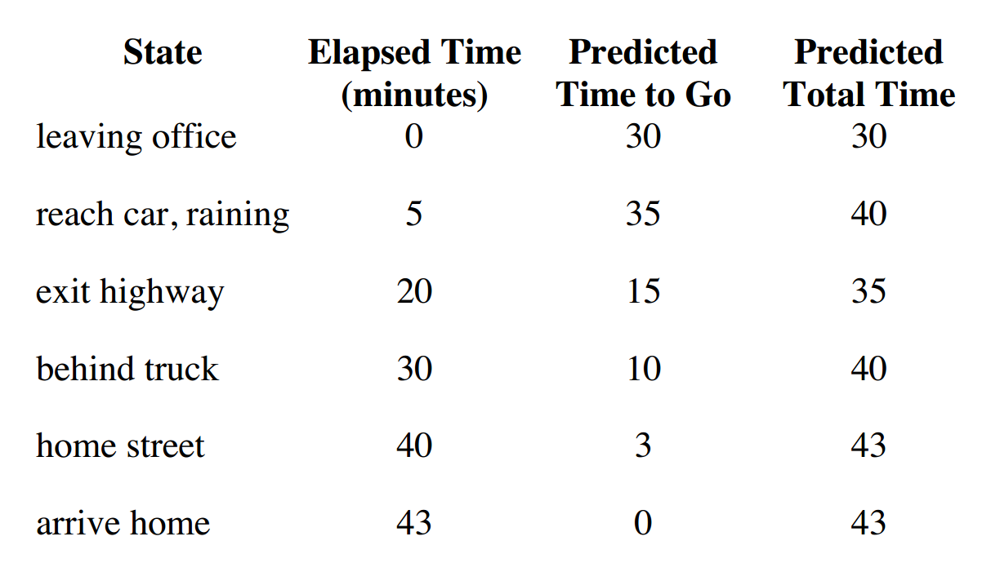

---
### Driving Home Example: MC vs. TD
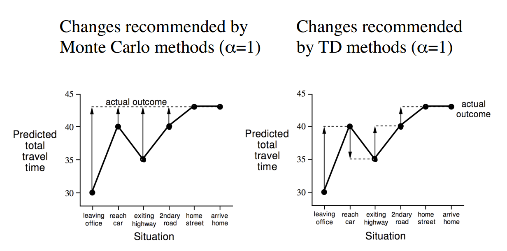

---
### Advantages and Disadvantages of MC vs. TD
- TD可以在知道最后的结果前学习
  - TD可以在每个时间步之后在线学习
  - MC必须等到片段结束，回报已知之后
- TD可以不需要最后结果进行学习
  - TD从不完整序列中学习
  - MC只能从完整序列中学习
  - TD在持续环境（无终结）环境中可以工作
  - MC必须工作在episodic(可终结)环境中

---
### Bias/Variance Trade-Off
- 回报$G_t = R_{t+1} + \gamma R_{t+2} + ... + \gamma^{T-1}R_T$是v_{\pi}(S_t)的无偏估计
- 真实的TD-target $R_{t+1} + \gamma v_{\pi}(S_{t+1})$ 也是$v_{\pi}(S_t)$的无偏估计
- TD target $S_{t+1} + \gamma V(S_{t+1})$是$v_{\pi}(S_t)$的有偏估计
- TD target 有比回报更低的方差
  - 回报依靠很多随机动作，转移，奖励
  - TD-target 依靠一个随机动作，转移和奖励

---
### Advantages and Disadvantages of MC vs. TD
- MC有高方差，0偏差
  - 良好的收敛性质
  - 即使是函数估计
  - 对初始值的不是非常敏感
  - 理解和使用非常简单
- TD有低方差，一些偏差 
  - 比MC更为有效
  - TD(0)收敛到$v_{\pi}(s)$
  - 但是在函数估计时并不经常可以收敛到
  - 对初始值更为敏感

---
### Random Walk Example
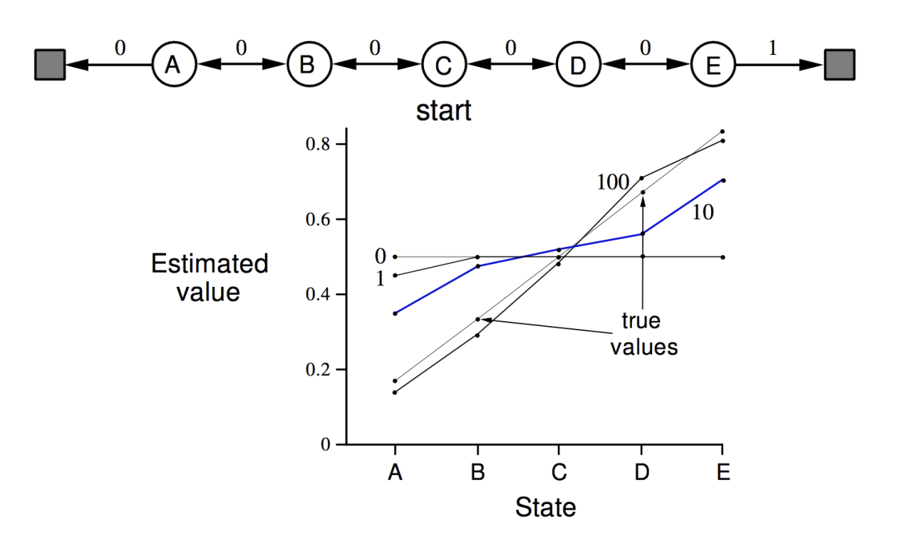

---
### Random Walk: MC vs. TD
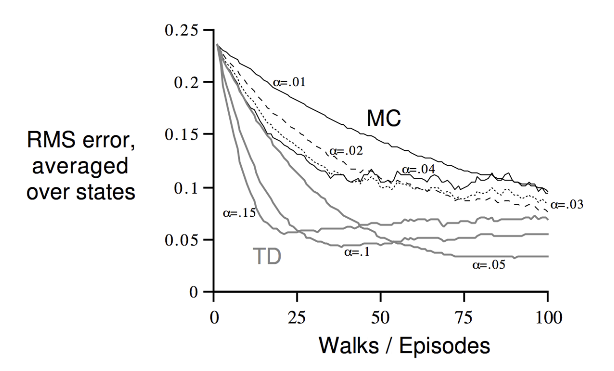

---
### Batch MC and TD
- MC和TD收敛：$V(s) \rightarrow v_{\pi}(s)$ 随着经验趋于无限 $experience \rightarrow \infty$
- 但是有限经验的batch解决方案是什么？
$s_1^1, a_1^1, r_2^1,...,s_T^1$
$...$
$s_1^K, a_1^K, r_2^K, ..., s_T^K$
  - 即，从片段k ($k \in [1,K]$)中重复采样
  - 在片段k上应用MC或者TD(0)

---
### AB Example
两个状态A,B；无折扣；经验的8个片段
A,0,B,0
B,1
B,1
B,1
B,1
B,1
B,1
B,0
V(A),V(B)是什么？

---
### AB Example
两个状态A,B；无折扣；经验的8个片段
A,0,B,0 | B,1 | B,1 | B,1 | B,1 | B,1 | B,1 | B,0
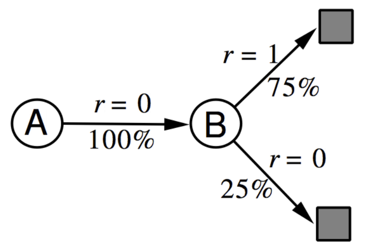
V(A),V(B)是什么？

---
### Certainty Equivalence
- MC收敛到最小均方误差的解决方案
  - 最符合观察到回报
  - 在AB Example中，$V(A) = 0$
- TD(0)收敛到马尔科夫模型的最大似然
  - 解决方案是最符合数据的MDP$(S,A,\hat{P},\hat{R},\gamma)$
  $\hat{P} = \frac{1}{N(s,a)} \sum_{k=1}^{K}\sum_{t=1}^{T_k}1(s_t^k,a_t^k,s_{t+1}^k=s,a,s')$
  $\hat{R_s^a} = \frac{1}{N(s,a)} \sum_{k=1}^{K}\sum_{t=1}^{T_k}1(s_t^k,a_t^k=s,a)r_t^k$
  - 在AB Example中，$V(A)=0.75$

---
### Advantages and Disadvantages of MC vs. TD 
- TD利用马尔科夫性
  - 通常在马尔科夫环境中更有效
- MC并不利用马尔科夫性
  - 通常在非马尔科夫环境中更有效

---
### Monte-Carlo Backup
$V(S_t) \leftarrow V(S_t) + \alpha(G_t - V(S_t))$
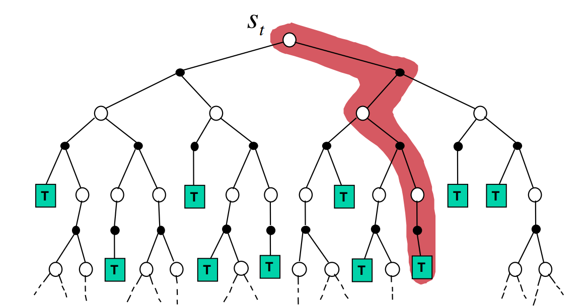

---
### Temporal-Difference Backup
$V(S_t) \leftarrow V(S_t) + \alpha(R_{t+1} + \gamma V(S_{t+1}) - V(S_t))$
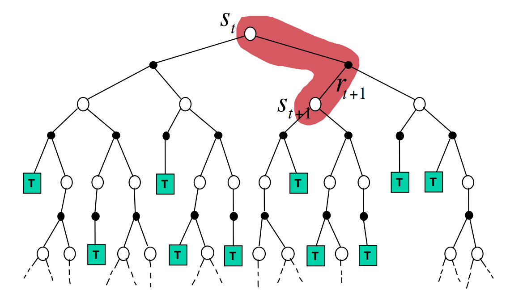

---
### Dynamic Programming Backup
$V(S_t) \leftarrow E_{\pi}(R_{t+1} + \gamma V(S_{t+1}))$
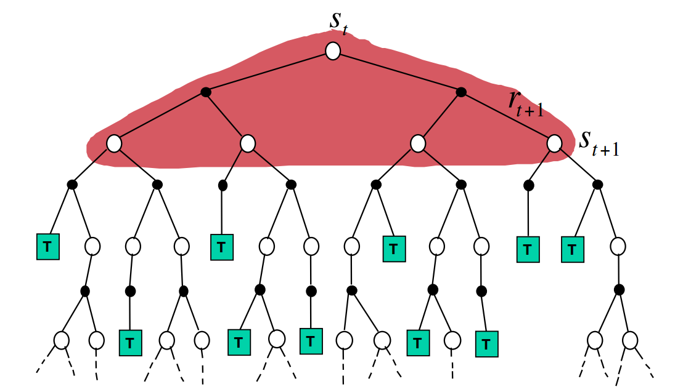

---
### Bootstrapping and Sampling
- Bootstrapping: 更新中包含估计
  - MC不采用bootstrap
  - DP bootstrap
  - TD bootstrap
- Sampling： 更新采样得到的期望
  - MC 采样
  - DP 不采样
  - TD 采样

---
### Unified View of Reinforcement Learning（强化学习的统一观点）
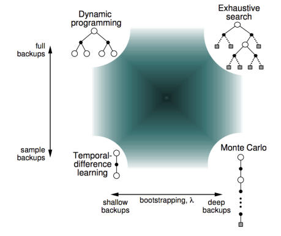

---
### n-Step Prediction
- TD-target向前看n步
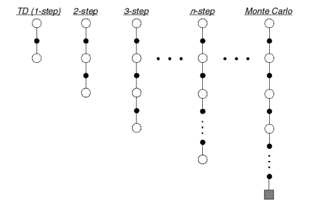

---
### n-Step Return
- 考虑接下来的n-步回报，对于$n=1,2,\infty$
n = 1 (TD) $\ \ G_T^{(1)}=R_{t+1} + \gamma V(S_{t+1})$
n = 2 (TD) $\ \ G_T^{(1)}=R_{t+1} + \gamma R_{t+2} + \gamma V(S_{t+2})$
...
n = 1 (MC) $\ \ G_T^{(1)}=R_{t+1} + \gamma R_{t+2} + ... + \gamma^{T-1}R_T)$
- 定义n-step 回报
$G_t^{n} = R_{t+1} + \gamma R_{t+2} + ... + \gamma^{n-1}R_{t+n} + \gamma^n V(S_{t+n})$
- n-step 时间差分学习
$V(S_{t}) \leftarrow V(S_t) + \alpha(G_t^{(n)}-V(S_t))$

---
### Large Random Walk Example
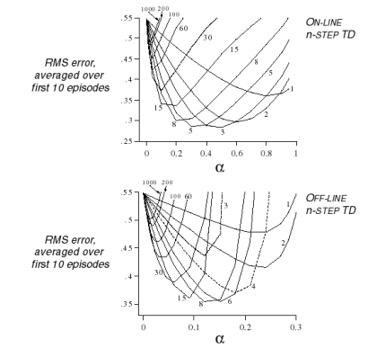

---
### Averaging n-Step Returns
- 我们将不同 n 对应的n-step回报进行平均
- 即 平均2-step和4-step回报
$\frac{1}{2}G^{(2)} + \frac{1}{2}G^{(4)}$
- 将两个不同时间步信息组合起来
- 我们是否可以有效综合所有时间步的信息？

---
### λ-return
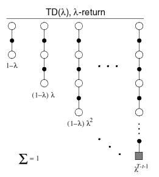
- $\lambda-return$组合n-step回报 $G_t^{(n)}$
- 使用权重$(1 - \lambda)\lambda^{n-1}$
$G_t^{\lambda} = (1-\lambda)\sum_{n=1}^{\infty} \lambda^{n-1}G_t^{(n)}$
- 前向视角$TD(\lambda)$
$V(S_t) \leftarrow V(S_t) + \alpha(G_t^\lambda - V(S_t))$

---
### TD($\lambda$) Weighting Function
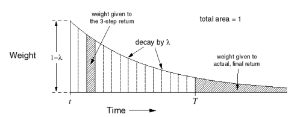
$G_{t}^{\lambda} = (1-\lambda)\sum_{n=1}^{\infty} \lambda^{n-1}G_t^{(n)}$

---
### Forward-view TD($\lambda$)
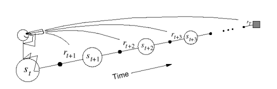
- 向着$\lambda-return$去更新价值函数
- 前向视角看到的未来去计算$G_t^{\lambda}$
- 就像MC，仅能使用完整片段进行计算

---
### Forward-View TD(λ) on Large Random Walk
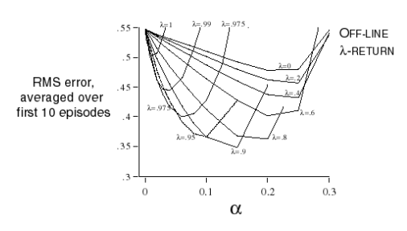

---
### Backward View TD(λ)
- 前向视角提供理论
- 后向视角提供机制
- 从不完整序列中，每一步在线更新

---
### Eligibility Traces
- 信用分配问题：铃铛或等是否会导致电击？
- 频率假设：将信用赋予频率最高的状态
- 最近假设：将信用赋予最近的状态
- Eligibility trace组合这两种假设
  - $E_0(s)=0$
  - $S_t(s)=\lambda E_{t-1}(s) + 1(S_t=s)$
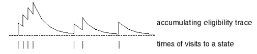

---
### Backward View TD(λ)
- 对每个状态$s$保持一个eligibility trace 
- 对每个状态$s$更新值 $V(s)$
- TD-error和Eligibility-trace成比例
$\delta_t = R_{t+1} + \gamma V(S_{t+1}) - V(S_t)$
$V(s) \leftarrow V(s) + \alpha \delta_t E_t(s)$

---
### TD(λ) and TD(0)
- 当$\lambda = 0$是，只有当前的状态被更新
$E_t(s) = 1(S_t=s)$
$V(s) \leftarrow V(s) + \alpha\delta_tE_t(s)$
- 这恰好等于TD(0)的更新等式
$V(S_t) \leftarrow V(S_t) + \alpha\delta_t$

---
### TD(λ) and MC
- 当$\lambda = 1$，信用只取决于片段的最后
- 考虑可遍历环境下的离线更新
- 在一个片段中，TD(1)的总更新和MC的总更新是相同的。
离线更新的和等于前向视角和后向视角的$TD(\lambda)$
$\sum_{t=1}^{T}\alpha \delta_tE_t(s)=\sum_{t=1}^{T} \alpha(G_t^{\lambda}-V(S_t))1(S_t=s)$

---
### MC and TD(1)
- 考虑在时间步t被访问过一次的片段状态$s$
- TD(1)的eligibility trace从访问开始折扣
$E_t(s)=\gamma E_{t-1}(s) + 1(S_t=s)$
$=\left \{ \begin{matrix} 0 & if & t \lt k \\1 & if & t\ge k \end{matrix} \right.$
- TD(1) 在线更新累计误差
$\sum_{t=1}^{T-1} \alpha\delta_tE_t(s) = \alpha\sum_{t=1}^{T-1} \gamma^{t-k}\delta_t = \alpha(G_k-V(S_k))$
- 片段结束时它累加的总误差
$\delta_k + \gamma\delta_{k+1} + \gamma^2 \delta_{k+2} + ... + \gamma^{T-1-k}\delta_{T-1}$

---
### Telescoping in TD(1)
当$\lambda =1$,TD误差可以约减为MC误差
$\delta_k + \gamma\delta_{k+1} + \gamma^2 \delta_{k+2} + ... + \gamma^{T-1-k}\delta_{T-1}$
$=R_{t+1} + \gamma V(S_{t+1})-V(S_t)$
$+\gamma R_{t+2} + \gamma^2 V(S_{t+2})- \gamma V(S_{t+1})$
$+\gamma^2 R_{t+3} + \gamma^3 V(S_{t+3})- \gamma^2 V(S_{t+2})$
$...$
$+\gamma^{T-1-t} R_{T} + \gamma^{T-t} V(S_{T})- \gamma^{T-1-k} V(S_{T-1})$
$=R_{t+1} + \gamma^1 R_{t+2} + \gamma^2 R_{t+3} + ... + \gamma^{T-1-t}R_T - V(S_t)$
$=G_t - V(S_t)$

---
### TD(λ) and TD(1)
- TD(1) 大约等于every-visit 蒙特卡洛
- 误差在线累积，逐步
- 如果价值函数仅在片段结束时离线更新
- 总的更新恰好和MC相同

---
### Telescoping in TD(λ)
对于一般$\lambda$，TD误差也可以约减为$\lambda -error$, $G_{t}^{\lambda} - V(S_t)$
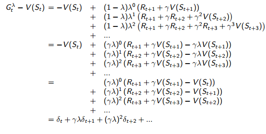

---
### Forwards and Backwards TD(λ)
- 考虑在时间步t状态s被访问了一次的片段
- TD(1)的eligibility trace从访问开始折扣
$E_t(s)=\gamma E_{t-1}(s) + 1(S_t=s)$
$=\left \{ \begin{matrix} 0 & if & t \lt k \\1 & if & t\ge k \end{matrix} \right.$
- 后向TD($\lambda$)在线更新累积误差
$$\sum_{t=1}^{T} \alpha\delta_tE_t(s) = \alpha\sum_{t=1}^{T} {(\lambda \gamma)}^{t-k}\delta_t = \alpha(G_k-V(S_k))$$
- 片段结束时$\lambda -return$累加的总误差
- 对于多次访问状态s,$E_t(s)$累积很多误差

---
### Offline Equivalence of Forward and Backward TD
offline updates(离线更新)
- 更新在片段内是累加的
- 但是在片段结束的时候采用batch的形式进行应用

---
### Onine Equivalence of Forward and Backward TD
Online updates(在线更新)
- $TD(\lambda)$更新在每一个片段内在线更新
- 前向和后向视角的$TD(\lambda)$稍微不同
- 新：Exact online TD($\lambda$)达到了完美等效
- 通过使用与eligibility trace的稍微不同的形式
- Sutton 和 von Sesijen，ICML 2014

---
### Summary of Forward and Backward TD(λ)
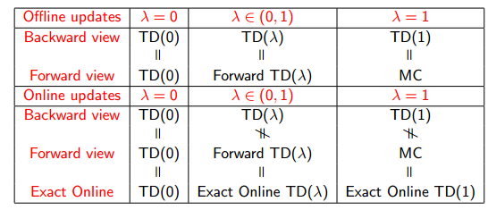
= 这里表明了在片段终止时总更新的等效性
