## Lecture 5: Model-Free Control
David Silver
翻译：xiaotian zhao

---
### Outline
- Introduction
- On-Policy Monte-Carlo Control
- On-Policy Temporal-Difference Learning
- Off-Policy Learning
- Summary

---
### Model-Free Reinforcement Learning
- 上节课：
  - Model-Free prediction
  - 估计未知MDP的价值函数
- 这节课：
  - Model-free control
  - 最优化未知MDP的价值函数

---
### Uses of Model-Free Control
一些示例问题可以被建模为MDP
- Elevator（电梯）
- Parallel Parking(并行泊车)
- Ship Steering(传播操纵)
- Bioreactor(生物反应器)
- Helicopter（直升机）
- Aeroplane Logistics（空勤）

---
### Uses of Model-Free Control
一些示例问题可以被建模为MDP
- Robocup Soccer（机器人足球）
- Quake(地震)
- Portfolio management（投资组合管理）
- Protein Folding(蛋白质折叠)
- Robot walking（机器人行走）
- Game of Go（围棋）

对于大部分问题：
- MDP是未知的，但是经验是可以被采样的
- MDP是已知的，但是太大难以使用，希望可以使用采样

Model-Free control（无模型控制）可以解决这些问题

---
- On-policy 学习
  - "learn on the job"（在任务上学习）
  - 通过策略$\pi$上采样得到的经验来学习策略$\pi$
- Off-policy 学习
  - "learn over someone's shoulder"(观察其他人学习)
  - 通过策略$\mu$上采样得到的经验来学习策略$\pi$

---
### Generalised Policy Iteration (Refresher)(通用策略迭代)
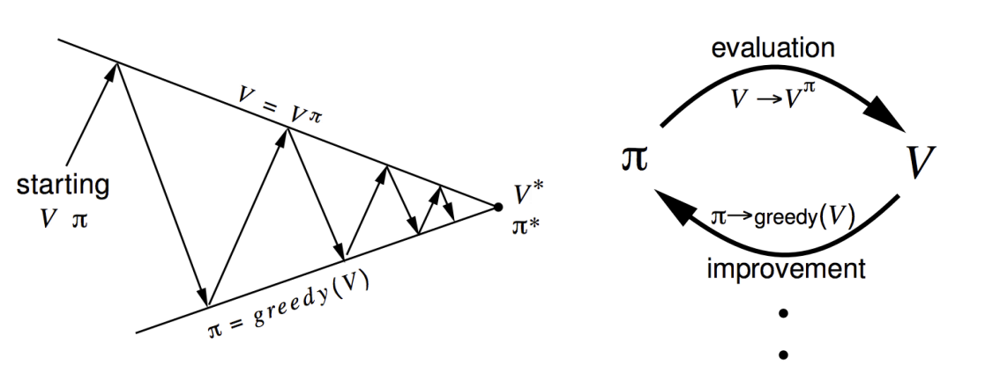
策略评估（Policy evaluation） 评估$v_{\pi}$
迭代策略评估
策略提升（Policy improvement） 生成策略 $\pi' \ge \pi$
贪心策略提升
$\pi_{*} \Longleftrightarrow v_{*}$

---
### Generalised Policy Iteration With Monte-Carlo Evaluation（采用蒙特卡洛评估的通用策略迭代）
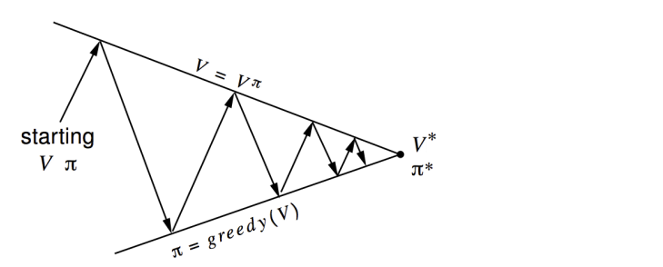
- 策略评估 蒙特卡洛策略评估，$V=v_{\pi}$?
- 策略提升 贪心策略提升？

---
### Model-Free Policy Iteration Using Action-Value Function（采用动作剪枝函数的无模型策略迭代）
- $V(s)$上的贪心策略提升需要MDP模型
$\pi'(s) = argmax_{a \in A} (R^a_s + \sum_{s' \in S}P_{ss'}^a V(s'))$
- $Q(s,a)$上的贪心策略提升是无模型的
$\pi'(s) = argmax_{a \in A}Q_(s,a)$

---
### Model-Free Policy Iteration Using Action-Value Function（采用动作剪枝函数的无模型策略迭代）

策略评估 蒙特卡洛策略评估，$Q = q_{\pi}$
策略提升 贪心策略提升？

---
### Example of Greedy Action Selection（贪心动作选择示例）
- 有两扇门在你前面
- 打开左边的门得到奖励0
$V(left)=0$
- 打开右边的门得到奖励 +1
$V(right)=+1$
- 打开右边的门得到奖励 +3
$V(right)=+3$
- 打开右边的门得到奖励 +2
$V(right)=+2$
...
- 你是否确定你选择的是最好的门？

---
- 一个简单的思想保证持续探索
- 所有m个动作使用非0概率
- 使用概率$1-\epsilon$选择贪心动作
- 使用概率$\epsilon$随机选择余下的动作
$\pi(a\mid s)=\left\{ \begin{matrix} \frac{\epsilon}{m} + 1 - \epsilon \ \ \ \ if \ \  a^*=argmax_{a \in A}Q(s,a)\\\frac{\epsilon}{m} \ \ \ \ \ \ \ \ \ \ \ \ \ \ \ \ \ \ \ \ \ \ \ \ \ \ \ \   otherwise \end{matrix}\right.$

---
### $\epsilon$-Greedy Policy Improvement
定理：
对于任意$\epsilon-greedy$策略$\pi$，遵循$q_{\pi}$的$\epsilon-greedy$策略$\pi'$也是提升。
$q_{pi}(s, \pi'(s)) = \sum_{a \in A}\pi'(a\mid s)q_{\pi}(s,a)$
$=\frac{\epsilon}{m}\sum_{a\in A}q_{\pi}(s,a) + (1 - \epsilon)\sum_{a\in A}q_{\pi}(s,a)$
$\ge \frac{\epsilon}{m} \sum_{a\in A}q_{\pi}(s,a) + (1- \epsilon)\sum_{a\in A}\frac{\pi(a\mid s) - \frac{\epsilon}{m}}{1-\epsilon}q_{\pi}(s,a)$
$=\sum_{a\in A}\pi(a\mid s)q_{\pi}(s,a)=v_{\pi}(s)$
因此策略提升定理，$v_{\pi'}(s) \ge v_{\pi}(s)$

---
### Monte-Carlo Policy Iteration(蒙特卡洛策略迭代)

策略评估 蒙特卡洛策略评估，$Q = q_{\pi}$
策略提升 $\epsilon-greedy$策略提升

---
### Monte-Carlo Control
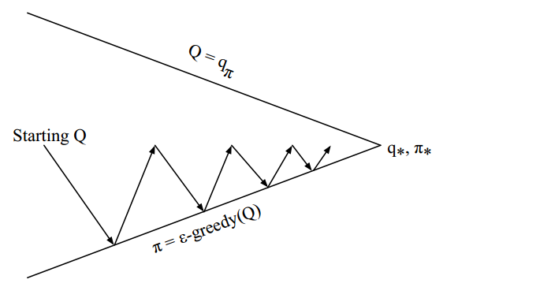
每一个片段：
策略评估　蒙特卡洛策略评估，$Q \simeq q_{\pi}$
策略提升　$\epsilon-greedy$策略提升

---
### GLIE
定理
Greedy in the Limit with infinite Exploration(GLIE，无限探索的贪心算法)
- 所有的状态-动作对被探索很多次
$\lim_{\infty} N_k(s,a) = \infty$
- 策略收敛到贪心策略
$lim_{k \rightarrow \infty} \pi_{k}(a \mid s) = 1(a = argmax_{a' \in A} \  Q_k(s,a))$
- 例如，$\epsilon-greedy$是GILE　如果$\epsilon$在$\epsilon_k=\frac{1}{k}$收敛到０

---
### GLIE Monte-Carlo Control
- 使用策略$\pi$采样$k$次片段:$\{S_1, A_1, R_2,...,S_T\} \sim T$
- 对于片段中每一个状态$S_t$和动作$A_t$
$N(S_t,A_t) \leftarrow N(S_t,A_t) + 1$
$Q(S_t, A_t) \leftarrow Q(S_t, A_t) + \frac{1}{N(S_t, A_t)}(G_t - Q(S_t,A_t))$
- 基于新的动作-价值函数提升策略
$\epsilon \leftarrow \frac{1}{k}$
$\pi \leftarrow \epsilon-greedy(Q)$
定理
GLIE 蒙特卡洛控制收敛到最优　动作-价值函数　$Q(s,a) \rightarrow q_*(s,a)$

---
### Monte-Carlo Control in Blackjack
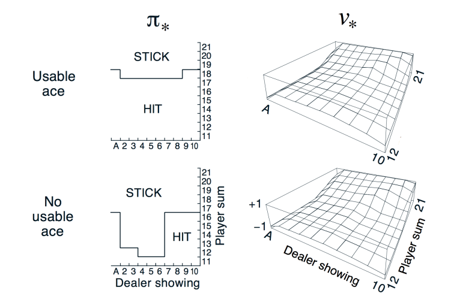

---
### MC vs. TD Control
- TD　算法与MC相比的几个优点
  - 低方差
  - 在线学习
  - 不完整片段
- 自然而然的思想：使用TD而不使用MC在我们的控制循环中
  - 在Q(S,A)上应用TD
  - 使用$\epsilon-greedy$策略提升
  - 在每个时间步进行更新

---
### Updating Action-Value Functions with Sarsa(使用Sarsa算法更新动作-状态函数)
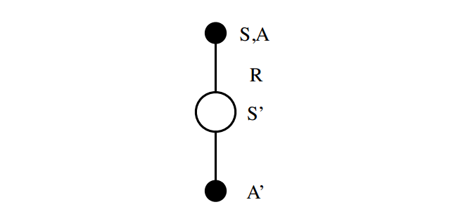
$Q(s,a) \leftarrow Q(s,a) + \alpha(R+\gamma Q(S',A') - Q(S,A))$

---
### On-Policy Control With Sarsa

对于每个时间步：
策略评估　Sarsa,$Q \simeq q_{\pi}$
策略提升　$\epsilon-greedy$ 策略提升

---
### Sarsa Algorithm for On-Policy Control
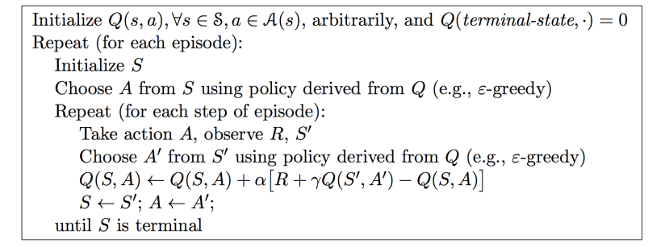

---
### Sarsa Algorithm for On-Policy Control
- 初始化$Q(s,a)$,$\forall s \in S$,$a \in A(s)$，任意的，并且$Q(tenrminal-state, .) = 0$
- 重复（对于每个片段）:
  - 初始化S
  - 使用策略，已知状态S，选择动作A（例如,$\epsilon-greedy$）
  - 重复（对于片段的每个时间步）
    - 采取动作A，观察R,S'
    - 使用策略，已知状态S'，选择动作A'(例如,$\epsilon-greedy$)
    - $Q(s,a) \leftarrow Q(s,a) + \alpha[R+\gamma Q(S',A') - Q(S,A)]$
    - $S \leftarrow S', A \leftarrow A'$
  - 直到状态S是终止状态

---
### Convergence of Sarsa
定理
Sarsa 收敛到最优的动作-状态函数，$Q(s,a) \leftarrow q_*(s,a)$，在下列条件下：
- 策略$\pi_{t}(a \mid s)$是GLIE序列
- 步长$\alpha_t$是Robbins-Monro序列
$\sum_{t=1}^{\infty} \alpha_t = \infty$
$\sum_{t=1} \alpha^2_{t} \lt \infty$

---
### Windy Gridworld Example
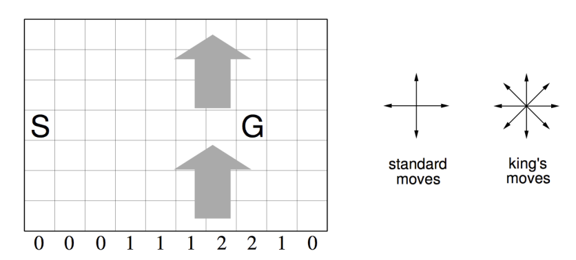
- 在到达目标之前每一步的奖励是-1
- 无折扣

---
### Sarsa on the Windy Gridworld
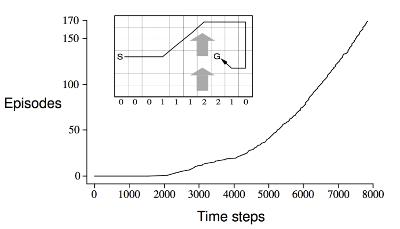

---
### n-step Sarsa
- 考虑下列 n-step　回报，n=1,2,3,...
n = 1 &nbsp;&nbsp;&nbsp; (Sarsa) &nbsp;&nbsp;&nbsp; $q_t^{(1)}=R_{t+1} + \gamma Q(S_{t+1})$
n = 2 &nbsp;&nbsp;&nbsp; &nbsp;&nbsp;&nbsp; $q_t^{(2)}=R_{t+1} + \gamma R_{t+2} + \gamma^2 Q(S_{t+2})$
n = $\infty$ &nbsp;&nbsp;&nbsp; (MC) &nbsp;&nbsp;&nbsp; $q_{t}^{\infty}$
- 定义　n-step Q-回报
$q_t^{n} = R_{t+1} + \gamma R_{t+2} + ... + \gamma^{n-1} R_{t+n} + \gamma^n Q(S_{t+n})$
- n-step Sarsa 向着　ｎ-step Ｑ-回报来更新Q(s,a)
$Q(S_t, A_t) \leftarrow Q(S_t, A_t) + \alpha Q(q_t^{(n)} + Q(S_t, A_t))$

---
### Forward View Sarsa(λ)
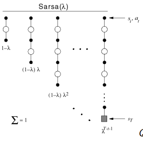
- $q^{\lambda}回报组合了n-step的Q-回报 $q_t^{(n)}$
- 使用权重$(1-\lambda)\lambda^{n-1}$
$q_t^{\lambda} = (1 - \lambda)\sum_{n=1}^{\infty}\lambda^{n-1}q_t^{(n)}$
- 前向视角Sarsa($\lambda$)
$Q(S_t,A_t) \leftarrow Q(S_t,A_t) + \alpha (q_t^{\lambda}  - Q(S_t,A_t))$

---
### Backward View Sarsa($\lambda$)
- 就行TD($\lambda$),我们在在线学习算法中使用 资格迹
- 但是$Sarsa(\lambda)$每个状态-动作对都有一个 资格迹
$E_0(s,a) = 0$
$E_t(s,a) = \gamma \lambda E_{t-1}(s,a) + 1(S_t=s,A_t=a)$
- Q(s,a)在每个状态和动作之后被更新
- 和TD-error $\delta_t$ 与 资格迹$E_t(s,a)$ 成比例
$\delta_t = R_{t+1} + \gamma Q(S_{t+1}, A_{t+1}) - Q(S_t, A_t)$
$Q(s,a) \leftarrow Q(s,a) + \alpha \delta_{t}E_t(s,a)$

---
### Sarsa($\lambda$) Algorithm(Sarsa算法)
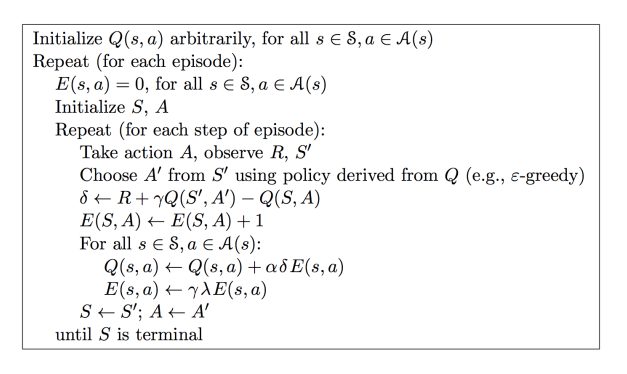

---
### Sarsa($\lambda$) Algorithm(Sarsa算法)
- 随机初始化$Q(s,a)$, $\forall s \in S, a\in A(s)$
- 重复（对于每个片段）:
  - E(s,a), $\forall s \in S, a \in A(s)$
  - 初始化$S,A$
  - 重复(对于片段的每一步)
    - 采取动作A,观察$R,S'$
    - 使用策略从$S'$中选择动作$A'$(例如,\epsilon-greedy)
    - $\delta \leftarrow R + \gamma Q(S',A') - Q(S,A)$
    - $E(S,A) \leftarrow E(S,A) + 1$
    - $\forall s \in S, a \in A(s)$
      - $Q(s,a) \leftarrow Q(s,a) + \alpha \delta E(s,a)$
      - $E(s,a) \leftarrow \gamma \lambda E(s,a)$
    - $S \leftarrow S'$; $A \leftarrow A'$
  - 直到S为终结状态

---
### Sarsa(λ) Gridworld Example
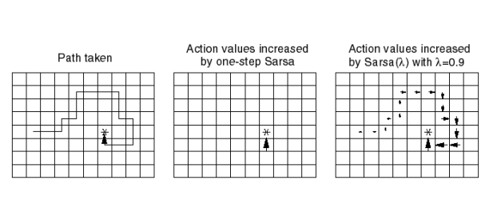

---
### Off-Policy Learning
- 评估目标策略$\pi(a \mid s)$，计算$v_{\pi}(s)$或$q_{\pi}(s,a)$
- 当跟随行为策略$\mu(s \mid s)$ 时
  $\{S_1,A_1,R_2, ..., S_T\} \sim \mu$
- 为什么如此重要？
  - 通过观察人类或者其他agent进行学习
  - 复用从旧策略中生成的经验$\pi_1, \pi_2, ... \pi_{t-1}$
  - 在遵循探索性策略的同时学习最优策略
  - 在遵循一个策略的同时学习更多策略

---
### Importance Sampling（重要性采样）
- 估计不同分布的期望
$E_{X \sim P}[f(X)] = \sum P(X)f(X)$
$=\sum Q(X)\frac{P(X)}{Q(X)}f(X)$
$=E_{X \sim Q}[\frac{P(X)}{Q(X)}f(X)]$

---
### Importance Sampling for Off-Policy Monte-Carlo（离线蒙特卡洛重要性采样）
- 使用从$\mu$生成的回报来评估$\pi$
- 加权回报$G_t$依据策略相似性
- 在整个片段中，重要性采样系数相乘
$G_t^{\pi / \mu} = \frac{\pi (A_t \mid S_t)}{\mu (A_t \mid S_t)} \frac{\pi (A_{t+1} \mid S_{t+1})}{\mu (A_{t+1} \mid S_{t+1})} ... \frac{\pi (A_{t+1} \mid S_{t+1})}{\mu (A_{t+1} \mid S_{t + 1})} G_t$
- 向着相关回报更新值
$V(S_t) \leftarrow V(S_t) + \alpha(G_t^{\pi / \mu} - V(S_t))$
- 如果$\pi$非零而$\mu$为零
- 重要性采样可能剧烈提高方差

---
### Importance Sampling for Off-Policy TD（离线时间差分重要性采样）
- 使用$\mu$生成的TD targets评价$\pi$
- 对TD target$R + \gamma V(S')$使用重要性采样进行加权
- 只需要一个单独的重要性采样系数
  - $V(S_t) \leftarrow \alpha(\frac{\pi(A_t \mid S_t)}{\mu(A_t \mid S_t)}(R_{t+1} + \gamma V(S_{t+1})) - V(S_t))$
  - 相比于MC重要性采样有更低的方差
  - 策略仅需要单步相似即可

---
### Q-learning
- 我们现在考虑离线学习所有的动作-价值$Q(s,a)$
- 不需要重要性采样
- 下一个动作通过行为策略 $A_{t+1} \sim \mu(. \mid S_t)$进行选择
- 当时我们考虑另一个后继动作$A' \sim \pi(. \mid S_t)$
- 并且向着另外一个动作更新$Q(S_t, A_t)$
$Q(S_t,A_t) \leftarrow Q(S_t,A_t) + \alpha (R_{t+1} + \gamma Q(S_{t+1},A') - Q(S_t,A_t))$

---
### Off-Policy Control with Q-Learning
- 我们现在允许行为和目标策略提升
- 目标策略$\pi$是贪心的，遵循$Q(s,a)$
$\pi(S_{t+1}) = argmax_{a'} Q(S_{t+1}, a')$
- 行为策略$\mu$是$\epsilon-greedy$，遵循$Q(s,a)$
- Q-learning的目标可以简化：
$R_{t+1} + \gamma Q(S_{t+1},A')$
$=R_{t+1} + \gamma Q(S_{t+1},argmax_{a'} Q(S_{t+1},a'))$
$=R_{t+1} + max_{a'}\gamma Q(S_{t+1},a')$

---
### Q-Learning Control Algorithm

$Q(S,A) \leftarrow Q(S,A) + \alpha (R + \gamma max_{a'}Q(S',a') - Q(S,A))$
定理
Q-learning控制可以收敛到最优动作-价值函数，$Q(S,A) \rightarrow q_{*}(s,a)$

---
### Q-Learning Algorithm for Off-Policy Control

---
### Q-Learning Algorithm for Off-Policy Control
- 随机初始化Q(s,a), $\forall s \in S, a\in A$,$Q(terminal-state,.)=0$
- 重复（对于每个片段）:
  - 初始化S
  - 重复(对于片段的每一步)
    - 遵循策略在给定状态S下选择动作A(即，$\epsilon-greedy$)
    - 采取动作$A$，观察$R,S'$
    - $Q(S,A) \rightarrow Q(S,A) + \alpha[R+\gamma max_{a} Q(S',a) - Q(S,A)]$
    - $S \leftarrow S'$
  - 直到S是终止状态

---
### Cliff Walking Example
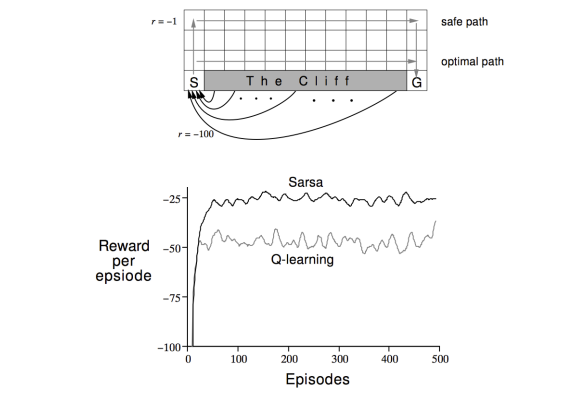

---
### Relationship Between DP and TD
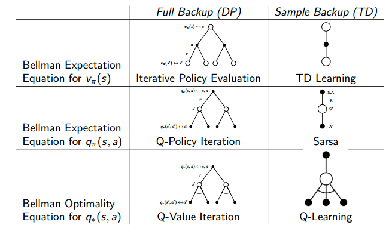

---
### Relationship Between DP and TD
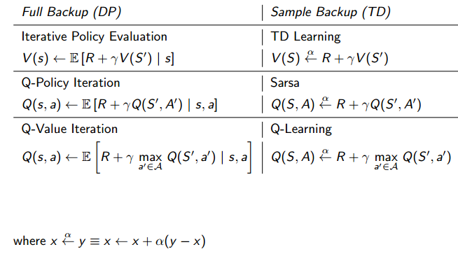

---
### Question?