## Lecture 6: Value Function Approximation
David Silver
翻译：xiaotian zhao

---
### Outline
- Introduction
- Incremental Methods
- Batch Methods

---
### Large-Scale Reinforcement Learning
强化学习可以用来解决大型问题
- 双陆棋： $10^{20}$个状态
- 计算机围棋： $10^{170}$个状态
- 直升机：连续状态空间

---
### Large-Scale Reinforcement Learning
强化学习可以用来解决大型问题
- 双陆棋： $10^{20}$个状态
- 计算机围棋： $10^{170}$个状态
- 直升机：连续状态空间

我们如何扩展上两节课的无模型预测和控制方法？

---
### Value Function Approximation
- 到目前为止我们使用表格来表示价值函数
  - 每个状态有一个实体$V(s)$
  - 或者每个状态-动作对s,a有一个实体$Q(s,a)$
- 大型MDP的问题：
  - 需要存储在内存中的状态或动作太多
  - 单独学习每个状态值太慢
- 大型MDP的解决方案
  - 通过函数逼近器来估计价值函数
  $\hat{v}(s,w) \approx v_{\pi}(s)$
  $\hat{q}(s,a,w) \approx q_{\pi}(s,a)$
  - 从看到的状态泛化到未见到状态
  - 使用MC或者TD学习更新参数

---
### Types of Value Function Approximation
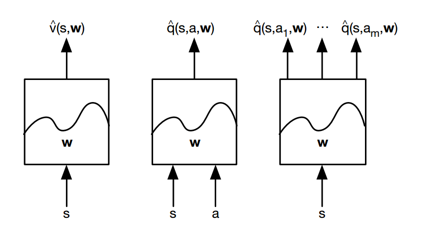

---
### Which Function Approximator?
有很多函数逼近器，即：
- 特征的线性组合
- 神经网络
- 决策树
- 最近邻
- 傅里叶小波变换
- ...

---
### Which Function Approximator?
我们考虑不同的函数逼近器，即
- <i>特征的线性组合</i>
- <i>神经网络</i>
- 决策树
- 最近邻
- 傅里叶小波变换
- ...
此外，我们需要一种可以适应非固定，非独立同分布的数据

---
### Gradient Descent
- $J(w)$是参数向量$w$的可微分函数
- 定义$J(w)$的梯度
$\triangledown_w J(w) = \left( \begin{matrix} \frac{\partial J(w)}{\partial w_1} \\ ... \\ \frac{\partial J(w)}{\partial w_n} \end{matrix} \right)$
- 寻找$J(w)$的局部最小值
- 向负梯度方向调整$w$
$\triangle w = -\frac{1}{2} \alpha \triangledown_{w} J(w)$
这里$\alpha$是步长

---
### Value Function Approx. By Stochastic Gradient Descent
- 目标：寻找参数向量$w$最小化预测函数值$\hat{v}(s,w)$和真实值$v_{\pi}(s)$均方误差
$J(w) = E_{\pi}[(v_{\pi}(S) - \hat{v}(S,w))^2]$
- 梯度下降寻找最小局部值
$\triangle w = -\frac{1}{2} \alpha \triangledown_{w} J(w)$
$=\alpha E_{\pi}(v_{\pi}(S)-\hat{v}(S,w))\triangledown_w \hat{v}(S,w)$
- 随机梯度下降采样梯度
$\triangle w=\alpha(v_{\pi}(S)-\hat{v}(S,w))\triangledown _{w}\hat{v}(S,w)$
- 期望采样梯度更新等价于全梯度更新

---
### Feature Vectors
- 通过一个特征向量代表
$x(s) = \left( \begin{matrix} x_1(S)  \\ ... \\ x_n(S) \end{matrix} \right)$
- 例如：
  - 机器人和地标的距离
  - 股票市场的趋势
  - 国际象棋中的棋子和棋子配置

---
### Linear Value Function Approximation
- 通过特征的线性组合表示价值函数
$\hat{v}(S,w) = x(S)^{T}w = \sum_{j=1}^{n} x_j(S)w_j$
- 目标函数是参数的二次方
$J(w) = E_{\pi}[(v_{\pi}(S) - x(S)^Tw)^2]$
- 随机梯度下降收敛到全局最优值
- 更新规则特别简单
$\triangledown_w \hat{v}(S,w)=x(S)$
$\triangle w=\alpha(v_{\pi}(S)-\hat{v}(S,w))x(S)$
更新=步长 x 预测误差 x 特征值

---
### Table Lookup Features
- 表格查询是线性价值函数逼近的一个特例
- 使用表格查询特征
$x^{table}(S) = \left( \begin{matrix} 1(S=s_1) \\ ... \\ 1(S=s_n) \end{matrix} \right)$
- 参数向量$w$给每个状态一个值
$\hat{v}(S,w) = \left( \begin{matrix} 1(S=s_1) \\ ... \\ 1(S=s_n) \end{matrix} \right) \left( \begin{matrix} w_1 \\ ... \\ w_2 \end{matrix} \right)$

---
### Incremental Prediction Algorithms
- 假设真实价值函数$v_{\pi}(s)$是监督者给定的
- 但是强化学习没有监督者，只有奖励
- 在实践中，我们用target(目标)替代$v_{\pi}(s)$
  - 对于MC,目标是回报$G_t$
  $\triangle w = \alpha(G_t - \hat{v}(S_t,w))\triangledown_w \hat{v}(S_t,w)$
  - 对于TD(0),目标是TD-target $R_{t+1} + \gamma \hat{v}(S_{t+1},w)$
  $\triangle w = \alpha(R_{t+1} + \gamma \hat{v}(S_{t+1},w) - \hat{v}(S_t,w))\triangledown_w \hat{v}(S_t,w)$
  - 对于TD($\lambda$),目标是$\lambda-return$ $G_t^{\lambda}$
  $\triangle w = \alpha(G_t^{\lambda} - \hat{v}(S_t,w))\triangledown_w \hat{v}(S_t,w)$
  
---
### Monte-Carlo with Value Function Approximation
- 回报$G_t$是无偏的，对真实值$v_{\pi}(S_t)$的有噪采样
- 因此在"训练数据"上可以应用监督学习
$<S_1, G_1>,<S_2,G_2>,...,<S_T,G_T>$
- 例如，使用线性蒙特卡洛策略评估
$\triangle w = \alpha(G_t - \hat{v}(S_t,w))\triangledown_w \hat{v}(S_t,w)$
$=\alpha(G_t-\hat{v}(S_t,w))x(S_t)$
- 蒙特卡洛评估收敛到局部最优值
- 即使当使用的是非线性价值函数逼近器

---
### TD Learning with Value Function Approximation
- TD-target $R_{t+1} + \gamma \hat{v}(S_{t+1},w)$是真实值$v_{\pi}(S_{t})$的有偏采样
- 仍然可以在“训练数据”上进行监督学习
$<S_1, R_2+\gamma \hat{v}(S_2,w)>, <S_2, R_3+\gamma \hat{v}(S_3, w)>,$
$...,<S_{T-1},R_T>$
- 例如，使用线性$TD(0)$
$\triangle w = \alpha(R+\gamma \hat{v}(S',w) - \hat{v}(S,w))\triangledown_w \hat{v}(S,w)$
$=\alpha \delta x(S)$
- 线性TD(0)收敛到全局最优值

---
### TD(λ) with Value Function Approximation
- $\lambda-return$ $G_t^{\lambda}$是真实值$v_{\pi}(s)$的有偏采样
- 仍然可以在“训练数据”上进行监督学习
$<S_1,G_1^{\lambda}>, <S_2,G_2^{\lambda}>,...,<S_{T-1},G_{T-1}^{\lambda}>$
- 前向视角线性$TD(\lambda)$
$\triangle w = \alpha (G_t^{\lambda} - \hat{v}(S_t, w))\triangledown_w \hat{v}(S_t,w)$
$\alpha (G_t^{\lambda} - \hat{v}(S_t,w))x(S_t)$
- 后向视角线性$TD(\lambda)$
$\delta_t = R_{t+1} + \gamma \hat{v}(S_{t+1}, w) - \hat{v}(S_t,w)$
$E_t = \gamma \delta E_{t-1} + x(S_t)$
$\triangle w = \alpha \delta_t E_t$

---
### TD(λ) with Value Function Approximation
- $\lambda-return$ $G_t^{\lambda}$是真实值$v_{\pi}(s)$的有偏采样
- 仍然可以在“训练数据”上进行监督学习
$<S_1,G_1^{\lambda}>, <S_2,G_2^{\lambda}>,...,<S_{T-1},G_{T-1}^{\lambda}>$
- 前向视角线性$TD(\lambda)$
$\triangle w = \alpha (G_t^{\lambda} - \hat{v}(S_t, w))\triangledown_w \hat{v}(S_t,w)$
$\alpha (G_t^{\lambda} - \hat{v}(S_t,w))x(S_t)$
- 后向视角线性$TD(\lambda)$
$\delta_t = R_{t+1} + \gamma \hat{v}(S_{t+1}, w) - \hat{v}(S_t,w)$
$E_t = \gamma \delta E_{t-1} + x(S_t)$
$\triangle w = \alpha \delta_t E_t$
前向视角和后向视角线性$TD(\lambda)$是等价的

---
### Control with Value Function Approximation
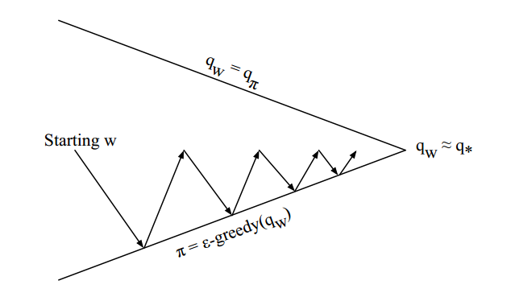
策略评估 近似函数评估 $\hat{q}(.,.,w) \approx q_{\pi}$
策略提升 $\epsilon-greedy$策略提升

---
### Action-Value Function Approximation
- 近似动作-价值函数
$\hat{q}(S,A,w) \approx q_{\pi}(S,A)$
- 最小化近似动作-价值函数$\hat{q}(S,A,w)$和真实动作-价值函数$q_{\pi}(S,A)$之间的最小均方误差
$J(w) = E_{\pi}[(q_{\pi}(S,A) - \hat{q}(S,A,w))^2]$
- 使用随机梯度下降寻找局部最小值
$-\frac{1}{2} \triangledown_{w} J(w) = (q_{\pi}(S,A) - \hat{q}(S,A,w))\triangledown_{w} \hat{q}(S,A,w)$
$\triangle w = \alpha(q_{\pi}(S,A)-\hat{q}(S,A,w))\triangledown_w \hat{q}(S,A,w)$

---
### Linear Action-Value Function Approximation(线性动作-价值函数估计)
- 通过状态和动作表示特征向量
$x(S,A) = \left( \begin{matrix} x_1(S, A) \\ ... \\ x_n(S,A) \end{matrix} \right)$
- 使用特征的线性组合表示动作-价值函数
$\hat{q}(S,A,w) = x(S,A)^{T}w = \sum_{j=1}^{n} x_j(S,A)w_j$
- 随机梯度下降更新
$\triangledown_w \hat{q}(S,A,w) = x(S,A)$
$\triangle w = \alpha (q_{\pi}(S,A) - \hat{q}(S,A,w))x(S,A)$

---
### Incremental Control Algorithms(增量控制算法)
- 就像预测一样，我们必须给$q_{\pi}(S,A)$找到一个替代者
- 对于MC，目标是回报$G_t$
$\triangle w = \alpha(G_t - \hat{q}(S_t,A_t,w)) \triangledown_w \hat{q}(S_t,A_t,w)$
- 对于$TD(0)$，目标是TD-target $R_{t+1} + \gamma Q(S_{t+1}, A_{t+1})$
$\triangle w = \alpha(R_{t+1} + \gamma \hat{q}(S_{t+1}, A_{t+1}, w) - \hat{q}(S_t,A_t,w))$
$* \triangledown_w \hat{q}(S_t,A_t,w)$
- 对于前向视角$TD(\lambda)$，目标是动作-价值 $\lambda-return$
$\triangle w = \alpha(q_{t}^{\lambda} - \hat{q}(S_t,A_t,w)) \triangledown_w \hat{q}(S_t,A_t,w)$
- 对于后向视角$TD(\lambda)$，等式更新是
$\delta_t = R_{t+1} + \gamma \hat{q}(S_{t+1}, A_{t+1}, w) - \hat{q}(S_t,A_t,w)$

---
### Linear Sarsa with Coarse Coding in Mountain Car
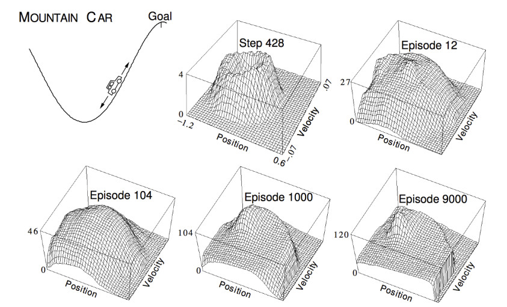

---
### Linear Sarsa with Radial Basis Functions in Mountain Car
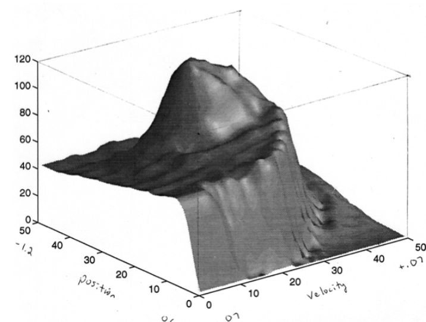

---
### $\lambda$的研究：我们是否应该执行bootstrap? 
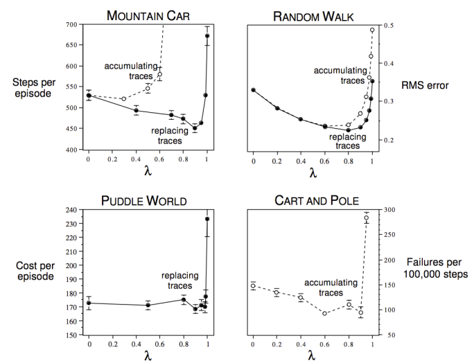

---
### Baird’s Counterexample
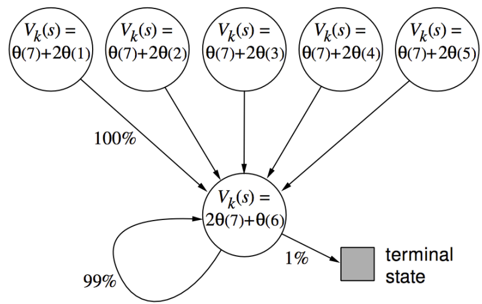

---
### Parameter Divergence in Baird’s Counterexample
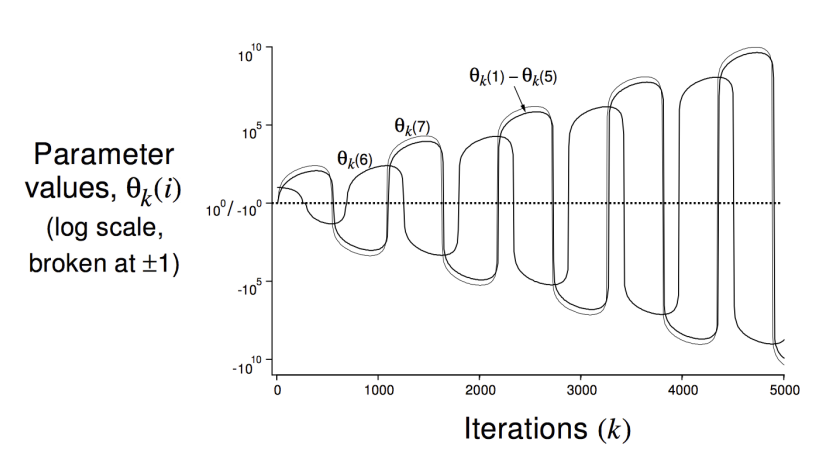

---
### Convergence of Prediction Algorithms(预测算法的收敛性)
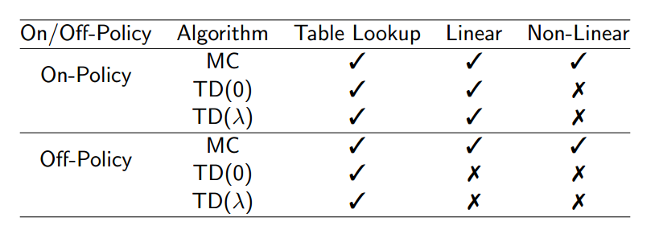

---
### Gradient Temporal-Difference Learning(梯度时间差分学习)
- TD不跟随任何目标函数的梯度
- 这就是为什么TD可以在off-policy或者使用非线性函数近似时发散
- 梯度TD跟随Bellman误差的真实梯度
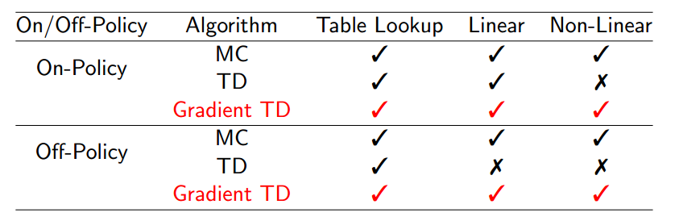

---
### Convergence of Control Algorithms（控制算法的收敛性）
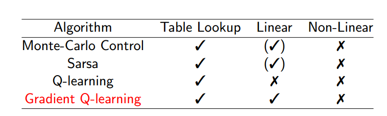
- ($\surd$) 表示在最优函数值附近来回徘徊

---
### Batch Reinforcement Learning
- 梯度下降很简单并且有吸引力
- 但是采样并不有效
- batch方法寻找最合适的价值函数
- 给定agent经验（训练数据）

---
### 最小平方预测
- 给定函数近似器$\hat{v}(s,w) \approx v_{\pi}(s)$
- 给定经验$D$包含$<state, value>$对
$D = \{<s_1, v_1^{\pi}>, <s_2, v_2^{\pi}>, ..., <s_T, v_{T}^{\pi}>\}$
- 哪个参数$w$给出最合适的价值函数$\hat{v}(s,w)$
- 最小平方算法寻找参数向量$w$最小化平方误差和，在$\hat{v}(s_t, w)$和目标值$v_t^{\pi}$
$LS(w) = \sum_{t=1}^{T} (v_t^{\pi} - \hat{v}(s_t, w))^2$
$=E_D[(v^{\pi} - \hat{v}(s,w))]$

---
### Stochastic Gradient Descent with Experience Replay(带有经验回放的随机梯度下降)
给定包含<state, value>的经验
$D = \{<s_1, v_1^{\pi}>, <s_2, v_2^{\pi}>, ..., <s_T, v_{T}^{\pi}>\}$
重复：
- 从经验中采样状态，价值
$<s, v^{\pi}> \sim D$
- 应用随机梯度下降算法
$\triangle w = \alpha(v^{\pi} - \hat{v}(s,w))\triangledown_w\hat{v}(s,w)$

---
### Stochastic Gradient Descent with Experience Replay
给定包含<state, value>的经验
$D = \{<s_1, v_1^{\pi}>, <s_2, v_2^{\pi}>, ..., <s_T, v_{T}^{\pi}>\}$
重复：
- 从经验中采样状态，价值
$<s, v^{\pi}> \sim D$
- 应用随机梯度下降算法
$\triangle w = \alpha(v^{\pi} - \hat{v}(s,w))\triangledown_w\hat{v}(s,w)$
收敛到最小平方解决方案
$w^{\pi} = argmin_w LS(w)$

---
### Experience Replay in Deep Q-Networks (DQN)
- 根据策略$\epsilon-greedy$策略采取动作$a_t$
- 存储$(s_t, a_t, r_{t+1}, s_{t+1})$在回放内存$D$中
- 从D的$s,a,r,s'$中随机采样出来一个mini-batch
- 计算Q-learning的目标值，旧的，固定参数值$w^{-}$
- 优化Q-network和Q-learning 目标值之间的MSE
$L_i(w_i)$
$= E_{s,a,r,s' \sim D_i}[(r + \gamma max_{a'}Q(s',a'; w^{-}) - Q(s,a;w_i))^2]$
- 使用随机梯度下降的变种

---
### DQN in Atari
- 从像素$s$ 到价值函数Q(s,a)的 端到端学习
- 输入状态$s$是最近4帧中的原始像素
- 输出是在18个操纵杆/按钮的Q(s,a)
- 奖励是那一步的得分的改变
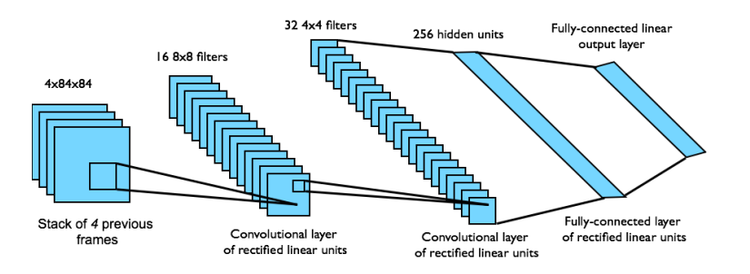

---
### DQN Results in Atari
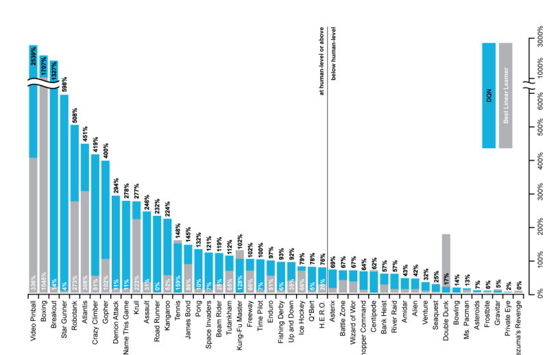

---
### How much does DQN help?
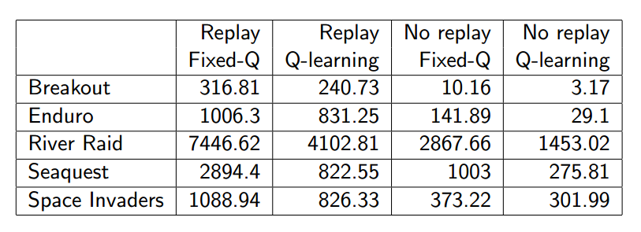

---
### Linear Least Squares Prediction
- 经验回放找到最小二乘解决方案
- 但是太多迭代
- 使用线性价值函数近似$\hat{v}(s,w) = x(s)^{T}w$
- 我们可以直接解决最小二乘解决方案（有解析解）

---
### Linear Least Squares Prediction
- 在LS(w)的最小值，期望更新必须是0
$E_D[\triangle w] = 0$
$\alpha \sum_{t=1}^{T} x(s_t)(v_t^{\pi} - x(s_t)^{T}w) = 0$
$\sum_{t=1}^{T} x(s_t)v_t^{\pi} = \sum_{t=1}^{T} x(s_t)x(s_t)^T w$
$w=(\sum_{t=1}^{T} x(s_t)x(s_t)^T)^{-1} \sum_{t=1}^{T} x(s_t) v_t^{\pi}$
- N个特征，直接解决方案时间复杂性是$O(N^3)$
- 增量解决方案时间复杂性是$O(N^2)，使用Shermann-Morrision$

---
### Linear Least Squares Prediction Algorithms
- 我们并不知道真实价值$v_t^{\pi}$
- 在实践中，我们的训练数据是有噪且有偏的对$v_{t}^{\pi}$的采样
LSMC 最小二乘蒙特卡洛使用回报$v_t^{\pi} \approx G_t$
LSTD 最小二乘时间差分使用TD-target $v_t^{\pi} \approx R_{t+1} + \gamma \hat{v}(S_{t+1},w)$
LSTD($\lambda$) 最小二乘$TD(\lambda)$使用$\lambda-return$ $v_t^{\pi} \approx G_t^{\lambda}$
- 在每个案例中，MC/TD/TD($\lambda$)都直接求解

---
### Linear Least Squares Prediction Algorithms
LSTC $0 = \sum_{t=1}^{T} \alpha(G_t - \hat{v}(S_t, w))x(S_t)$
$w = (\sum_{t=1}^{T} x(S_t)x(S_t)^T)^{-1} \sum_{t=1}^{T} x(S_t)G_t$
LSTD $0 = \sum_{t=1}^{T} \alpha(R_{t+1} + \gamma \hat{v}(S_{t+1}, w) - \hat{v}(S_t, w))x(S_t)$
$w = (\sum_{t=1}^{T} x(S_t)(x(S_t) - \gamma x(S_{t+1}))^{T})^{-1} \sum_{t=1}^{T} x(S_{t})R_{t+1}$
LSTD($\lambda$) $0 = \sum_{t=1}^{T} \alpha \delta_{t} E_t$
$w = (\sum_{t=1}^{T} E_t(x(S_t) - \gamma x(S_{t+1}))^{T})^{-1} \sum_{t=1}^{T} E_t R_{t+1}$

---
### Convergence of Linear Least Squares Prediction Algorithms(线性最小平方预测算法的收敛性)
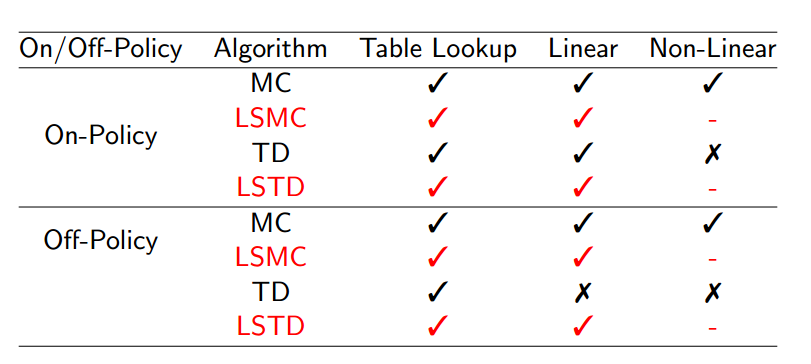

---
### Least Squares Policy Iteration
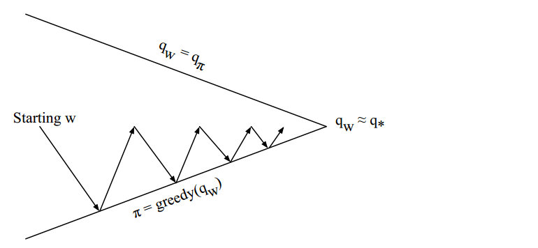
策略评估 使用最小平方$Q-learning$的策略评估
策略提升 贪心策略提升

---
### Least Squares Action-Value Function Approximation
- 近似动作-价值函数 $q_{\pi}(s,a)$
- 使用线性特征组合$x(s,a)$
$\hat{q}(s,a,w) = x(s,a)^{T} w \approx q_{\pi}(s,a)$
- 最小化$\hat{q}(s,a,w)$和$q_{\pi}(s,a)$之间的最小二乘
- 使用策略生成经验
- 包含$<(state, action), value>$对
$D = {<(s_1,a_1), v_1^{\pi}>, <(s_2, a_2), v_2^{\pi}>, ..., <(s_T, a_T), v_{T}^{\pi}>}$

---
### Least Squares Control
- 对于策略评估，我们想要有效的利用所有的经验
- 对于控制，我们也想要提升策略
- 这个经验是从很多策略中生成的
- 所以为了评估$q_{\pi}(S,A)$我们必须使用$off-policy$
- 我们使用和Q-learning一样的思想：
  - 使用旧策略生成的经验$S_t,A_t, R_{t+1}, S_{t+1} \sim \pi_{old}$
  - 考虑可供选择的后继动作$A' = \pi_{new}(S_{t+1})$
  - 向着可选择状态更新$\hat{q}(S_t,A_t,w)$
  $R_{t+1} + \gamma \hat{q}(S_{t+1},A',w)$

---
### Least Squares Q-Learning(最小二乘Q-learning)
- 考虑下列线性Q-learning 更新
$\delta = R_{t+1} + \gamma \hat{q}(S_{t+1}, \pi(S_{t+1}), w) - \hat{q}(S_t,A_t,w)$
- LSTDQ 算法： 总更新的解 = 0
0 = \sum_{t=1}^{T} \alpha(R_{t+1} + \gamma \hat{q}(S_{t+1}, \pi (S_{t+1}), w) -\hat{q}(S_t,A_t,w))x(S_t,A_t)
w = (\sum_{t=1}^{T}x(S_t,A_t)(x(S_t, A_t) - \gamma x(S_{t+1}, \pi(S_{t+1})))^{T})^{-1} \sum_{t=1}^{T} x(S_t,A_t) R_{t+1}

---
### Least Squares Policy Iteration Algorithm
- 下面的程序使用LSTDQ进行策略评估
- 它重复的再评估不同策略的经验$D$
- function LSPI-TD(D, $\pi_0$)
  - $\pi' \leftarrow \pi_{0}$
  - repeat
    - $\pi \leftarrow \pi'$
    - $Q \leftarrow LSTDQ(\pi, D)$
    - for all $s \in S$ do
      - $\pi'(s) \leftarrow argmax_{a \in A} Q(s,a)$
    - end for
  - util ($\pi \approx \pi'$)
  - return $\pi$
- end function

---
### Convergence of Control Algorithms
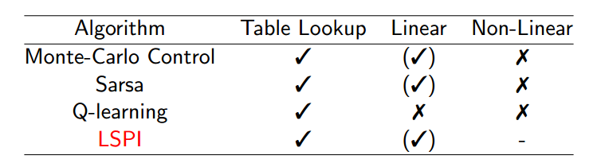
- $(\surd)$ 表示在最优函数值附近徘徊

---
### Chain Walk Example
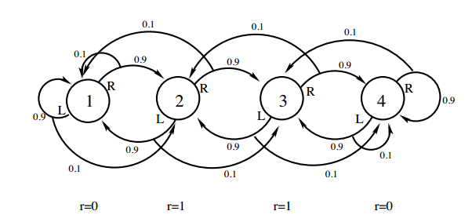
- 考虑这个问题的50个状态的版本
- 在10-41状态中，奖励是+1;否则，奖励是0
- 最优化策略：R(1-9),L(10-25),R(36-41),L(42,50)
- 特征：每个动作10个均匀间隔的高斯$\sigma = 4$分布
- 经验：10000 使用随机行走策略

---
### LSPI in Chain Walk: Action-Value Function
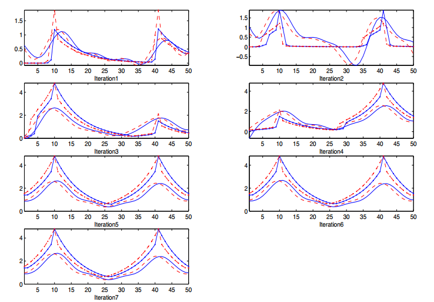

---
### LSPI in Chain Walk: Policy
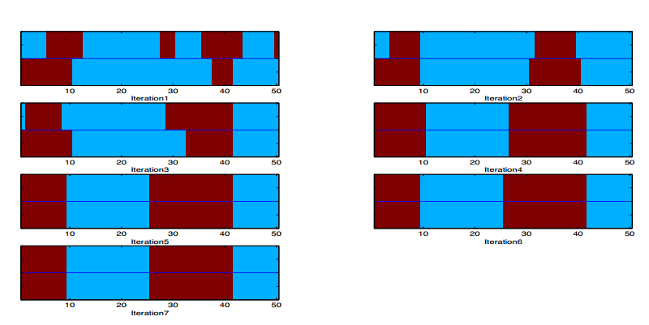

---
### Questions?

