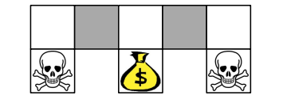
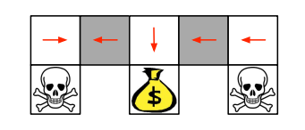
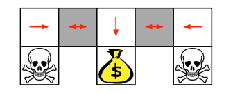
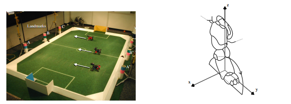
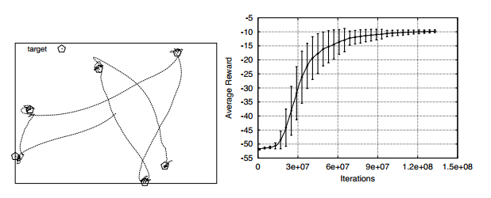
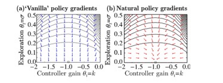
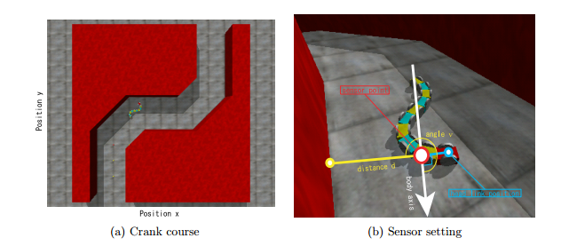
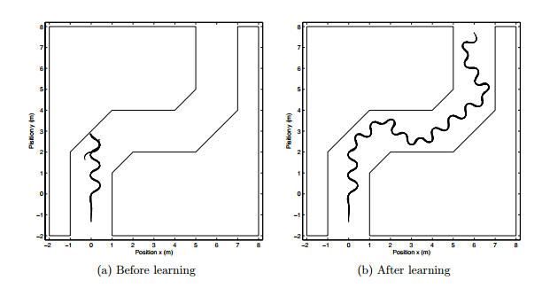
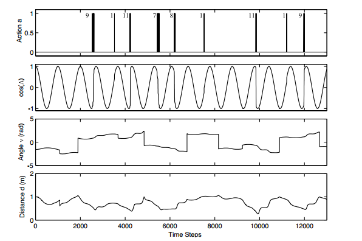

## Lecture 7: Policy Gradient
David Silver
翻译：xiaotian zhao

---
### Outline
- Introduction
- Finite Difference Policy Gradient
- Monte-Carlo Policy Gradient
- Actor-Critic Policy Gradient

---
### Policy-Based Reinforcement Learning(基于策略的强化学习)
- 上节课，我们使用参数$\theta$逼近价值或者动作-价值函数
$V_{\theta}(s) \approx V^{\pi}(s)$
$Q_{\theta}(s,a) \approx V^{\pi}(s)$
- 从价值函数可以直接生成策略
  - 例如， $\epsilon-greedy$算法
- 在这节课中，我们之间参数化策略
$\pi_{\theta}(s,a) = P(a \mid s, \theta)$
- 我们将再次关注无模型强化学习

---
### Value-Based and Policy-Based RL
- 基于Value
  - 学习价值函数
  - 隐式策略（$\epsilon-greedy$）
- 基于Policy
  - 无价值函数
  - 学习策略
- Actor-Critic
  - 学习价值函数
  - 学习策略

---
### Advantages of Policy-Based RL
优点
- 更好的收敛特性
- 在高维和连续动作空间的有效性
- 可以学习随机策略
缺点
- 通常收敛到局部最优而不是全局最优
- 评估策略通常不够有效且有高方差

---
### Examle: Rock-Paper-Scissors
- 两个游戏者的剪刀石头布
  - 剪刀赢布
  - 石头赢剪刀
  - 布赢石头
- 思考迭代剪刀石头布的策略
  - 确定性策略容易被开发
  - 一个均匀随机策略是最优的（如，纳什均衡）

---
### Example: Aliased Gridworld

- agent不能区分灰色的状态
- 考虑下列的形式的特征(对于所有的N,E,S,W)
$\Phi(s,a) = 1(wall \  to \ N, a = move \ E)$
- 对比基于value的RL，使用近似价值函数
$Q_{\theta}(s,a) = f(\Phi(s,a), \theta)$
- 对于基于Policy的RL,使用参数化策略
$\pi_{\theta}(s,a) = g(\Phi(s,a), \theta)$

---
### Example: Aliased Gridworld

- 在alising的情况下，一个最优确定性策略是
  - 在两个灰色状态下向W移动
  - 在两个灰色状态下向E移动
- 两种任一策略，都有可能陷入来回反复的状态，永远到不了Money
- 基于Value的RL可以学习 近似-确定策略
  - 即，$greedy$或$\epsilon-greedy$
- 因此，他可能使用很长时间穿过长廊

---
### Aliased GridWorld

- 一个最优化的随机策略可以再灰色的状态中随机向W,或者E移动
$\pi_{\theta}(wall \ to \ N \ and\ S, move\ E) = 0.5$
$\pi_{\theta}(wall \ to \ N \ and\ S, move\ W) = 0.5$
- 它将以高概率在几步之内走到目标状态
- 基于策略的RL可以学习到最优随机策略

---
### Policy Objective Functions（策略目标函数）
- 目标：给定策略$\pi_{\theta}(s,a)$和参数$\theta$,寻找最优$\theta$
- 但是我们如何度量策略$\pi_{\theta}$?
- 在有限环境中，我们可以使用start value(起始值)
$J_1(\theta) = V^{\pi_{\theta}}(s_1) = E_{\pi_{\theta}}[v_1]$
- 在连续环境中，我们可以使用平均值
$J_{avV}(\theta) = \sum_{s}d^{\pi_{\theta}}(s)V^{\pi_{\theta}}(s)$
- 或者每个时间步的平均奖励
$J_{avR}(\theta) = \sum_{s}d^{\pi_{\theta}}(s) \sum_{a} \pi_{\theta}(s,a)R_s^a$
- 这里$d^{\pi_{\theta}}(s)$ 是马尔科夫链的策略$\pi_{\theta}$的静态分布

---
### Policy Optimisation
- 基于Policy的强化学习是优化问题
- 寻找参数$\theta$最大化$J(\theta)$
- 一些不使用梯度的方法
  - 爬山法
  - 下山单纯形法
  - 基因算法
- 使用梯度的通常更有效
  - 梯度下降
  - 共轭梯度
  - 拟牛顿法
- 我们关注梯度下降，很多可能的扩展
- 以及利用顺序结构的算法

---
### Policy Gradient
- 让$J(\theta)$可以是策略目标函数
- 策略梯度算法寻找$J(\theta)$的局部最大值通过提升策略的梯度
$\triangle \theta = \alpha \triangledown_{\theta} J(\theta)$
- 这里$\triangledown_{\theta} J(\theta)$是策略梯度
$\triangledown_{\theta} J(\theta) = \left ( \begin{matrix} \frac{\partial J(\theta)}{\partial \theta_1} \\ ... \\ \frac{\partial J(\theta)}{\partial \theta_n} \end{matrix} \right)$
- $\alpha$是一个步长参数

---
### Computing Gradients By Finite Differences
- 为了评价$\pi_{\theta}(s,a)$策略梯度
- 对于每个维度$k \in [1, n]$ 
  - 估算目标函数的第k个偏微分
  - 通过给参数$\theta$一个小的扰动$\epsilon$在第k个维度
  $\frac{\partial J(\theta)}{\partial \theta_k} \approx \frac{J(\theta + \epsilon u_k) - J(\theta)}{\epsilon}$
  这里$u_k$在第k个维度是1，否则是0
  - 使用n次评估计算n个维度的策略梯度
  - 简单，有噪，低效-但是有时候是有效的
  - 任意策略都可是使用，即便策略不可微

---
### Training AIBO to Walk by Finite Difference Policy Gradient

- 目标：学习AIBO行走（参加机器人世界杯）
- AIBO的行走策略被12个数字控制
- 通过有限差分策略梯度调整这些参数
- 通过行走时间来评估策略表现

---
### AIBO Walk Policies
- 训练前
- 训练中
- 训练后

---
### Score Function
- 我们现在分析计算策略梯度
- 假设策略$\pi_{\theta}$可微分并且任何时候都不为0
- 并且我们知道梯度$\triangledown_{\theta} \pi_{\theta}(s,a)$
- 似然比使用下列等式
$\triangledown_{\theta} \pi_{\theta}(s,a) = \pi_{\theta}(s,a) \frac{\triangledown_{\theta} \pi_{\theta}(s,a)}{\pi_{\theta}(s,a)} = \pi_{\theta}(s,a)\triangledown_{\theta}log \pi_{\theta}(s,a)$
- 得分函数是$\triangledown_{\theta} log \ \pi_{\theta}(s,a)$

---
### Softmax Policy
- 我们使用softmax策略作为运行示例
- 使用特征的线性组合$\phi(s,a)^{T}\theta$对动作进行加权
- 动作的概率正比于指数权重
$\pi_{\theta}(s,a) \propto e^{\phi(s,a)^{T}\theta}$
- 得分函数是
$\triangledown_{\theta} log \ \pi_{\theta}(s,a) = \phi(s,a) - E_{\pi_{\theta}}[\phi(s,.)]$

---
### Gaussian Policy
- 在连续状态空间中，高斯策略是自然地
- 均值是状态特征的线性组合$\mu(s) = \phi(s,a)$
- 方差可以使固定的$\sigma^2$,或者是参数
- 策略是高斯分布$a \sim N(\mu(s), \sigma^2)$
- 得分函数是
$\triangledown_{\theta} log \pi_{\theta}(s,a) = \frac{(\alpha - \mu(s))\phi(s)}{\sigma^2}$

---
### One-Step MDPs
- 考虑one-step MDP的简单类别
  - 开始在状态$s \sim d(s)$中
  - 在一个时间步得到奖励$r=R_{s,a}$之后停止
- 使用似然比计算策略梯度
$J(\theta) = E_{\pi_{\theta}}[r] = \sum_{s\in S} d(s)\sum_{s\in A}\pi_{\theta}(s,a)R_{s,a}$
$\triangledown_{\theta}J(\theta) = \sum_{s \in S} d(s) \sum_{a \in A} \pi_{\theta}(s,a) \triangledown_{\theta}log \pi_{\theta}(s,a)R_s^a$
$=E_{\pi_{\theta}}[\triangledown_{\theta} log \pi_{\theta}(s,a)r]$

---
### Policy Gradient Theorem
- 策略梯度定理可以将似然比方法泛化到multi-step MDP
- 可以使用长期值$Q^{\pi}(s,a)$替换实时反馈$r$
- 策略梯度定理应用于起始状态目标函数，平均奖励和平均价值目标函数。
定理
对于任意可微分策略$\pi_{\theta}(s,a)$
对于任意策略目标函数$J=J_1, J_{avR},\frac{1}{J_{avV}}$,策略梯度是
$\triangledown_{\theta}J(\theta)= E_{\pi_{\theta}}[\triangledown_{\theta}log\pi_{\theta}(s,a)Q^{\pi_{\theta}}(s,a)]$

---
### Monte-Carlo Policy Gradient (REINFORCE) 蒙特卡洛策略梯度
- 使用随机梯度下降更新参数
- 使用策略梯度定理
- 使用回报$v_t$作为$Q^{\pi_{\theta}}(s_t,a_t)$的无偏采样
$\triangle \theta = \alpha \triangledown_{\theta} \pi_{\theta}(s_t, a_t)v_t$
- function REINFORCE
  - 随机初始化$\theta$
  - for 每个片段$\{s_1,a_1,r_2,...,s_{T-1}, a_{T-1},r_T\}$ do
    - for t = 1 to T-1 do
      - $\theta \leftarrow \theta + \alpha \triangledown_{\theta} log \pi_{\theta}(s_t,a_t)v_t$
    - end for
  - end for
  - return $\theta$
- end function

---
### Puck World Example

- 连续动作对冰球施加小力量
- 冰球的奖励是 离目标更近
- 目标位置每隔30s重置
- 策略训练使用蒙特卡洛策略梯度的变种

---
### Reducing Variance Using a Critic
- 蒙特卡洛策略梯度仍然有高方差
- 我们使用 critic 估计动作-策略 函数
$Q_w(s,a) \approx Q^{\pi_{\theta}}(s,a)$
- Actor-critic算法维持两套参数
  - Critic 更新动作-价值函数的参数$w$
  - Actor 更新策略参数$\theta$,根据critic建议的方向
- Actor-critic算法跟随近似策略梯度
$\triangledown J(\theta) \approx E_{\pi_{\theta}}[\triangledown_{\theta}log\pi_{\theta}(s,a)Q_w(s,a)]$
$\triangle \theta = \alpha \triangledown_{\theta} log \pi_{\theta}(s,a)Q_w(s,a)$

---
### Estimating the Action-Value Function
- Critic 解决了一个相似问题：策略评估
- 当前参数$\theta$下，策略$\pi_{\theta}$有多好？
- 这个问题可以在之前两节课给出答案，即
  - 蒙特卡洛策略评估
  - 时间差分学习
  - $TD(\lambda)$
- 我们是否可以也使用最小二乘策略评估

---
### Action-Value Actor-Critic
- 简单的actor-critic算法是基于action-value critic的
- 使用线性价值函数近似。$Q_w(s,a) = \phi(s,a)^T w$
  - Critic 使用TD(0)更新w
  - Actor 使用策略梯度更新$\theta$

---
### Action-Value Actor-Critic
- function QAC
  - 初始化s,$\theta$
  - 采样$a \sim \theta$
  - for 每步 do
    - 采样回报$r = R_s^a$;采样转移$s' \sim P_s^a$
    - 采样动作$a' \sim \pi_{\theta}(s',a')$
    - $\delta = r + \gamma Q_w(s',a') - Q_w(s, a)$
    - $\theta = \theta + \alpha \triangledown_{\theta} log \pi_{\theta}(s,a)Q_w(s,a)$
    - $w \leftarrow w + \beta \delta \phi(s,a)$
    - $a \leftarrow a', s \leftarrow s'$
  - end for
- end function

---
### Bias in Actor-Critic Algorithms
- 近似策略梯度会引入偏差
- 一个有偏的策略梯度可能找不到正确的解决方案
  - 即，如果 $Q_{w}(s,a)$使用有偏特征，我们是否可以解决gridworld例子
- 幸运的是，如果我们小心的选择近似价值函数
- 我们可以避免引入偏差
- 我们可以跟随正确的策略梯度

---
### Compatible Function Approximation（近似兼容函数）
定理（近似兼容函数定理）
如果下列两个条件被满足：
- 价值函数近似器对策略兼容
$\triangledown_w Q_w(s,a) = \triangledown_{\theta} log \pi_{\theta}(s,a)$
- 价值函数参数w,最小化均方差
$\epsilon = E_{\pi_{\theta}}[(Q^{\pi_{\theta}}(s,a) - Q_{w}(s,a))^2]$
然后策略梯度是正确的，
$\triangledown_{\theta} J(\theta) = E_{\pi_{\theta}}[\triangledown_{\theta} log \pi_{\theta}(s,a) Q_w(s,a)]$

---
### Proof of Compatible Function Approximation Theorem(近似兼容函数定理证明)
如果$w$被选择最小化均方差，$\epsilon$关于$w$的梯度必须是0
$\triangledown_w \epsilon = 0$
$E_{\pi_{\theta}}[(Q^{\pi_{\theta}}(s,a) - Q_{w}(s,a))\triangledown_{w}Q_w(s,a)] = 0$
$E_{\pi_{\theta}}[(Q^{\pi_{\theta}}(s,a) - Q_{w}(s,a)) \triangledown_{\theta} log \pi_{\theta}(s,a)] = 0$
$E_{\pi_{\theta}}[Q^{\pi_{\theta}}(s,a) \triangledown_{\theta} log \pi_{\theta}(s,a)] = E_{\pi_{\theta}}[Q_{w}(s,a) \triangledown_{\theta} log \pi_{\theta}(s,a)]$
所以$Q_w(s,a)$可以被直接替换进策略梯度中
$\triangledown_{\theta} J(\theta) = E_{\pi_{\theta}}[\triangledown_{\theta} log \pi_{\theta}(s,a) Q_w(s,a)]$

---
### Reducing Variance Using a Baseline
- 我们从策略梯度中减去一个基线函数$B(s)$
- 这可以减少方差，在不替换期望的情况下
$E_{\pi_{\theta}}[\triangledown_{\theta} log \pi_{\theta}(s,a) B(s)] = \sum_{s \in S} d^{\pi_{\theta}}(s)\sum_{a} \triangledown_{\theta}\sum_{a \in A}\pi_{\theta}(s,a)$
$=\sum_{s \in S} d^{\pi_{\theta}}B(s) \triangledown_{\theta}\sum_{a \in A}\pi_{\theta}(s,a)$
$=0$
- 一个好的基线函数是状态价值函数$B(s) = V^{\pi_{\theta}}(s)$
- 所有我们可以重写策略函数，使用 advantage function $A^{\pi_{\theta}}(s,a)$
$A^{\pi_{\theta}}(s,a) = Q^{\pi_{\theta}}(s,a) - V^{\pi_{\theta}}(s)$
$\triangledown_{\theta} J(\theta)= E_{\pi_{\theta}}[\triangledown_{\theta} log \pi_{\theta}(s,a)A^{\pi_{\theta}}(s,a)]$

---
### Estimating the Advantage Function
- advantage function对于减小策略梯度的方差很重要
- 所以critic应该真实估计advantage function
- 例如，通过同时估计$V^{\pi_{\theta}}(s)$和$Q^{\pi_{\theta}}(s,a)$
- 使用两个函数近似器和两套参数向量
$V_{v}(s) \approx V^{\pi_{\theta}}(s)$
$Q_{w}(s,a) \approx Q^{\pi_{\theta}}(s,a)$
$A(s,a) = Q_{w}(s,a) - V_v(s)$
- 同时更新两个价值函数，通过例如TD-learning

---
### Estimating the Advantage Function 
- 对于真实价值函数$V^{\pi_{\theta}}(s)$,TD-error $\delta^{\pi_{\theta}}$
$\delta^{\pi_{\theta}} = r + \gamma V^{\pi_{\theta}}(s') - V^{\pi_{\theta}}(s)$
- 是对advantage function的无偏估计
$E_{\pi_{\theta}}[\delta^{\pi_{\theta}} \mid s, a] = E_{\pi_{\theta}}[r + \gamma V^{\pi_{\theta}}(s') \mid s,a] - V^{\pi_{\theta}}(s)$
$=Q^{\pi_{\theta}}(s,a) - V^{\pi_{\theta}}(s)$
$=A^{\pi_{\theta}}(s,a)$
- 所以我们可以使用TD-error计算策略梯度
$\triangledown_{\theta}J(\theta) = E_{\pi_{\theta}}[\triangledown_{\theta} log_{\pi_{\theta}}(s,a) \delta^{\pi_{\theta}}]$
- 在实践中，我们可以使用TD-error的近似
$\delta_v = r + \gamma V_v(s') - V_v(s)$
- 这个方法仅需要一套critic的参数v

---
### Critics at Different Time-Scales(不同时间范围内的Critics)
- Critic可以从不同的目标在不同的时间尺度上对价值函数进行估算
- 对于MC,目标是回报$v_t$
$\triangle \theta = \alpha(v_t - V_{\theta}(s))\phi(s)$
- 对于TD(0),目标是TD-target $r + \gamma V(s')$
$\triangle \theta = \alpha(r + \gamma V(s') - V_{\theta}(s))\phi(s)$
- 对于前向视角$TD(\lambda)$,目标是$\lambda-return$ $v_t^{\lambda}$
$\triangle \theta = \alpha(v_t^{\lambda} + \gamma V(s') - V_{\theta}(s))\phi(s)$
- 对于后向视角$TD(\lambda)$,我们使用资格迹
$\delta_t = r_{t+1} + \gamma V(s_{t+1}) - V(s_t)$
$e_t = \gamma \lambda e_{t-1} + \phi(s_t)$
$\triangle \theta = \alpha \delta_{t} e_t$

---
### Actors at Different Time-Scales
- 策略梯度也可以在很多时间范围被估算
$\triangle_{\theta} J(\theta) = E_{\pi_{\theta}}[\triangledown_{\theta} log \pi_{\theta}(s,a) A^{\pi_{\theta}}(s,a)]$
- 蒙特卡洛策略梯度使用完整回报的误差
$\triangle \theta = \alpha (v_t - V_{t}(s_t)) \triangledown_{\theta}log\pi_{\theta}(s_t, a_t)$
- Actor-critic策略梯度使用one-step 的TD-error
$\triangle \theta = \alpha(r+ \gamma V_v(s_{t+1}) - V_v(s_t)) \triangledown_{\theta}(s_t,a_t)$

---
### Policy Gradient with Eligibility Traces
- 像前向视角 $TD(\lambda)$ ，我们可以混合多个时间范围
$\triangle \theta = \alpha (v_t^{\lambda} - V_{t}(s_t)) \triangledown_{\theta}log\pi_{\theta}(s_t, a_t)$
- 这里$v_t^{\lambda} - V_v(s_t) \triangledown_{\theta} log \pi_{\theta}(s_t, a_t)$
- 像后向视角$TD(\lambda)$,我们可以使用资格迹
  - 通过$TD(\lambda)$的等式，将$\phi(s) = \triangledown_{\theta} log \pi_{\theta}(s, a)$
  $\delta = r_{t+1} + \gamma V_v(s_{t+1}) - V_v(s_t)$
  $e_{t+1} = \lambda e_{t} + \triangledown_{\theta} log \pi_{\theta}(s,a)$
  $\triangle \theta = \alpha \delta e_t$
  - 这可以利用不完整片段，在线更新

---
### Alternative Policy Gradient Directions
- 梯度提升算法可以跟随任意提升方向
- 一个好的梯度提升方向可以显著加速收敛
- 策略在不改变动作概率的情况下也可以重新参数化
- 例如，在softmax策略里面提高所有动作的得分
- vanilla梯度对于重新参数化敏感

---
### Natural Policy Gradient

- 神经策略梯度是单独参数化的
- 它寻找接近vanilla 梯度的提升方向，当策略改变很小且固定的量
$\triangledown_{\theta}^{nat} \pi_{\theta}(s,a) = G_{\theta}^{-1} \triangledown_{\theta} \pi_{\theta}(s,a)$
- 这里$G_{\theta}$是Fisher信息矩阵
$G_{\theta} = E_{\pi_{\theta}}[\triangledown_{\theta} log \pi_{\theta}(s,a) \triangledown_{\theta} log \pi_{\theta}(s,a)^T]$
 
---
### Natural Actor-Critic
- 使用compatible function approximation
$\triangledown_w A_w(s,a) = \triangledown_{\theta} log \pi_{\theta}(s,a)$
- 所以神经策略梯度简化
$\triangledown_{\theta}J(\theta) = E_{\pi_{\theta}}[\triangledown_{\theta} log \pi_{\theta}(s,a)A^{\pi_{\theta}}(s,a)]$
$=E_{\pi_{\theta}}[\triangledown_{\theta} log \pi_{\theta}(s,a)\triangledown_{\theta} log \pi_{\theta}(s,a)^Tw]$
$=G_{\theta}w$
$\triangledown_{\theta}^{nat}J(\theta) = w$
- 向着critic参数的方向跟新actor的参数

---
### Natural Actor Critic in Snake Domain

---
### Natural Actor Critic in Snake Domain

---
### Natural Actor Critic in Snake Domain

---
### Summary of Policy Gradient Algorithms
- 策略梯度有很多等式形式
$\triangledown_{\theta} J(\theta) = E_{\pi_{\theta}}[\triangledown_{\theta} log \pi_{\theta}(s,a) v_t]$ REINFORCE
$= E_{\pi_{\theta}}[\triangledown_{\theta} log \pi_{\theta}(s,a) Q^{w}(s,a)]$ Q Actor-critic
$= E_{\pi_{\theta}}[\triangledown_{\theta} log \pi_{\theta}(s,a) Q^{w}(s,a)]$ Advantage Actor-critic
$= E_{\pi_{\theta}}[\triangledown_{\theta} log \pi_{\theta}(s,a) \delta]$ TD Actor-critic
$= E_{\pi_{\theta}}[\triangledown_{\theta} log \pi_{\theta}(s,a) \delta e]$ TD($\lambda$) Actor-critic
$G_{\theta}^{-1} \triangledown_{\theta} J(\theta) = w$ Natural Actor-critic
- 每个都导致一种梯度提升算法
- Critic使用策略评估（例如，MC和TD learning）去估计$Q^{\pi}(s,a)$, $A^{\pi}(s,a)$或$V^{\pi}(s)$