## Lecture 8: Integrating Learning and Planning
David Silver
翻译：xiaotian zhao

---
### Outline
- Introduction
- Model-Based Reinforcement Learning
- Integrated Architectures
- Simulation-Based Search

---
### Model-Based Reinforcement Learning
- 上节课：直接从经验中学习策略
- 之前的课：直接从经验中学习价值函数
- 这节课：直接从经验中学习模型
- 并且使用planning构建价值函数或策略
- 将learning和planning整合到同一个架构中

---
### Model-Based and Model-Free RL
- Model-Free RL（无模型强化学习）
  - 无模型
  - 从经验中学习价值函数（和/或 策略）

---
### Model-Based and Model-Free RL
- Model-Free RL（无模型强化学习）
  - 无模型
  - 从经验中学习价值函数（和/或 策略）
- Model-Base RL (基于模型的强化学习)
  - 从经验中学习模型
  - 从模型中Plan价值函数（和/或 策略）

---
### Model-Free RL

---
### Model-Based RL
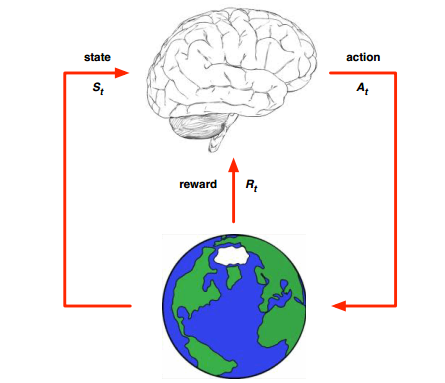

---
### Model-Based RL

---
### Advantages of Model-Based RL
- 优点
  - 可以有效使用监督学习方法学习模型
  - 可以推理模型的不确定性
- 缺点
  - 首先学习模型，然后构造价值函数
  - 两个近似误差的来源

---
### What is a Model?
- 模型$M$ 是使用参数$\eta$表示模型$MDP<S,A,P,R>$
- 我们假设状态空间S和状态空间A是已知的
- 模型$M = (P_{\eta},R_{\eta})$表示转移概率$P_{\eta} \approx P$，奖励$R_{\eta} \approx R$
$S_{t+1} \sim P_{\eta}(S_{t+1} \mid S_t, A_t)$
$R_{t+1} = R_{\eta}(R_{t+1} \mid S_t, A_t)$
- 典型的，假设状态转移和奖励是条件独立的
$P(S_{t+1}, R_{t+1} \mid S_t, A_{t}) = P[S_{t+1} \mid S_t, A_t]P[R_{t+1} \mid S_t, A_t]$

---
### Model Learning
- 目标：从经验${S_1,A_1,R_2,...,S_T}$中估计模型$M_{\eta}$
- 这是一个监督学习问题
$S_1, A_1 \rightarrow R_2, S_2$
$S_2, A_2 \rightarrow R_3, S_3$
$...$
$S_{T-1}, A_{T-1} \rightarrow R_{T}, S_{T}$
- 学习$s,a \rightarrow r$是一个回归问题
- 学习$s,a \rightarrow s'$ 是一个概率密度估计问题
- 选择损失函数，例如，均方差，KL散度
- 寻找参数$\eta$最小化经验误差

---
### Examples of Models
- Table Lookup Model(表查询模型)
- Linear Expectation Model(线性期望模型)
- Linear Gaussian Model（线性高斯模型）
- Gaussian Process Mode（高斯过程模型）
- Deep Belief Network Model（深度信念网模型）
- ...

---
### Table Lookup Model
- 模型是个显式MDP，$\hat{P}, \hat{R}$
- 对每个状态-动作对$N(s,a)$进行访问计数
$\hat{P_{ss'}^a} = \frac{1}{N(s,a)}\sum_{t=1}^{T}1(S_t,A_t,S_{t+1}=s,a,s')$
$\hat{R_{s}^a} = \frac{1}{N(s,a)}\sum_{t=1}^{T}1(S_t,A_t=s,a)R_t$
- 另一种方式
  - 在每个时间步$t$,记录经验元组$<S_t,A_t,R_{t+1},S_{t+1}>$
  - 为了采样模型，随机选择符合$<s,a,.,.>$的元组

---
### AB Example
两个状态A,B;无折扣；8个经验片段
A,0,B,0
B,1
B,1
B,1
B,1
B,1
B,1
B,0
我们从经验中构造表查询模型。

---
### AB Example

---
### Planning with a Model
- 给定模型$M_{\eta} = <P_{\eta}, R_{\eta}>$
- 求解MDP$<S,A,P_{\eta}, R_{\eta}>$
- 使用任何你喜欢算法
  - 价值迭代
  - 策略迭代
  - 树搜索
  - ...

---
### Sample-Based Planning
- 一个简单但强大的planning方法
- 仅使用模型生成样例
- 从模型中采样
$S_{t+1} \sim P_{\eta}(S_{t+1} \mid S_t,A_t)$
$R_{t+1} = R_{\eta}(R_{t+1} \mid S_t, A_t)$
- 使用无模型RL采样，例如
  - 蒙特卡洛控制(MC control)
  - Sarsa
  - Q-learning
- 基于采样的planning方法经常更有效

---
### Back to the AB Example
- 从真实经验中构造表查询模型
- 应用无模型RL采样经验
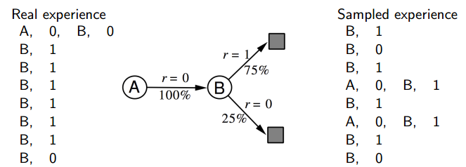
- 例如：蒙特卡洛学习：$V(A) = 1, V(B)=0.75$

---
### Planning with an Inaccurate Model
- 给定一个不完美模型$<P_{\eta},R_{\eta}> \neq <P,R>$
- 基于模型的RL的性能仅限于最优策略，用于近似MDP$<S,A,P_{\eta},R_{\eta}>$
- 即，基于模型的RL仅能和估计模型一样
- 当模型是不精确的时候，planning过程将会计算一个次优策略
- 解决方案1：当模型是错误的，使用无模型RL
- 解决方案2：明确地表示模型不确定性

---
### Real and Simulated Experience
- 我们考虑两个经验的来源
  - 真实经验：从环境中采样(真实 MDP)
  $S' \sim P_{ss'}^{a}$
  $R = R_s^a$
  - 模拟经验：从模型中采样(近似 MDP)
  $S' \sim P_{\eta}(S' \mid S,A)$
  $R = R_{\eta}(R \mid S,A)$
  
---
### Integrating Learning and Planning
- 无模型
- 从真实经验中学习价值函数（和/或 策略）

---
### Integrating Learning and Planning
- 无模型RL
  - 无模型
  - 从真实经验中学习价值函数（和/或 策略）
- 基于模型RL
  - 从真实经验学习
  - 从模拟经验中，Plan（规划）价值函数（和/或 策略）

---
### Integrating Learning and Planning
- 无模型RL
  - 无模型
  - 从真实经验中学习价值函数（和/或 策略）
- 基于模型RL
  - 从真实经验学习
  - 从模拟经验中，Plan（规划）价值函数（和/或 策略）
- Dyna
  - 从真实经验学习模型
  - 从真实经验和模拟经验学习和规划价值函数（和/或 策略）

---
### Dyna Architecture
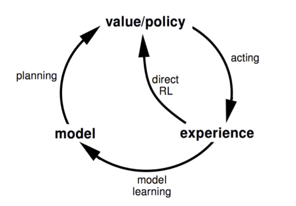

---
### Dyna-Q Algorithm
- 初始化Q(s,a)和Model(s,a),$\forall \ s\in S, a \in A$
- 无限循环：
  - (a) $S \leftarrow$ 当前（非终止）状态
  - (b) $A \leftarrow \epsilon-greedy(S,A)$
  - (c) 执行动作A；观测结果奖励R，和状态S'
  - (d) $Q(S,A) \leftarrow Q(S,A) +$
    $\alpha[R + \gamma max_a Q(S',a) - Q(S,A)]$
  - (e) $Model(S,A) \leftarrow R,S'$(假设是确定性环境)
  - (f) 重复n次：
    - $S \leftarrow .$随机选择之前观察到的状态
    - $A \leftarrow .$随机选择之前在状态$S$下采取的动作
    - $R,S' \leftarrow Model(S,A)$
    - $Q(S,A) \leftarrow Q(S,A) +$
      $\alpha[R+\gamma max_a Q(S',a) - Q(S,A)]$
      
---
### Dyna-Q on a Simple Maze
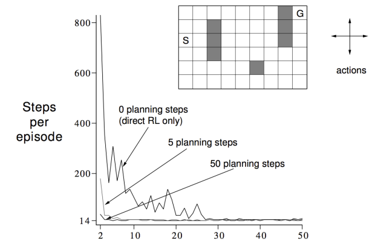

---
### Dyna-Q with an Inaccurate Model
- 变换的环境更困难
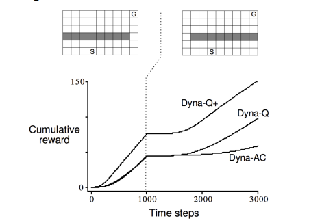

---
### Dyna-Q with an Inaccurate Model
- 变化的环境更简单
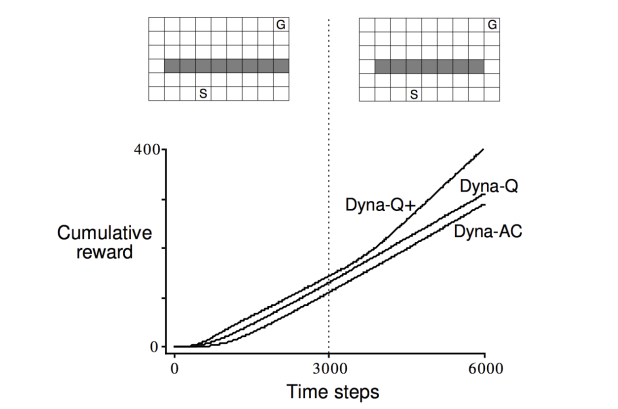

---
### Simulation-Based Search

---
### Forward Search
- 前向搜索算法通过向前看选择最佳动作
- 使用当前状态$s_t$作为根节点构建搜索树
- 使用MDP模型向前看
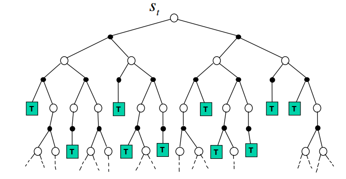
- 不需要求解整个MDP，只需要从现在开始的子MDP

---
### Simulation-Based Search
- 使用基于采样的planning的前向搜索范式
- 从现在开始使用模型模拟经验片段
- 在模拟片段上使用无模型RL
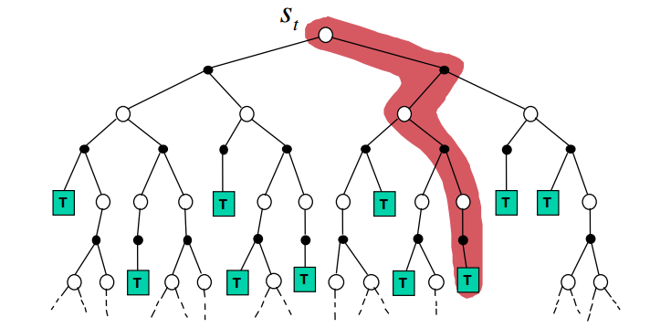

---
### Simulation-Based Search
- 从现在开始使用模型模拟片段
$\{s_t^k, A_t^k, R_{t+1}^k, ..., S_T^k\}_{k=1}^{K} \sim M_v$
- 应用无模型RL模拟片段
  - 蒙特卡洛控制 $\rightarrow$ 蒙特卡洛搜索
  - Sarsa $\rightarrow$ TD 搜索

---
### Simple Monte-Carlo Search
- 给一个模型$M_v$和一个模拟策略$\pi$
- 对于每个动作$a \in A$
  - 从当前（真实）状态$s_t$模拟$K$个片段
  $\{s_t, a, R_{t+1}^{k},S_{t+1}^{k},A_{t+1}^{k},...,S_{T}^{k}\}_{k=1}^{K} \sim M_{v}, \pi$
  - 通过平均回报（蒙特卡洛评估）
  
- 使用最大值选择当前状态
$a_t = argmax_{a\in A}Q(s_t,a)$

---
### Monte-Carlo Tree Search (Evaluation)
- 给定模型$M_v$
- 从当前状态$s_t$开始使用当前的模拟策略模拟$K$个片段
$\{s_t, a, R_{t+1}^{k},S_{t+1}^{k},A_{t+1}^{k},...,S_{T}^{k}\}_{k=1}^{K} \sim M_{v}, \pi$
- 建造一棵搜索树包含已访问的状态和动作
- 通过从$s,a$开始的片段的平均回报评估状态$Q(s,a)$
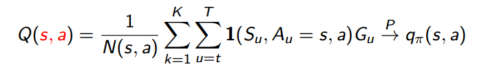
- 在搜索结束之后，根据搜索树中的最大值选择动作
$a_t = argmax_{a \in A}Q(s_t,a)$

---
### Monte-Carlo Tree Search (Simulation)
- 在MCTS,模拟策略$\pi$提升
- 评估包括两个阶段（in-tree,out-of-tree）
  - Tree policy（提升）：选择动作最大化$Q(S,A)$
  - Default policy(固定的)：随机选择动作
- 重复（每次模拟）
  - 通过蒙特卡洛评估 估计状态$Q(S,A)$
  - 提升树策略，例如，通过$\epsilon-greedy(Q)$
- 蒙特卡洛控制应用在模拟经验
- 收敛到最优化搜索树，$Q(S,A) \rightarrow q_{*}(S,A)$

---
### Case Study: the Game of Go
- 2500年前的古老游戏
- 被认为是最难的经典棋盘游戏
- 被认为是AI的巨大挑战任务
- 在围棋上，传统树搜索是失败的

---
### Rules of Go
- 通常在19 x 19, 13 x 13, 9 x 9的棋盘上玩
- 简单规则，复杂策略
- 黑白子依次落子
- 围住的子被捕获并移除
- 有更多棋子的玩家获胜
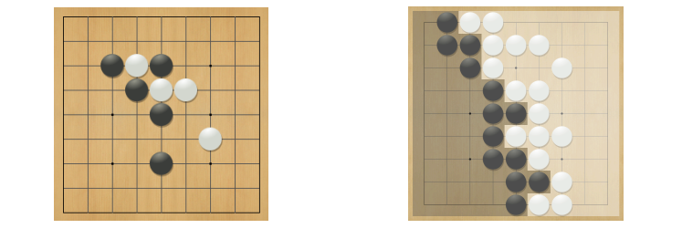

---
### Position Evaluation in Go
- 位置$s$有多好？
- 奖励函数（无折扣）：
  $R_t = 0 \ for \ all \ non-terminal \ steps \ t \lt T$
  $R_T = \left\{ \begin{matrix} 1 \ if \ Black \ wins \\ 0 \ if \ White \ wins\end{matrix} \right.$
- 策略$\pi = <\pi_B, \pi_W>$选择连个玩家的动作
- 价值函数（位置$s$有多好？）：
  $v_{\pi}(s) = E_{\pi}[R_T \mid S=s] = P[Black \ wins \mid S =s]$
  $v_{*}(s) = max_{\pi_B} min_{\pi_W} v_{\pi}(s)$
  
---
### Monte-Carlo Evaluation in Go
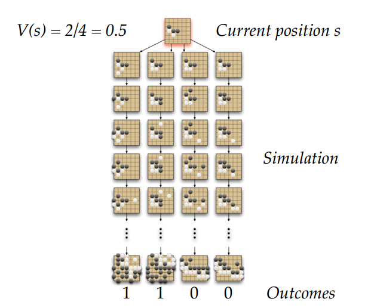

---
### Applying Monte-Carlo Tree Search
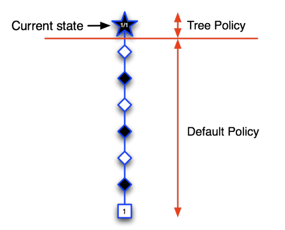

---
### Applying Monte-Carlo Tree Search
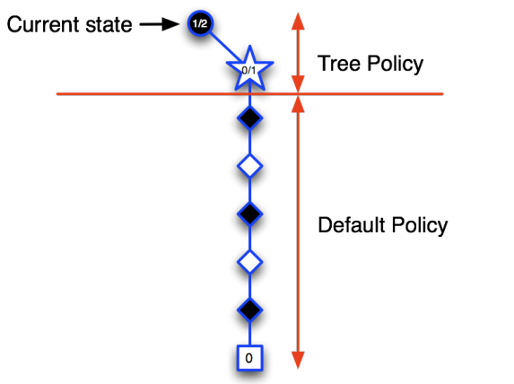

---
### Applying Monte-Carlo Tree Search
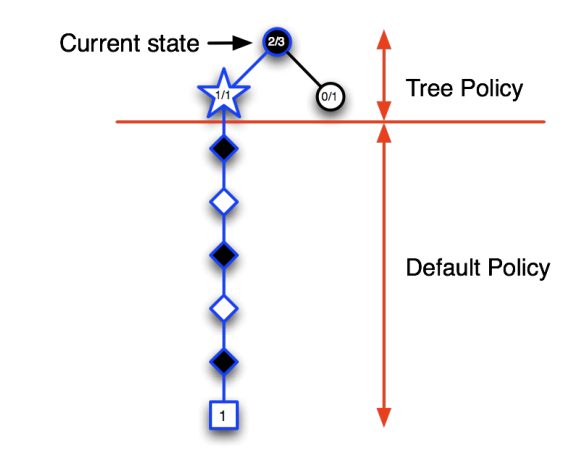

---
### Applying Monte-Carlo Tree Search 
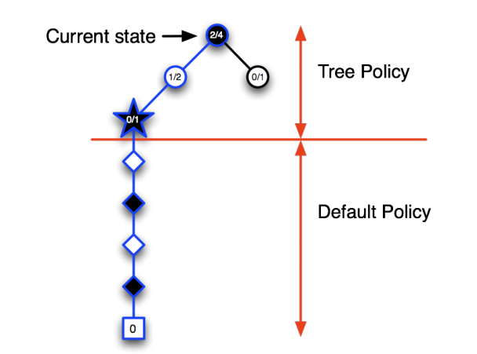

---
### Applying Monte-Carlo Tree Search 
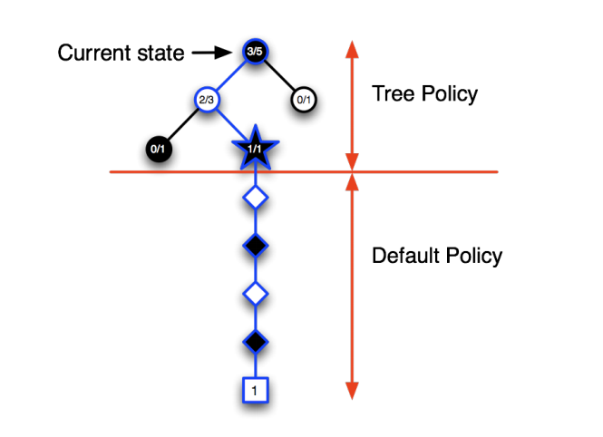

---
### Advantages of MC Tree Search
- 高选择性的最优优先搜索
- 动态评估状态（不像例如 DP）
- 使用采样打破维度诅咒
- 在黑盒模型下工作（仅需要采样）
- 计算有效性，任何时间，并行化的

---
### Example: MC Tree Search in Computer Go
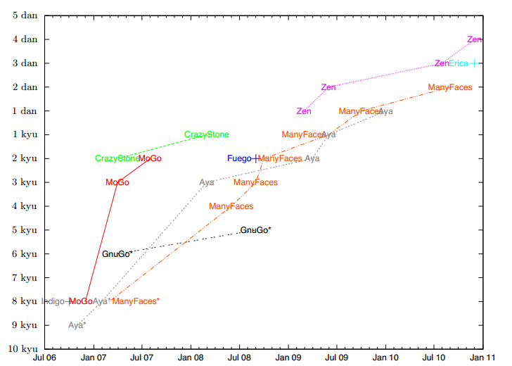

---
### Temporal-Difference Search
- 基于模拟的搜索
- 使用TD而不是MC(自举)
- MC树搜索在从当前开始在sub-MDP上应用MC控制
- TD树搜索在sub-MDP上应用Sarsa

---
### Temporal-Difference Search
- 对于无模型强化学习，自举是有用的
  - TD learning降低了方差但是提高了偏差
  - TD learning比MC更有效
  - TD($\lambda$) learning比MC有效更多
- 对于基于模拟的搜索，自举也很有效
  - TD 搜索降低了方差但是提高了偏差
  - TD 搜索比MC更有效
  - TD($\lambda$) 搜索比MC有效更多

---
### TD Search
- 从当前真实状态$s$模拟片段
- 估计动作-价值函数$Q(s,a)$
- 对于模拟的每一步，通过Sarsa更新动作-状态函数
$\triangle Q(S,A) = \alpha(R+\gamma Q(S',A') - Q(S,A))$
- 基于动作-状态函数$Q(s,a)$选择动作
$例如，\epsilon-greedy$
- Q也有很多函数近似器

---
### Dyna-2
- 在Dyna-2中，agent保存两套特征权重
  - long-term 记忆
  - short-term(working) 记忆
- 长期记忆从真实经验中使用TD learning更新
  - 通用领域知识被应用在任何一个片段
- 短期记忆从模拟经验中使用TD search更新
  - 特定局部知识关于当前位置
- 将长期记忆和短期记忆加起来是价值函数

---
### Results of TD search in Go
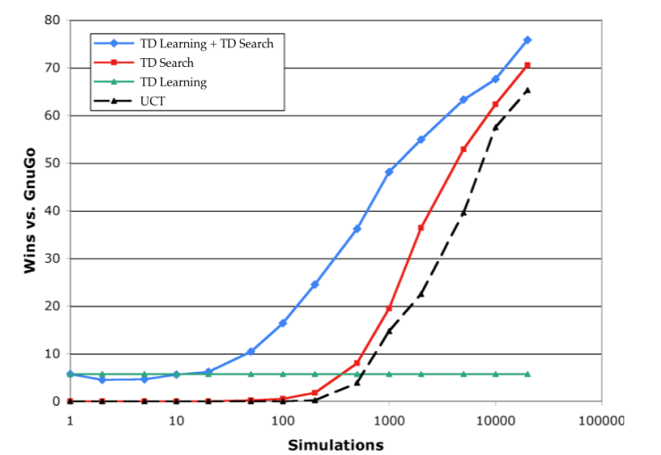

---
### Questions?