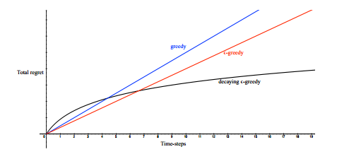
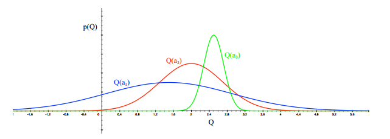
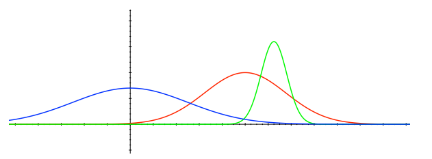
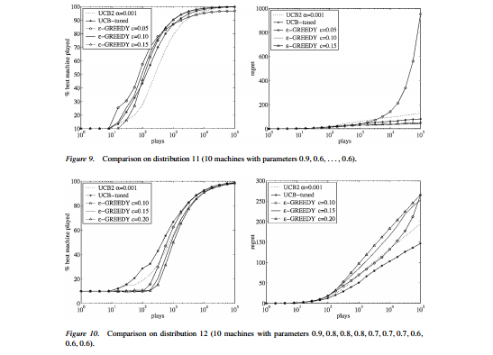
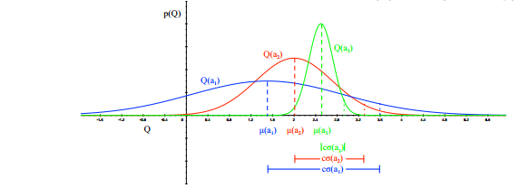
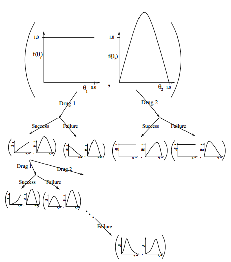
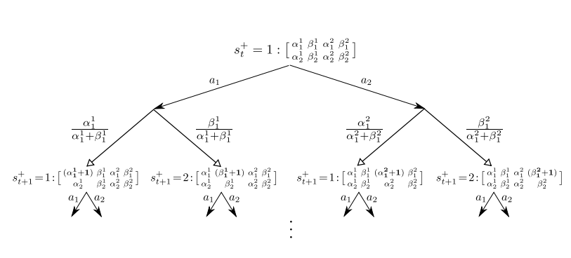
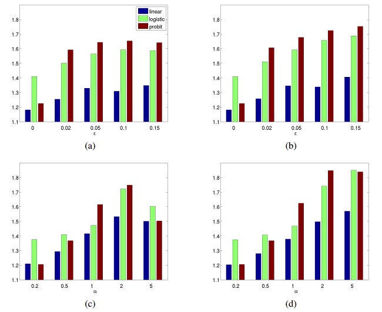

## Lecture 9: Exploration and Exploitation
David Silver
翻译：xiaotian zhao

---
### Outline
- Introduction
- Multi-Armed Bandits
- Contextual Bandits
- MDPs

---
### Exploration vs. Exploitation Dilemma(探索 vs. 开发困境)
- 在线决策涉及一个基本选择：
Exploitation: 给定当前信息做出最优决策
Exploration: 收集更多信息
- 最好的长期策略可能包含短期牺牲
- 收集足够用的信息做出全局最优决策

---
### Examples
- 餐厅选择
  Exploitation 去最喜欢的饭店
  Exploration 尝试新的饭店
- 在线Banner广告
  Exploitation 展示最成功的广告
  Exploration 展示不同的广告
- 石油钻探
  Exploration 在已知最好的地点钻探
  Exploration 在新的地点钻探
- 游戏
  执行你认为最好的行为
  执行尝试性行为

---
### Principles
- Naive Exploration(基础探索)
  - 在贪心策略中添加噪声（例如，$\epsilon-greedy$）
- Optimistic Initialisation(乐观初始化)
  - 除非被证明，假设是最好的
- Optimism in the Face of Uncertainty(面对不确定性的乐观)
  - 更倾向有不确定值的动作
- Probability Matching(概率匹配)
  - 根据最好的概率选择动作
- Information State Search(信息状态查询)
  - 整合值信息的前向搜索

---
### The Multi-Armed Bandit（多臂老虎机）
- 多臂老虎机是一个元组$<A,R>$
- A一个已知的m个动作的集合(或 摇杆臂)
- $R^a(r) = P[r \mid a]$是一个在奖励上的未知分布
- 在每个时间步$t$,agent选择动作$a_t \in A$
- 环境生成一个奖励$r_t \sim R^{a_t}$
- 目标是最大化累计误差$\sum_{\tau = 1}^{t} r_{\tau}$

---
### Regret
- 动作-价值函数是动作a的平均奖励
$Q(a) = E[r \mid a]$
- 最优价值函数$V^{*}$是
$V^{*} = Q(a^{*}) = max_{a \in A}Q(a)$
- regret是一步的机会损失
$l_t = E[V^{*} - Q(a_t)]$
- total regret 是总的机会损失
$L_t = E[\sum_{\tau = 1}^{t} V^{*} - Q(a_{\tau})]$
- 最大化累计奖励$\equiv$最小化total regret

---
### Counting Regret
- 计数$N_t(a)$是动作a的选择期望数
- 间隙$\triangle_a$是动作a和最优动作$a^{*}$之间的误差：$\triangle_a = V^{*} - Q(a)$
- regret是间隙和计数的函数
$L_t = E[\sum_{\tau=1}^{t}V^{*} - Q(a_{\tau})]$
$=\sum_{a \in A}E[N_t(a)](V^{*} - Q(a))$
$=\sum_{a \in A} E[N_t(a)]\triangle_a$
- 一个好的算法可以保证大间隙的时候是小计数
- 问题：间隙是未知的

---
### Linear or Sublinear Regret

- 如果算法一直探索，它将会有线性total regret
- 如果算法从不探索，他将会有线性total regret
- 是否有可能达到亚线性total regret

---
### Greedy Algorithm
- 考虑算法估计$\hat{Q_t}(a) \approx Q(a)$
- 通过蒙特卡洛评估来估计每个动作的价值
$\hat{Q_t}(a) = \frac{1}{N_t(a)} \sum_{t=1}^{T} r_t 1(a_t = a)$
- 贪心算法选择具有最大值的动作
$a_t^{*} = argmax_{a \in A} \hat{Q_t}(a)$
- 贪心策略将会被永远困在次优动作中
- 贪心策略有线性total regret

---
### $\epsilon-greedy$算法
- $\epsilon-greedy$算法永远持续探索
  - 使用概率$1 - \epsilon$选择$a = argmax_{a \in A} \hat{Q}(s)$
  - 使用概率$\epsilon$随机选择动作
- 常量$\epsilon$保证最小化regret
$l_t \ge \frac{\epsilon}{A} \sum_{a \in A} \triangle_a$
- $\epsilon-greedy$有线性total regret

---
### Optimistic Initialisation
- 简单实用的想法：使用大的数值初始化$Q(a)$
- 通过增量蒙特卡洛评估更新动作价值
- 从$N(a) \gt 0$开始
$\hat{Q_t}(a_t) = \hat{Q}_{t-1} + \frac{1}{N_t(a_t)}(r_t - \hat{Q}_{t-1})$
- 鼓励早期进行系统性探索
- 但仍可能困在次优动作中
- greedy+optimistic initialisation 有线性total regret
- $\epsilon-greedy$ + optimistic initialisation 有线性total regret

---
### Decaying $\epsilon_t$-Greedy Algorithm
- 选择衰减策略$\epsilon_1, \epsilon_2,...$
- 考虑下列策略
$c \gt 0$
$d = min_{a \mid \triangle_a \gt 0} \triangle_i$
$\epsilon_t = min\{1, \frac{c\mid A \mid}{d^2t}\}$
- Decaying $\epsilon_t - greedy$对数渐进 total regret
- 不幸的是，策略需要有间隙的知识
- 目标：寻找针对多臂老虎机的拥有亚线性regret的算法

---
### Lower Bound
- 任何算法的性能由最优摇臂和其他摇臂之间的相似性决定
- 困难的问题在于有看起来相似但具有不同平均值的摇臂
- 正式的描述通过间隙$\triangle_a$和分布$KL(R^a \mid\mid R^{a*})$相似性来表示
定理
渐进total regret 至少是步数的对数
$\lim_{t \rightarrow \infty} L_t \ge log \ t \sum_{a \mid \triangle_a \gt 0} \frac{\triangle_a}{KL(R^a \mid\mid R^{a*})}$

---
### Optimism in the Face of Uncertainty(面对不确定性的优化)

- 我们应该选择哪个动作？
- 我们对动作价值越不确定
- 探索动作的重要性就越高
- 可以被证明是最佳动作

---
### Optimism in the Face of Uncertainty

- 我们选择蓝色的动作
- 关于价值的不确定性减少了
- 更倾向于选择第二个
- 直到我们回到最优动作

---
### Upper Confidence Bounds
- 估计信心上限$\hat{U}(a)$对于每个动作价值
- 比如高概率符合$Q(a) \le \hat{Q_t}(a) + \hat{U_t}(a)$
- 这取决于$N(a)$被选择的次数
  - 小$N(a)$ $\Rightarrow$ 大$\hat{U_t}(a)$
  - 大$N(a)$ $\Rightarrow$ 小$\hat{U_t}(a)$
- 通过最大化信心上限(Upper Confidence Bound, UCB)
$a_t = argmax_{a \in A}  \hat{Q_t}(a) + \hat{U_t}(a)$

---
### Hoeffding’s Inequality
定理
$X_1, ..., X_t$是随机变量的独立同分布数据，$\bar{X_t} = \frac{1}{\tau} X_{\tau}$是样本平均值，然后
$P[E[X] \gt \bar{X_t} + u] \le e^{-2tu^2}$
- 我们将Hoeffding不等式应用于老虎机的奖励上
- 在选择动作a的条件下
$P[Q(a) \gt \hat{Q_t}(a) + U_t(a)] \le e^{-2N_t(a)U_t(a)^2}$

---
### Calculating Upper Confidence Bounds
- 选择概率$p$的真实值超过UCB
- 现在求解$U_t(a)$
  $e^{-2N_t(a)U_t(a^2)} = p$
  $U_t(a) = \sqrt{\frac{-log p}{2N_t(a)}}$
- 当观察到更多奖励的时候减少p,例如 $p=t^{-4}$
- 随着$t \rightarrow \infty$,确保选择最优动作
$U_t(a) = \sqrt{\frac{2log t}{N_t(a)}}$

---
### UCB1
- 这衍生出UCB1 算法
$a_t = argmax_{a \in A} Q(a) + \sqrt{\frac{2log t}{N_t(a)}}$
定理
UCB算法达到了对数渐进total regret
$lim_{t \rightarrow \infty} \le 8 log t \sum_{a \mid \triangle_a \gt 0} \triangle_a$

---
### Example: UCB vs. $\epsilon-Greedy$在10-臂老虎机

---
### Bayesian Bandits
- 到目前为止，没有奖励分布$R$没做假设
  - 奖励的期望边界
- 贝叶斯老虎机 利用奖励的先验知识,$p[R]$
- 然后计算奖励的后验分布$p[R \mid h_t]$
  这里 $h_t = a_1, r_1, ..., a_{t-1}, r_{t-1}$是历史
- 使用后验分布引导探索
  - 上限置信区间（贝叶斯UCB）
  - 概率匹配(Thompson 采样）
- 如果先验知识是精确的可以获得更好的表现

---
### Bayesian UCB Example: Independent Gaussians
- 假设奖励分布是高斯分布，$R_a(r) = N(r;u_a,\sigma^2_a)$

- 在$\mu_a$和$\sigma^2_a$上计算高斯后验分布（使用贝叶斯规则）
$p[\mu_a, \sigma_a^2 \mid h_t] \propto p[\mu_a, \sigma^2] \Pi_{t \mid a_t = a} N(r_t; \mu_a,\sigma^2)$
- 选择最大化$Q(a)$标准差的动作
$a_t = argmax \ \mu_a + c\sigma_a /\sqrt{N(a)}$

---
### Probability Matching
- 概率匹配根据动作$a$是最优动作的概率选择动作$a$
$\pi(a \mid s) = P[Q(a) \gt Q(a'), \forall a' \neq a \mid h_t]$
- 概率匹配在面对不确定性是乐观的
  - 不确定的动作有更高的概率是最大的
- 可能难以从后验分布分析计算

---
### Thompson Sampling
- Thompson Sampling实现了概率匹配
$\pi(a \mid h_t) = P[Q(a) \gt Q(a'), \forall a' \neq a \mid h_t]$
$=E_{r\mid h_t}[1(a=argmax_{a\in A}Q(a))]$
- 使用贝叶斯法则计算后验分布$p[R \mid h_t]$
- 从后验分布对奖励分布$R$进行采样
- 计算动作-价值函数$Q(a) = E[R_a]$
- 选择在样本上的最大化价值的动作，$a_t = argmax_{a \in A}Q(a)$
- Thompson Sampling达到了Lai-Robbins下界

---
### Value of Information
- 探索是有用的，因为它获取信息
- 我们是否可以量化信息的价值？
  - 在做决定之前，决策者需要准备为获取这个信息准备多少奖励？
  - 在获得信息之后得到的长期奖励-即时奖励
- 在不确定的位置，信息增益更高
- 因此，探索不确定性高的位置是更有道理的
- 如果知道信息的价值，我们可以在探索和开发之间平衡，选择最优的

---
### Information State Space
- 我们将老虎机视为单步决策制定问题
- 也可以被是为你序列决策制定问题
- 在每一步有一个信息状态$\tilde{s}$
  - $\tilde{s}$是历史的统计，$\tilde{s} =f(h_t)$
  - 总结了到目前为止累积的所有信息
- 每个动作$a$引起像新的信息状态$\tilde{s}'$的转移，使用概率$\tilde{P_{\tilde{s}, \tilde{s}'}^{a}}$
- 这定义了增加信息状态空间的MDP$\tilde{M}$
$\tilde{M} = <\tilde{S},A,\tilde{P},R,\gamma>$

---
### Example: Bernoulli Bandits
- 考虑一个伯努利老虎机，例如$R^a = \beta(\mu_a)$
- 即，以概率$\mu_a$赢或输比赛
- 想要找到哪个摇臂有最高的$\mu_a$
- 信息状态是$\tilde(s) = <\alpha, \beta>$
  - $\alpha_a$是摇动摇臂a奖励是0的计数
  - $\beta_a$是摇动摇臂a奖励是1的计数

---
### Solving Information State Space Bandits
- 在信息状态上有一个有限MDP
- 这个MDP可以通过强化学习求解
- 无模型强化学习
  - 例如,Q-learning(Duff, 1994)
- 贝叶斯基于模型的强化学习
  - 例如，Gittins indices(Gittins, 1994)
  - 这种方法被称为贝叶斯自使用强化学习
- 发现遵循先验分布的贝叶斯最优探索-开发平衡

---
### Bayes-Adaptive Bernoulli Bandits
- 在奖励函数$R^a$使用先验分布$Beta(\alpha_a, \beta_a)$
- 每次$a$被选择，更新$R^a$的后验分布
$Beta(\alpha_a + 1, \beta_a) \ if \ r=0$
$Beta(\alpha_a, \beta_a + 1) \ if \ r=1$
- 这定义了贝叶斯-自适应MDP的条件转移$\tilde{P}$
- 信息状态$<\alpha, \beta>$对应于奖励模型$Beta(\alpha, \beta)$
- 每个状态转移对应一个贝叶斯模型更新

---
### Bayes-Adaptive Bernoulli Bandits

---
### Bayes-Adaptive MDP for Bernoulli Bandits

---
### Gittins Indices for Bernoulli Bandits
- Bayes-adaptive MDP可以通过动态规划求解
- 这个解决方案也被成为Gittins index
- Bayes-adaptive MDP的正确解决方案通常是难以处理的
  - 信息状态空间太大
- 最近的想法：应用基于模拟的搜索(Guez et al. 2012)
  - 在状态空间前向搜索
  - 从当前信息状态使用模拟

---
### Contextual Bandits
- 上下文老虎机是元组$<A,S,R>$
- $A$是一个已知动作集合(或摇臂)
- $S=P[s]$是一个状态上的未知分布(或上下文)
- $R_s^a(r) = P[r \mid s, a]$是奖励上的未知概率分布
- 在每个时间步$t$
  - 环境生成状态$s_t \sim S$
  - agent选择动作$a_t \in A$
  - 环境生成奖励$r_t \sim R_{s_t}^{a_t}$
- 目标是最大化累积奖励$\sum_{\tau=1}^{t} r_{\tau}$

---
### Linear Regression
- 动作-价值函数是状态$s$和动作$a$的期望奖励
$Q(s,a) = E[r \mid s,a]$
- 使用线性函数逼近器估计价值函数
$Q_{\theta}(s,a) = \phi(s,a)^{T}\theta \approx Q(s,a)$
- 通过最小二乘回归估计参数
$A_t = \sum_{\tau = 1}^{t} \phi(s_{\tau},a_{\tau})\phi(s_{\tau}, a_{\tau})^T$
$b_t = \sum_{\tau=1}^{t} \phi(s_{\tau}, a_{\tau})r_{\tau}$
$\theta_t = A_{t}^{-1} b_t$

---
### Linear Upper Confidence Bounds（线性上置信区间）
- 最小二乘回归估计动作-价值$Q_{\theta}(s,a)$的平均值
- 但是也要估计动作-价值函数的方差$\sigma^2(s,a)$
- 即，不确定性来自己参数估计的误差
- 加上不确定性的奖励$U_{\theta}(s,a) = c\sigma$
- 即，将UCB定义为高于平均值的c的标准差

---
### Geometric Interpretation（几何解释）
- 在参数$\theta$周围定义置信椭圆空间$\varepsilon_t$
- 这样的$\varepsilon_t$高概率包含真实参数$\theta^*$
- 使用这个椭圆估计动作-价值的不确定性
- 选择参数在椭圆内部且最大化动作-价值函数
$argmax_{\theta \in \varepsilon}Q_{\theta}(s,a)$

---
### Calculating Linear Upper Confidence Bounds
- 对于最小二乘回归，参数协方差是$A^{-1}$
- 动作-价值是特征的线性组合，$Q_{\theta}=\phi(s,a)^T \theta$
- 所以动作-价值函数是二次的
$\sigma_{\theta}^{2}(s,a) = \phi(s,a)^TA^{-1}\phi(s,a)$
- 上置信区间是$Q_{\theta}(s,a) + c\sqrt{\phi(s,a)^TA^{-1}\phi(s,a)}$
- 选择最大化置信界的动作
$a_t = argmax_{a \in A} Q_{\theta}(s_t, a) + c \sqrt{\phi(s_t,a)^T A_t^{-1}\phi(s_t,a)}$

---
### Example: Linear UCB for Selecting Front Page News

---
### Exploration/Exploitation Principles to MDPs
应用于MDP的探索/开发原则是一样的：
- Naive Exploration(基础探索)
- Optimistic Initialisation(乐观初始化)
- Optimism in the Face of Uncertainty(面对不确定性的乐观)
- Probability Matching(概率匹配)
- Information State Search(信息状态查询)

---
### Optimistic Initialisation: Model-Free RL
- 初始化动作-价值函数$Q(s,a)$为$\frac{r_{max}}{1 - \gamma}$
- 运行你最喜欢的无模型强化学习算法
  - 蒙特卡洛控制
  - Sarsa
  - Q-learning
  - ...
- 鼓励系统性的探索状态和动作

---
### Optimistic Initialisation: Model-Based RL
- 构建MDP的乐观模型
- 初始化转移概率
  - 即，转移到终止状态的转移概率初始化为$r_{max}$
- 通过你最喜欢的planning算法解决乐观MDP
  - 策略迭代
  - 价值迭代
  - 树搜索
  - ...
- 鼓励系统性的状态和动作
- 例如,RMax 算法（Brafman and Tennenholtz）

---
### Upper Confidence Bounds: Model-Free RL
- 在动作-价值函数$Q^{\pi}(s,a)$上最大化UCB
  $a_t = argmax_{a \in A}Q(s_t,a) + U(s_t, a)$
  - 估计策略评估的不确定性（容易）
  - 忽略策略提升的不确定性
- 在动作-价值函数$Q^{*}(s,a)$上最大化UCB
  $a_t = argmax_{a \in A} Q(s_t, a) + U_1(s_t, a) + U_2(s_t, a)$
  - 估计策略评估的不确定性（容易）
  - 从策略提升中增加不确定性（困难）

---
### Bayesian Model-Based RL
- 保持MDP模型的后验分布
- 一起估计转移概率和奖励，$p[P, R \mid h_t]$
- 使用后验概率引导探索
  - 上置信界（贝叶斯UCB）
  - 概率匹配（Thompson sampling）

---
### Thompson Sampling: Model-Based RL
- Thompson 采样实现了概率匹配
$\pi(s,a \mid h_t) = P[Q^{*}(s,a) \gt Q^{*}(s,a'), \forall a' \neq a \mid h_t]$
$=E_{P,R \mid h_t}[1(a=argmax_{a \in A}Q^{*}(s,a))]$
- 使用贝叶斯法则计算后验分布$p[P,R \mid h_t]$
- 从后验分布采样$MDP$
- 使用你最喜欢的planning算法求解MDP,得到$Q^{*}(s,a)$
- 为采样MDP选择最优动作，$a_t = argmax_{a \in A}Q^{*}(s_t,a)$

---
### Information State Search in MDPs
- MDP可以通过包含信息状态被增强
- 现在增强状态是$<s, \tilde{s}>$
  - 这里$s$是MDP里面的原始状态
  - $\tilde{s}$是历史的统计（累积信息）
- 每个动作引起一个转移
  - 使用新的概率$P_{s,s'}^{a}$到新的状态$s'$
  - 到一个新的信息状态$\tilde{s}'$
- 定义MDP$\tilde{M}$是增加信息状态空间的
$\tilde{M} = <\tilde{S},A,\tilde{P},R, \gamma>$

---
### Bayes Adaptive MDPs
- MDP模型上的后验分布是信息状态
$\tilde{s_t} = P[P,R \mid h_t]$
- 在$<s, \tilde{s}>$上增强的MDP成为贝叶斯自适应MDP
- 解决这个MDP去选择最优开发/探索平衡（遵循先验）
- 然而，贝叶斯-自适应MDP通常是巨大的
- 基于模拟的搜索已经被证明是有效的(Guez et al.)

---
### Conclusion
- 已经覆盖了探索/开发的一些原则
  - Naive Exploration(基础探索)
  - Optimistic Initialisation(乐观初始化)
  - Optimism in the Face of Uncertainty(面对不确定性的乐观)
  - Probability Matching(概率匹配)
  - Information State Search(信息状态查询)
- 每个原则在老虎机设置下被开发出来
- 但是同样也可以应用在MDP设置下